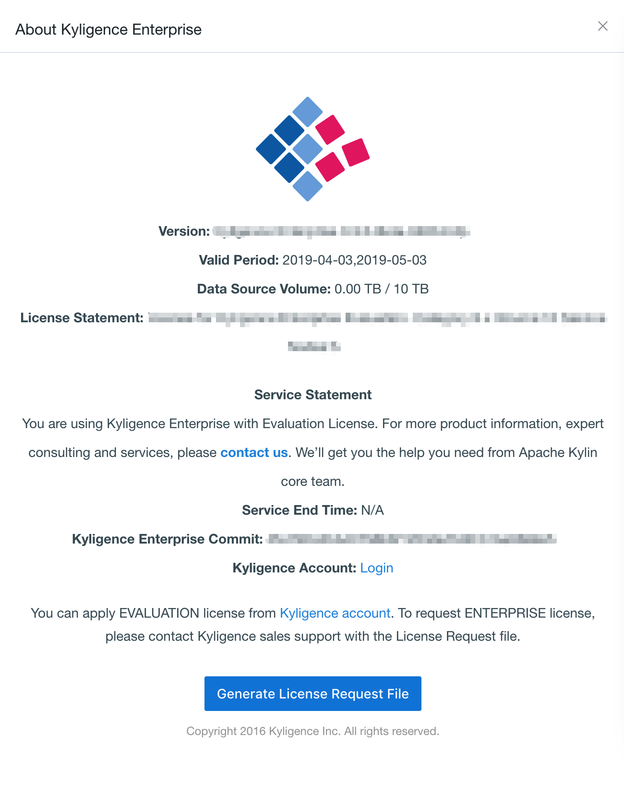

## Apply License

License is a prerequisite to use Kyligence Enterprise. There are two types of license, which are trial, with 2 months period, and official license. The following is a detailed introduction of the application process and specific operation of the Kyligence Enterprise license.

### Application Process

1. Please login [Kyligence Account Center](http://account.kyligence.io/) with your account. If you do not have an account, please sign up first.

   

2. After login, please apply the trial license by filling an application form. The trial license will be sent to you by e-mail, if the application is approved. 

### Application for Official License

1. If you want to purchase an **Official License** of Kyligence Enterprise, please generate a **License Request File**. You can Click  **Help  -> About Kyligence Enterprise** in Kyligence Enterprise. 

   

2. And then click **Generate License Request File**. 

   

3. Contact your account manager and provide the above **License Request File**. Our account manager will assist you in completing the remaining official license application process.

### Update License File

After received the license file (Trial License or Official License) and installed Kyligence Enterprise, please upload it to enable Kyligence Enterprise.

In Kyligence Enterprise login page, click **Help -> Update License**, you will see **Update License** window. Click **Browse** and select the license file and then click **Submit** to upload it to Kyligence Enterprise; Or you can paste the license content directly into the text box and click **Submit**.

If the license need to be updated, it can also be carried out by the above methods.

> Notice: If the license has expired, you will not be able to login Kyligence Enterprise.
