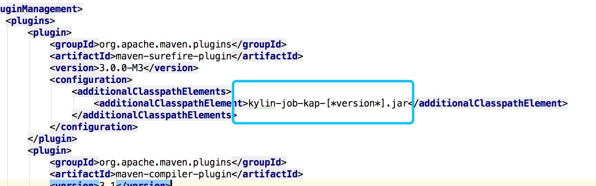

## Developer Guide for Implementing Java Class of Customized Cube Build

In this section, we will introduce how to develop a Java class for customized cube build based on a simple example.

Suppose in your source data, there is no standard date/time column for the date/time based incremental cube build. Instead, you have two columns *MONTH_ID* and *BATCH_ID* and your data is updated by different batches in each month. *MONTH_ID* contains the year/month information and it's 6 digits like 201901, 201902. *BATCH_ID* means the update batches in each month and it's 4 digits like 1, 2, 3. So *MONTH_ID* and *BATCH_ID* can be concatenated to compose a segment range, as shown below:

- [2012010001, 2012010002) means the first batch data in Janurary 2012 (not including second batch)

- [2014020001, 2014020004) means the first batch to third batch data in Feburary 2012 (not including the forth batch)

  > **Note:** "["  means close interval, ")"  means open interval。

Based on this example, we will show how to implement a Java class for customized incremental build, to map the segment range above to data selection criteria (a WHERE clause).

#### 1. Build Development Environment

Copy `$KYLIN_HOME/customize/customized-incremental-build.tar.gz` to your local folder and unzip. This is a sample project with `pom.xml` and maven project defined. Import it into your Java IDE.

Add Kyligence Enterprise library `$KYLIN_HOME/lib/kylin-job-kap-[*version*].jar ` to your project lib, and add it to your classpath.

Meanwhile please replace `kylin-job-kap-[*version*].jar` with its absolute path in your environment  in `pom.xml`.




#### 2. Implement Java Class for Customized Cube Build

The Java class for customized cube build must implement interface `PartitionDesc.IPartitionConditionBuilder` and its method `buildDateRangeCondition()`. In this method, we will map parameter *segmentRange* to a SQL WHERE clause. In each build job, Kyligence Enterprise will call it to generate a select SQL with proper filter and incrementally load data into cube.

Below is a Java class template for customized cube build:

```java
import org.apache.kylin.metadata.model.ISegment;
import org.apache.kylin.metadata.model.PartitionDesc;
import org.apache.kylin.metadata.model.SegmentRange;

import java.text.ParseException;
import java.text.SimpleDateFormat;

public class SampleConditionBuilder implements PartitionDesc.IPartitionConditionBuilder {

    public SampleConditionBuilder() {}

    @Override
    public String buildDateRangeCondition(PartitionDesc partitionDesc, ISegment segment, SegmentRange segmentRange) {
		...
    }
}
```

Parameter *segmentRange* contains the range start value and end value of type Long for a segment. Before writing the code to implement the Java class, we have to decide how this range maps to the columns for data filtering.

In this example, we can define start and end to be a 10-digits number, the first 6 digits is *MONTH_ID* and later 4 digits is *BATCH_ID*. So below are the *segmentRange* examples when submitting a cube build job:

- Build the first batch data in January 2012

  segmentRange: [2012010001, 2012010002)

  method `buildDateRangeCondition()` returns: `MONTH_ID=201201 AND BATCH_ID>=1 AND BATCH_ID<2`

- Build the second to ninth batch data in February 2012

  segmentRange: [2012020002, 2012020010)

  method `buildDateRangeCondition()` returns: `MONTH_ID=201202 AND BATCH_ID>=2 AND BATCH_ID<10`

  > **Note: ** The end value should be a open interval value in segmentRange, to avoid overlapping data between two consecutive segments。

So based on our example, the Java class for customized cube build can be implemented as below:

```java
import org.apache.kylin.metadata.model.ISegment;
import org.apache.kylin.metadata.model.PartitionDesc;
import org.apache.kylin.metadata.model.SegmentRange;

public class SampleConditionBuilder implements PartitionDesc.IPartitionConditionBuilder {
    
    String monthColumn;
    String batchColumn;

    // default constructor, called when no arguments is configured on the type of customized incremental build
    public SampleConditionBuilder() {
        // default column names
        this(new String[] { "MONTH_ID", "BATCH_ID" });
    }

    // called when arguments is configured
    public SampleConditionBuilder(String[] args) {
        this.monthColumn = args[0];
        this.batchColumn = args[1];
    }

    /**
     * Build filter condition on data source for a new segment.
     * 
     * @param partitionDesc     Model partition descriptor
     * @param segment           The segment object
     * @param segmentRange      The data range of the segment
     * @return a SQL where clause used to filter source records
     */
    @Override
    public String buildDateRangeCondition(PartitionDesc partitionDesc, ISegment segment, SegmentRange segmentRange) {
        // get segment range
        long startInclusive = (Long) segmentRange.start.v;
        long endExclusive = (Long) segmentRange.end.v;
        // check segmentRange validity
        if (startInclusive > endExclusive) {
            throw new IllegalArgumentException("endOffset should be greater than startOffset!");
        }

        String startStr = String.valueOf(startInclusive);
        String endStr = String.valueOf(endExclusive);

        int startMonth = Integer.parseInt(startStr.substring(0, 6));
        int startBatch = Integer.parseInt(startStr.substring(6));
        int endMonth = Integer.parseInt(endStr.substring(0, 6));
        int endBatch = Integer.parseInt(endStr.substring(6));

        // build filter condition from segment start and end
        StringBuilder builder = new StringBuilder();
        if (startMonth == endMonth) {
            builder.append(monthColumn + "=" + startMonth)
                    .append(" AND ")
                    .append(batchColumn + ">=" + startBatch)
                    .append(" AND ")
                    .append(batchColumn + "<" + endBatch);
            
        } else if (startMonth < endMonth) {
            builder.append("(")
                    .append(monthColumn + "=" + startMonth)
                    .append(" AND ")
                    .append(batchColumn + ">=" + startBatch)
                    .append(")");
            
            builder.append(" OR ");
            
            builder.append("(")
                    .append(monthColumn + "=" + endMonth)
                    .append(" AND ")
                    .append(batchColumn + "<" + endBatch)
                    .append(")");
            
            builder.append(" OR ");
            
            builder.append("(")
                    .append(monthColumn + ">" + startMonth)
                    .append(" AND ")
                    .append(monthColumn + "<" + endMonth)
                    .append(")");
    
        } else {
            throw new IllegalStateException();
        }

        // return filter condition
        return builder.toString();
    }
}
```


#### 3. Write Unit Test for Customized Cube Build

Please refer to `src/test/java/SampleConditionBuilderTest.java` in sample project to write a unit test case.


#### 4. Packaging, Deploying and Testing Your Java Class

- Pack you code into a JAR file using maven

  ```sh
  mvn package -DskipTests
  ```

  It will create `customized-incremental-build-1.0-SNAPSHOT.jar` file under the target folder.

- Deploy JAR file
  Put the JAR file to folder `$KYLIN_HOME/ext`, then restart Kyligence Enterprise.

  ```sh
  cp customized-incremental-build-1.0-SNAPSHOT.jar $KYLIN_HOME/ext
  $KYLIN_HOME/bin/kylin.sh stop
  $KYLIN_HOME/bin/kylin.sh start
  ```

- Create model

  Select *Customize* for **Incremental Data Loading** when save the model, input class name `SampleConditionBuilder` in **Java Class for Customized Incremental Build** and leave the initialization parameter empty.

- Create cube

  > **Caution:** It's highly recommended to disable the auto merge function in step **Refresh Setting**, as the default thresholds are defined for standard date/time types. If you want to enable the auto merge for customized incremental build, make sure the thresholds are carefully set according to your specific segment ranges.

- Customized cube build must be triggered via REST API, e.g.:

  ```sh
  curl -X PUT \
    http://localhost:8080/kylin/api/cubes/cube_cus/segments/build_customized \
    -H 'Authorization: Basic QURNSU46S1lMSU4=' \
    -H 'Content-Type: application/json' \
    -H 'cache-control: no-cache' \
    -d '{
      "sourceOffsetStart": 2012020002,
      "sourceOffsetEnd": 2012020010,
      "buildType": "BUILD",
  }'
  ```