## Get Support

### Kyligence Support

Kyligence will help customer install, configure, optimize, and run Kyligence Enterprise, help customer resovle the large scale data processing and analytics problems. Kyligence will support customer to install Kyligence Enterprise in their own data center, and also cloud environment, such as Amazon Web Services and Microsoft Azure.

You can find answers to technical questions by searching our knowledgeg base or submit a ticket to get technical support in [Kyligence Support Portal](https://support.kyligence.io). If you are a registered Kyligence user, below is the user guide for Kyligence Support Portal.

* [Knowledge Base](#Knowledge-Base)
* [Create Ticket](#Create-Ticket)
* [Monitor Ticket](#Monitor-Ticket)
* [Manual and Release Notes](#Manual-and-Release-Notes)

### Knowledge Base

**Search Knowledge Base**

You can find the section ``Knowledge Base`` on the page of Kyligence Support Portal.

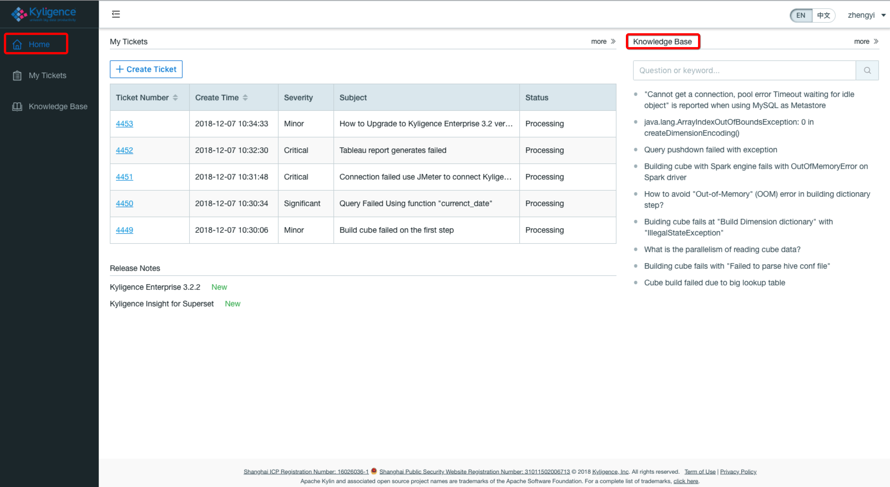

Moreover, you can take in the page of ``Knowledge Base`` after clicking on the label of ``Knowledge Base``.

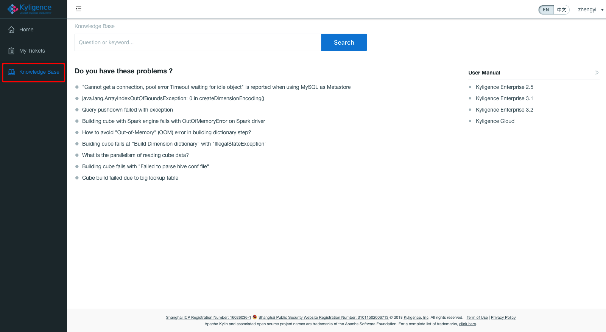

**Example**

You will find the corresponding result after type in the content of "Cannot get a connection"  in the search bar.

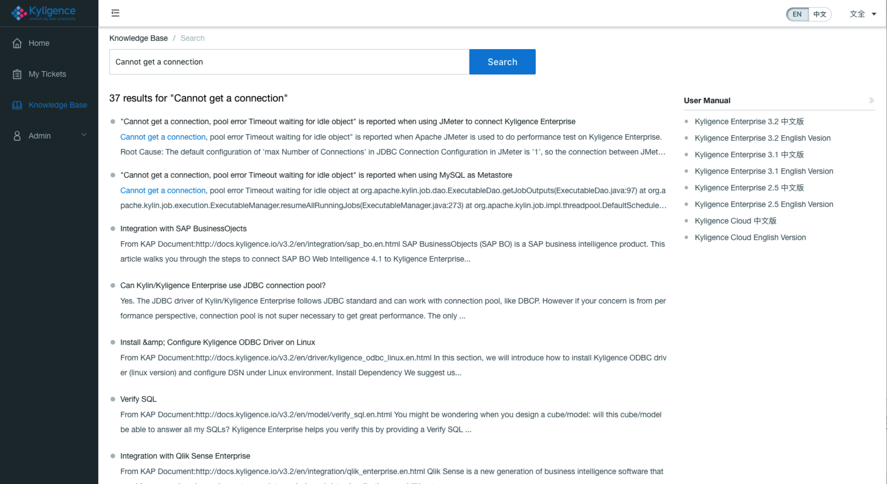

### Create Ticket

You can click button **Create Ticket** on the home page of Kyligence Support Portal or the page of **My Tickets**.

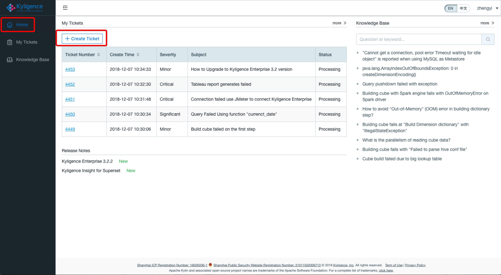

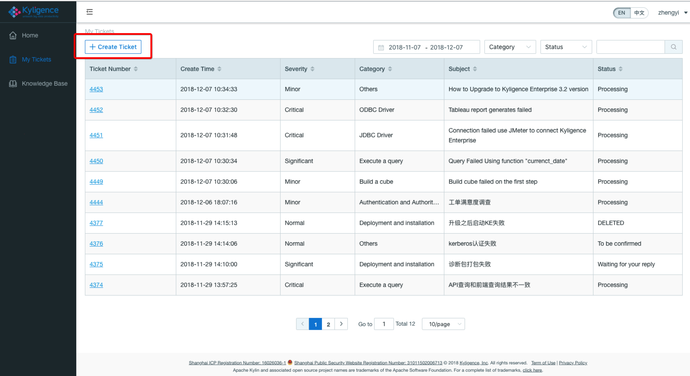

**Example**

You can submit the ticket with proper input to get help from Kyligence Support.
> **Note**：Maximum size of uploaded file is 2 GB.

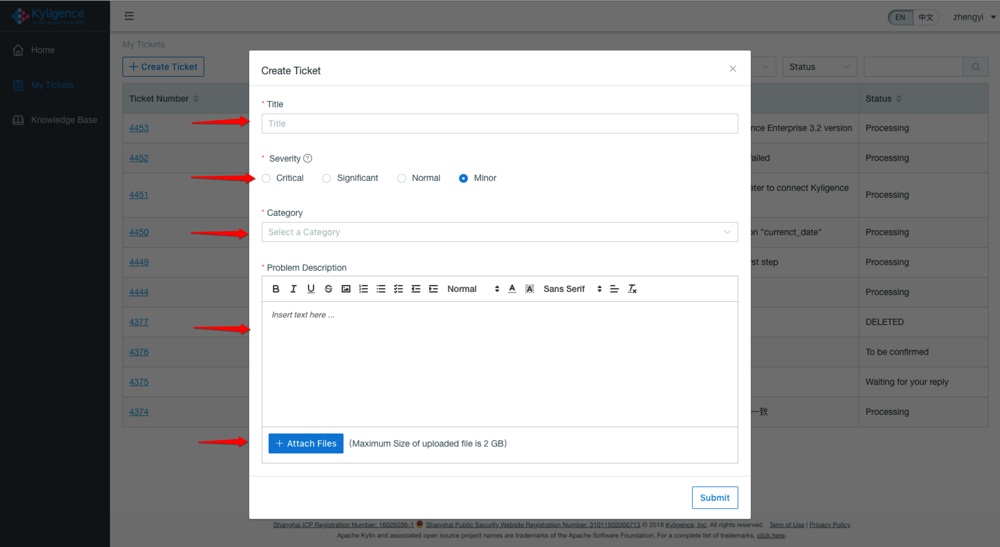

**Definition of Severity**

|Severity|Defination|
|-|-|
|Critical|Software is completely unusable.A production system is down or rendered unusable with no available workaround. Business operations have been halted or substantially impacted.|
|Significant|Use of the software is significantly degraded.A production system is functioning with significantly reduced capacity and no available workaround. Business operations can continue in a limited fashion.For development environments, an error is blocking further development work and putting a significant milestone or deadline at risk.|
|Normal|Non-critical loss of software functionality.Partial, non-critical loss of software functionality. Usage of software is impaired but business operations can continue.|
|Minor|General usage question. A general usage or how-to question. An error is cosmetic in nature or has minimal impact on business operations.|

> **Notice**: Please choose the right issue severity, otherwise Kyligence has the permission to adjust it according to real situation.

### Monitor Ticket  

**Status of Ticket**

It will show the latest five tickets on the home page, and you can have more details after clicking on the hyperlinks of Ticket Number.

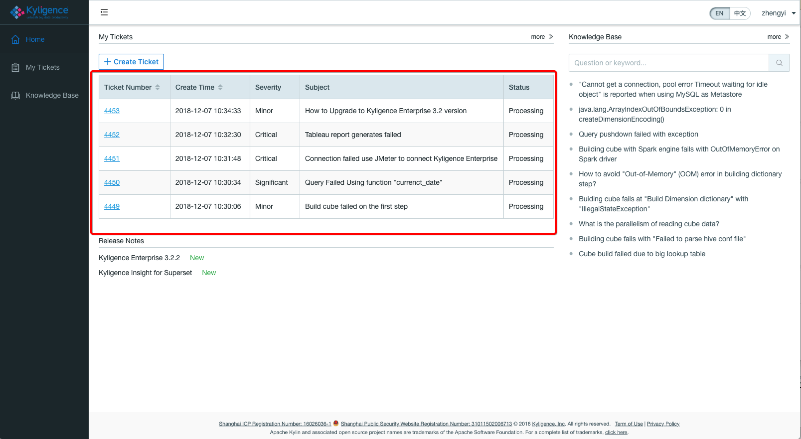

You can also monitor all of your tickets on the page of ``My Tickets``

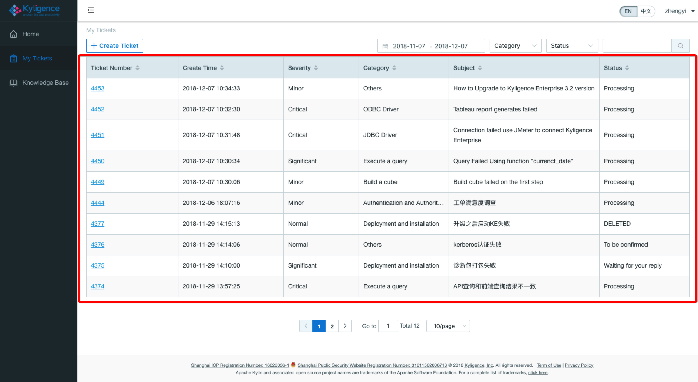

There are four status for tickets as *Processing*, *Waiting for your reply*, *To be confirmed* and *Closed*.

And you can close the ticket at your end as the problem has been solved.

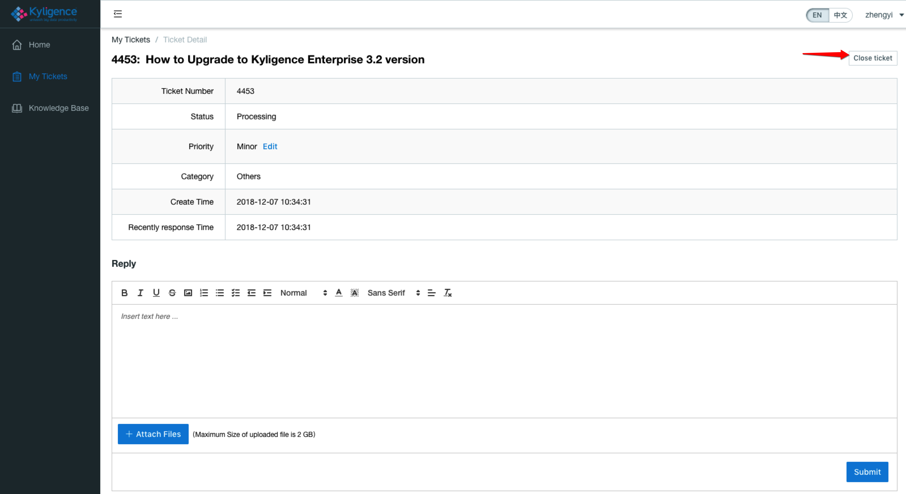

At the same time, you will be invited to fill in your comments in the Satisfaction Servey.

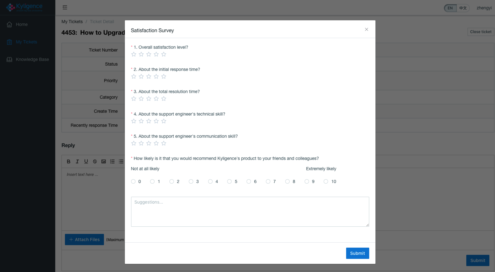

### User Manual and Release Notes

**User Manual**

You can find the user manual for different versions of Kyligence Enterprise.

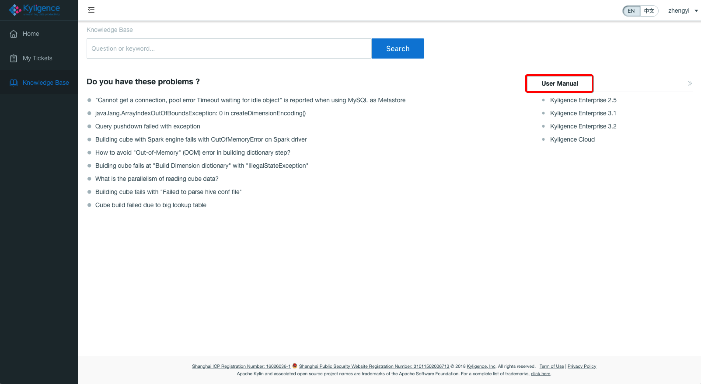

**Release Notes**

Kyligence Support Portal shows the latest release notes for the product of Kyligence.

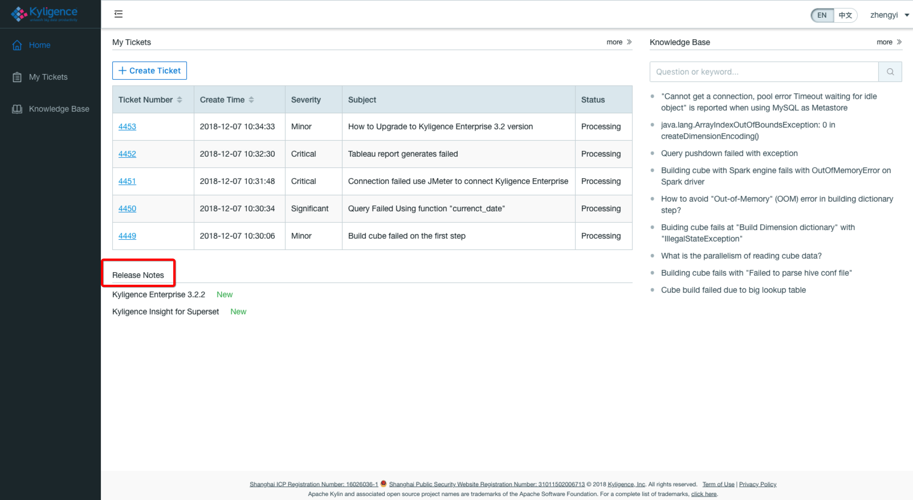
