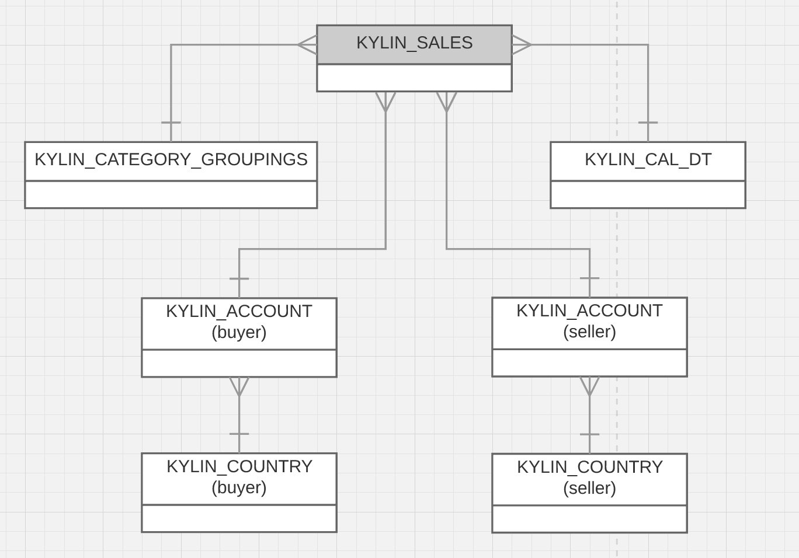

## Sample Dataset

Kyligence Enterprise binary package contains a sample dataset for testing, with about 1.5 MB in total. It consists of five tables, including the fact table which has 10,000 rows. Because of the small data size, it is convenient to carry out as a test in the virtual machine. For more details, please refer to [Import Data from Hive](../datasource/import_hive.en.md) section.

Kyligence Enterprise supports both star schema and snowflake data model since v2.4.0. In this manual, we will use a typical snowflake data model as our sample data set which contains five tables:

* **KYLIN\_SALES**
  This is the fact table, it contains detail information of sales orders. Each row holds information such as the seller, the commodity classification, the amount of orders, the quantity of goods, etc. Each row corresponds to a transaction.
* **KYLIN\_CATEGORY\_GROUPINGS**
  This is a dimension table, it represents details of commodity classification, such as, name of commodity category, etc.
* **KYLIN\_CAL\_DT**
  This is another dimension table which extends information of dates, such as beginning date of the year, beginning date of the month, beginning date of the week.
* **KYLIN_ACCOUNT**
  This is the user account table. Each row represents a user who could be a buyer and/or a seller of a specific transaction, which links to **KYLIN\_SALES** through the BUYER_ID or SELLER_ID.
* **KYLIN_COUNTRY**
  This is the country dimension table linking to **KYLIN_ACCOUNT**.

The five tables together constitute the structure of the entire snowflake data model. Below is a relational diagram of them.

### Data Dictionary

Below introduces some key columns in the tables.

| Table                      | Field                 | Description                      |
| :------------------------- | :-------------------- | :------------------------------- |
| KYLIN\_SALES               | PART\_DT              | Order Date                       |
| KYLIN\_SALES               | LEAF\_CATEG\_ID       | ID Of Commodity Category         |
| KYLIN\_SALES               | SELLER\_ID            | Account ID Of Seller             |
| KYLIN\_SALES               | BUYER\_ID             | Account ID Of Buyer              |
| KYLIN\_SALES               | PRICE                 | Order Amount                     |
| KYLIN\_SALES               | ITEM\_COUNT           | The Number Of Purchased Goods    |
| KYLIN\_SALES               | LSTG\_FORMAT\_NAME    | Order Transaction Type           |
| KYLIN\_CATEGORY\_GROUPINGS | USER\_DEFINED\_FIELD1 | User Defined Fields 1            |
| KYLIN\_CATEGORY\_GROUPINGS | USER\_DEFINED\_FIELD3 | User Defined Fields 3            |
| KYLIN\_CATEGORY\_GROUPINGS | UPD\_DATE             | Update Date                      |
| KYLIN\_CATEGORY\_GROUPINGS | UPD\_USER             | Update User                      |
| KYLIN\_CATEGORY\_GROUPINGS | META\_CATEG\_NAME     | Level1 Category                  |
| KYLIN\_CATEGORY\_GROUPINGS | CATEG\_LVL2\_NAME     | Level2 Category                  |
| KYLIN\_CATEGORY\_GROUPINGS | CATEG\_LVL3\_NAME     | Level3 Category                  |
| KYLIN\_CAL\_DT             | CAL\_DT               | Date                             |
| KYLIN\_CAL\_DT             | WEEK\_BEG\_DT         | Week Beginning Date              |
| KYLIN\_CAL\_DT             | MONTH\_BEG\_DT        | Month Beginning Date             |
| KYLIN\_CAL\_DT             | YEAR\_BEG\_DT         | Year Beginning Date              |
| KYLIN\_ACCOUNT             | ACCOUNT\_ID           | ID Number Of Account             |
| KYLIN\_ACCOUNT             | ACCOUNT\_COUNTRY      | Country ID Where Account Resides |
| KYLIN\_COUNTRY             | COUNTRY               | Country ID   (2 chars)           |
| KYLIN\_COUNTRY             | NAME                  | Descriptive Name Of Country      |
