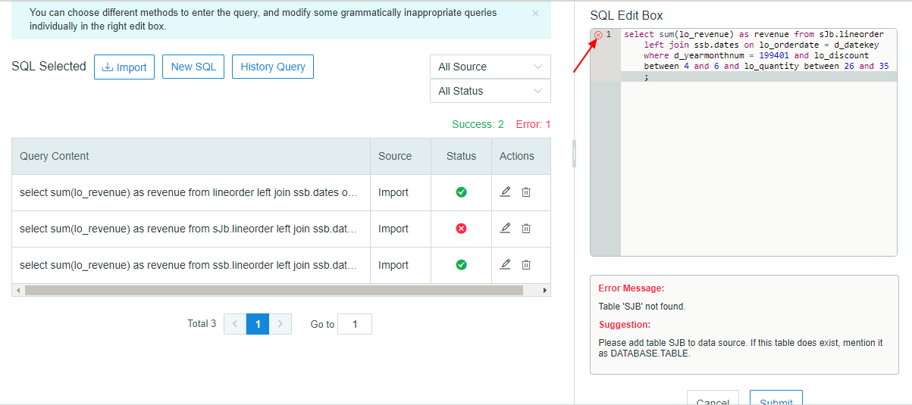
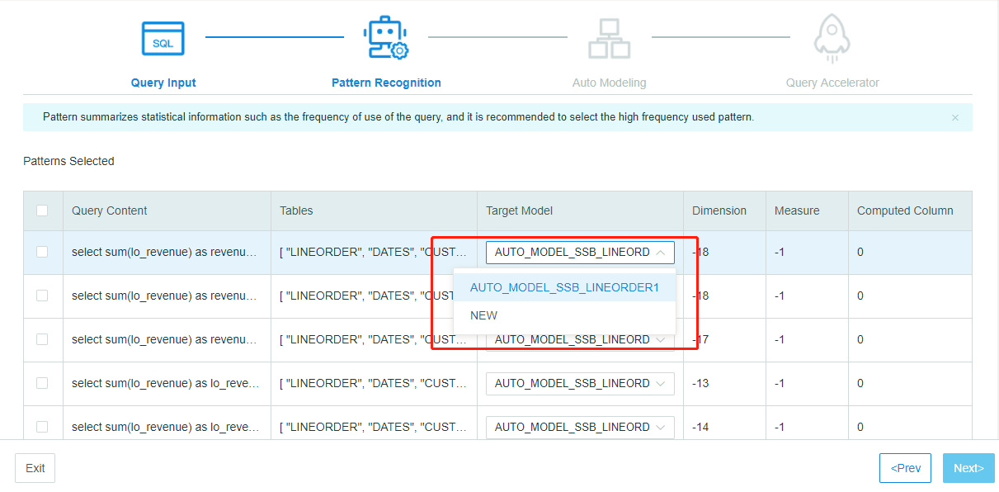
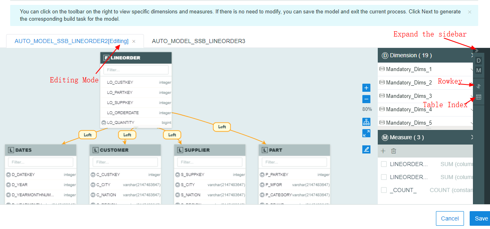
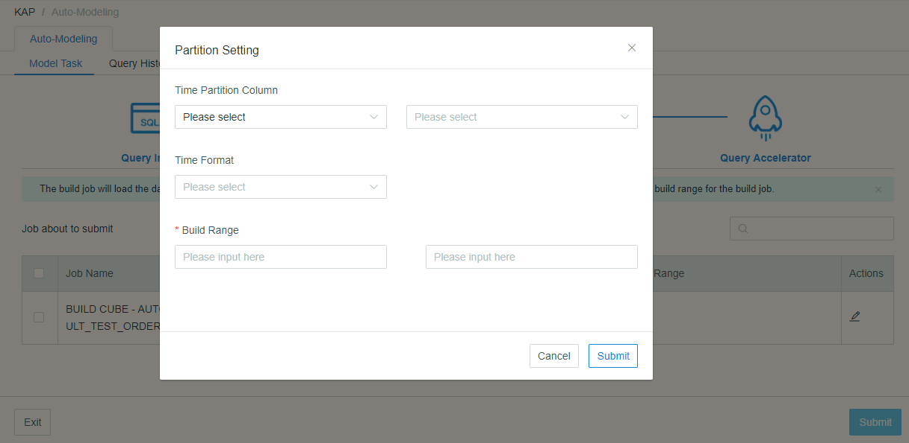

## Auto-Modeling instruction

The Auto-Modeling has been supported since Kyligence Enterprise 3.0. The system will create models automatically on the basis of the SQL statements imported or user's query history. You can learn modeling more easily, and greatly improve the efficiency of your modeling and query.

It takes four steps to accomplish Auto-Modeling (you can create multiple models at a time) :

- [Query Input](#Query Input)
- [Pattern Recognition](#Pattern Recognition)
- [Auto Modeling](#Auto Modeling)
- [Query Accelerator](#Query Accelerator)
  

#### Enter Auto-Modeling

Start Kyligence Enterprise and create a project, then you can click *Auto-Modeling* to access this module. If you do not have records of auto-modeling, Auto-Modeling will lead you to import source table, from Hive and RDBMS.

> Notice: In Kyligence Enterprise 3.x version, each project supports only one data source. Kafka is not available in Auto-Modeling for now.

After you have imported souce tables, click on the left navigation bar to return to *Auto-Modeling*.  Click 

*+ Auto-Modeling* to start.

#### Query Input

The first step in Auto-Modeling is *Query Input*: on this page, you can *Import* local SQL or select SQL from *History Query*, or you can manually add queries in *New SQL*.

> Notice:
>
> 1. The type of Query History includes Pushdown and Slow.
> 2. SQL statements you import should be a text document (.txt or t.sql) less than 1M.

All selected SQL statements will be displayed in the following list, where each SQL records  *Query Content*, *Source* and *Status*. *Status* represents the system's syntax test results for the SQL. It should be noticed that the *Next* button can be only clicked when all SQL status are *right*.

Click *Edit* button, then you can check the content and status on the right of the page. You can click the red *'X'* button to see the specific reasons for SQL errors and suggestions for modification.

Click *Exit* to leave Auto-Modeling workflow.

#### Pattern Recognition 

At the page of Pattern Recognition, Kyligence Enterprise integrates all SQL statements which have the similar content. Kyligence Enterprise can summarize the influence of query mode on model semantics. The system will recommend you to adapt SQL to existing models or recommend you to create a new one (NEW).

> Notice:
>
> 1. In Kyligence Enterprise 3.x, the model name generated automatically by system can not be modified. The name follows the pattern of: AUTO_MODEL_DATABASE_FACTTABLE_NUMBER, the NUMBER here means the iterative version of the Auto-Model.
> 2. If you create a new model, the number of it will accumulate on the basis of the existed largest number of this fact table.

#### Auto Modeling

In Auto Modeling, according to the SQL mode you choose, system will automatically create multiple models and display them. Then you can check the Dimensions, Measures, Rowkey and Table Index by clicking the sidebar. Computed column function is not supported in *Auto-Modeling* in Kyligence Enterprise 3.x.

After clicking the *Edit* button, you will access the edit mode. The system will recommand different *Dimensions*, including Joint Dimension (J:joint) , Hierachy Dimension (H:hierarcy) and Mandatory Dimension (M: madontary). The detailed information can be found in chapter [Aggregation Group](../model/cube/aggregation_group.en.md).

> Notice:
>
> 1. In read-only mode, all the contents of the model cannot be modified.
> 2. Dimension cannot be changed in edit mode.
> 3. In the edit mode, measures can be selected and deleted in batches.
> 4. Configuration of Rowkey ([Cube Design](../model/cube/create_cube.cn.md)) and table index ([Table index](../model/cube/table_index.cn.md)) has been recommended by the system, you can refer to manual for adjustment.
> 5. To delete model: click "X" in the model. If you want to get the model again, click *Pre* to rechoose target model.

If you need more detailed adjustment of Auto Model, you can click *Save and Close* and check the model in *Studio*→*Model*（[Model Design](../model/data_modeling.cn.md)）。

#### Query Accelerator

The system generates construction tasks for each automatic model. The default is full-build, and you can click the edit button to change the partition and rage. For more details, please refer to [Data Modeling](../model/data_modeling.en.md) and [Build Cube](../model/build_cube.en.md).

You can check the job information in this page, *choose* the needed jobs by the jobs' name and *submit* to build. Only after building, the model (including the cube) can be queried, and accelerate query to sub second delay.

