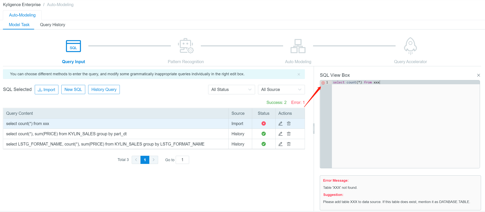
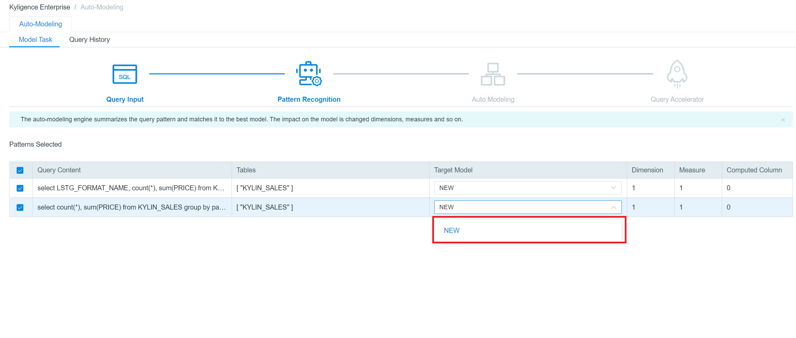

## Auto Modeling Introduction

Since Kyligence Enterprise 3.0, the system can create models automatically as well as further intelligent cubing based on SQL statements. This feature enables Kyligence Enterprise as an intelligent SQL accelerator, which greatly improves efficiency of big data modeling and OLAP analysis. All this can be done in **Auto Modeling**.

It takes four steps to accomplish auto modeling and you can create multiple models at the same time:

- [Query Input](#query-input)
- [Pattern Recognition](#pattern-recognition)
- [Auto Modeling](#auto-modeling)
- [Query Accelerator](#query-accelerator)
  

#### Enter Auto Modeling

Launch Kyligence Enterprise and create a project, then you can click **Auto Modeling** to access this module. If you have not yet done auto modeling before, it will lead you to import source table from Hive or RDBMS.

> **Note**: In Kyligence Enterprise 3.x, each project supports only one data source. Kafka is not supported in Auto Modeling at present.

After you have imported source tables, click on the left navigation bar to return to **Auto Modeling**.  Click

**+ Auto Modeling** to start.

#### Query Input

The first step in Auto Modeling is **Query Input**: in this page, you can **Import** local SQL or select SQL from **History Query**, or you can manually add queries in **New SQL**.

> **Note**:
>
> 1. The type of Query History includes Pushdown and Slow.
> 2. SQL statements you import should be a text document (.txt or t.sql) less than 1M.

All the selected SQL statements will be displayed in the following list, where each SQL records  *Query Content*, *Source* and *Status*. *Status* represents the system's syntax test results for the SQL statement. It should be noticed that the **Next** button can be only clicked when all SQL status are correct.

Click **Edit** button, then you can check the content and status on the right of the page. You can click the red **X** button to see the specific reasons for SQL errors and suggestions for modification.

Click **Exit** to leave Auto Modeling workflow.

#### Pattern Recognition 

At the page of Pattern Recognition, Kyligence Enterprise integrates all SQL statements which have the similar query pattern. Kyligence Enterprise can summarize the impact of query mode on model semantics. The system will recommend you to adapt SQL statements to the existing models or recommend you to create a new one.

> **Note**:
>
> 1. In Kyligence Enterprise 3.x, the model name that automatically generated by system cannot be modified. The name follows the pattern of: AUTO_MODEL_DATABASE_FACTTABLE_NUMBER, the NUMBER here means the iterative version of the Auto Model.
> 2. If you create a new model, the number of it will accumulate on the basis of the existed largest number of this fact table.

#### Auto Modeling

In Auto modeling, according to the SQL mode you choose, system will automatically create multiple models and display them. Then you can check the Dimensions, Measures, Rowkey and Table Index by clicking the sidebar. Computed column function has limited support in **Auto Modeling** in Kyligence Enterprise 3.x, only following expressions are supported right now.

1. CASE WHEN expression in SELECT/GROUP BY clause or WHERE condition
2. The inner expression in AVG/SUM aggregation function

After clicking the **Edit** button, you will access the edit mode. The system will recommend different optimization settings for dimension, including Joint Dimension (J: Joint) , Hierarchy Dimension (H: Hierarchy) and Mandatory Dimension (M: Mandatory). The detailed information can be found in chapter [Aggregation Group](../model/cube_design/aggregation_group.en.md).

> **Note**:
>
> 1. In read-only mode, all the contents of the model cannot be modified.
> 2. Dimension cannot be changed in the edit mode.
> 3. In the edit mode, measures can be selected and deleted in batches.
> 4. Configuration of Rowkey ([Cube Design](../model/cube_design/create_cube.en.md)) and table index ([Table index](../model/cube_design/table_index.en.md)) has been recommended by the system, you can refer to manual for adjustment.
> 5. To delete the model: click "X" in the model. If you want to get the model again, click *Pre* to re-choose the target model.

If you need more detailed adjustment of auto generated models, you can click **Save and Close** and check the model in **Studio** -> **Model**（[Model Design](../model/model_design/data_modeling.en.md)）。

#### Query Accelerator

The system generates cube building job for each auto generated model. The default mode is full-build, and you can click the edit button to change the partition and range. For more details, please refer to [Build Cube](../model/build_cube.en.md).

You can check the job information in this page, *choose* the needed jobs by the jobs' name and **submit** to build. Only after cube building job is succeeded, the model (including the cube) can serve queries and accelerate the response time to sub-second latency on big data.

