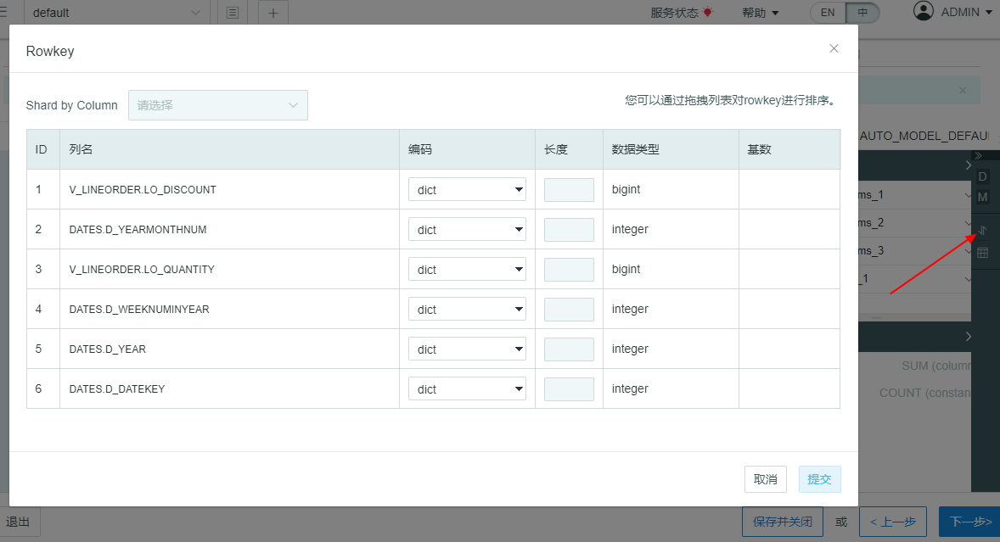
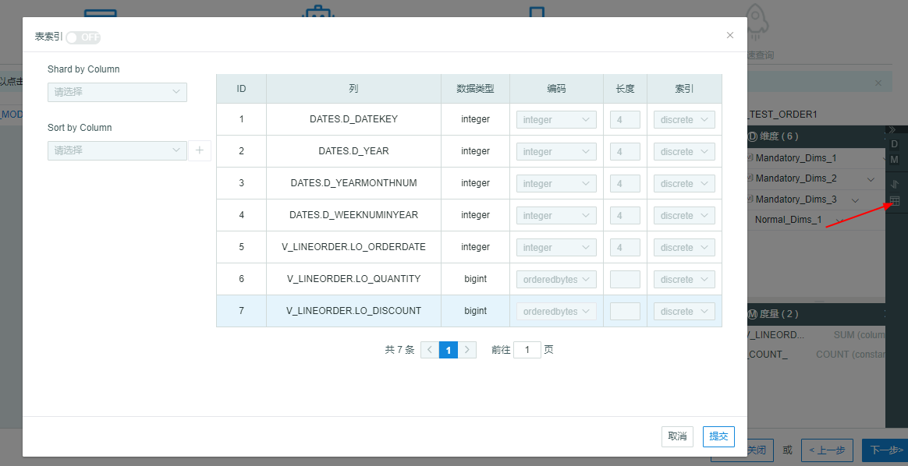
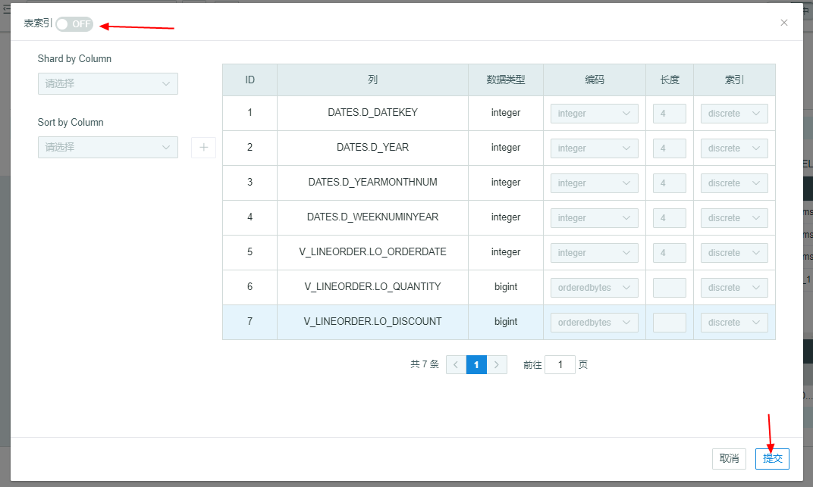

## Model Check and Edit

In Auto Modeling, you can check the models selected on the previous page and adjust the size of the model.Then you can check the Dimensions, Measures, Rowkey and Table Index by clicking the sidebar. 

> Notice: The Join relationship and dimensions cannot be changed while measures, rowkey and table       index can be changed in edit mode.

### Model Edit

After clicking the edit button, you will access the edit mode. There will be 'Editing' showing beside the model name.

The system will recommand different *dimensions*, including Joint Dimension, Hierachy Dimension and Mandatory Dimension. The detailed information can be found in chapter [Aggregation Group](../model/cube/aggregation_group.en.md).

> Notice: Dimension cannot be changed in edit mode.

You can check the detailed information of **Measure** in editing mode, and you can also add and delete measure. The detailed information please refer to the rule of measure in KAP Manual.

The Shardby column lies on top of the **rowkey** table. The detailed information please refer to [Create Cube](../model/cube/create_cube.en.md).

The Shardby and Sortby column of **Table Index** lies on the left of Table Index. The default status is OFF. Please refer to [Table Index](../model/cube/table_index.en.md) in KAP Manual for more detailed information.s

### Save and Close

If you click the x mark beside the model name to close the model, the model will be closed without save. If you want to get this model again, you can click *Pre* to choose target model again.

If you do not want to build the model, you can click *Save and Close* and check the model in the *Studio*.