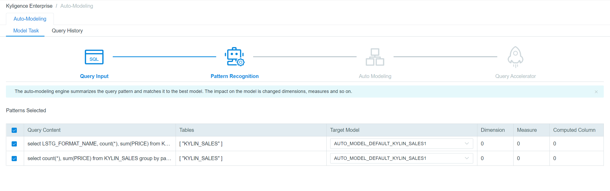

## Pattern Recognition and Select

At the page of Pattern Recognition, KAP integrates all SQLs which have the same content and recommends target models. 

You can click **Prev** to change SQLs which you have chosen, **Next** to go to the next step and **Exit** to back to Task List or Guide page.

### Target Model

The Target Model includes all models related to the fact table and a new model recommanded by KAP.

The **name** of target model obeys the following rules:

- The name is AUTO_MODEL_DATABASE_FACTTABLE_NUMBER.

- The number will accumulate according to the frequency of models which are related to the same fact table. Different fact tables own respective numbers.

- The number of the new model will accumulate on the basis of the existed largest number of this fact table.

- If you choose an existed table, it will be numbered as a new model.

You can select target model through drop-down box, and click **Next** to check the Model.
