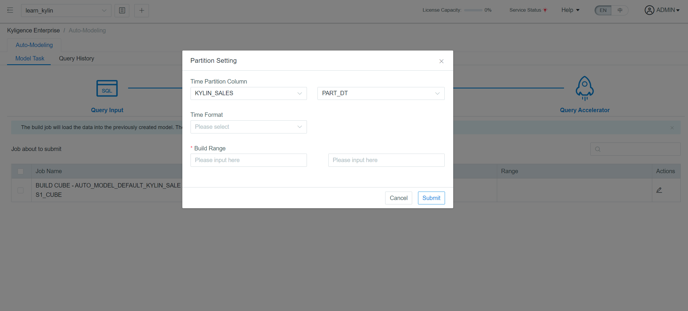

## Query Accelerator

You can check the job information in this page and choose the needed jobs to submit building job. If you do not need build the models, you can click Exit button.

The default is full-time build, and you can click the edit button to change the partition and rage. For more details, please refer to [Data Modeling](../model/data_modeling.en.md) and [Build Cube](../model/build_cube.en.md).

