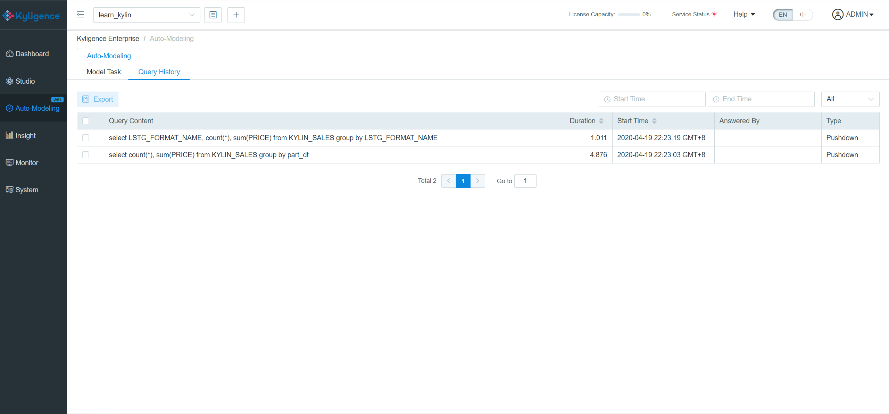
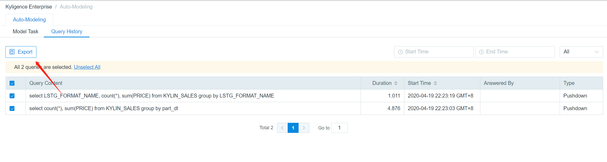

## Query History

The *Query History* includes some of the SQLs you have queried, including Slow and Pushdown. You can check the query content, latency, start time and type of each SQL and filter by the type of the queries.

The default threshold for a slow query is 90 seconds, so the query will be classified as *Slow* if its response time is over 90s. This parameter can be changed by adding `kylin.query.badquery-alerting-seconds` into file `$KYLIN_HOME/conf/kylin.properties`.

> Notice: Kyligence Enterprise stores 500 unique SQL statements by default. It could be changed by setting the value of `kylin.query.badquery-history-number` in `$KYLIN_HOME/conf/kylin.properties`. If the number of SQL statements in the query history is more than the setting value, the oldest SQL statement will be replaced by the new one automatically.

On *Query History* page, you can choose SQL statements and click *Export*, which can export SQL statements as txt file.

