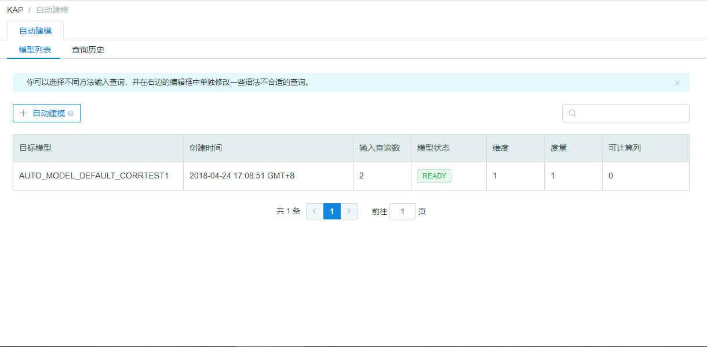
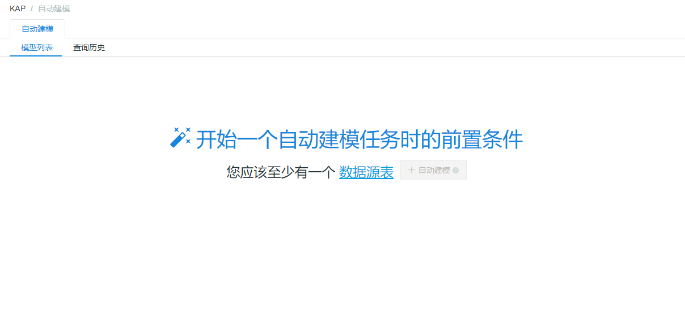
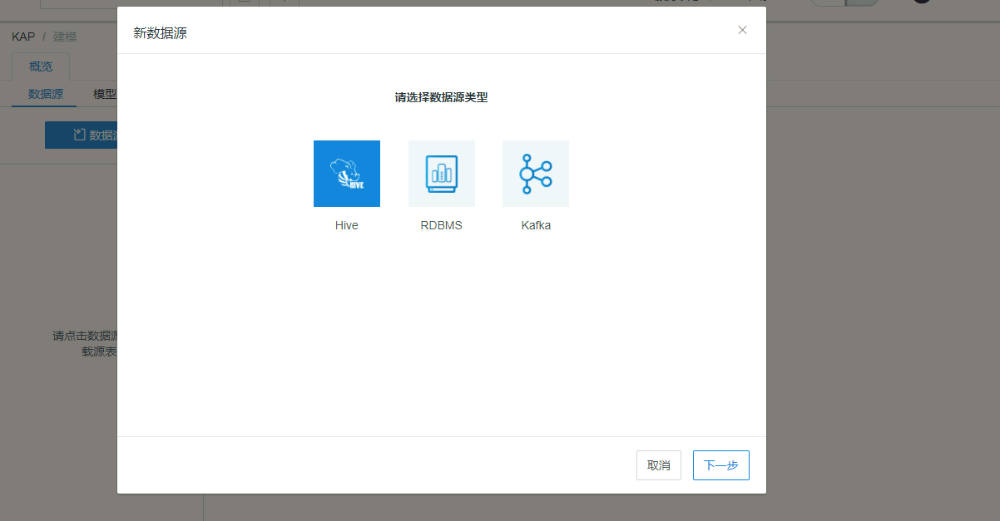
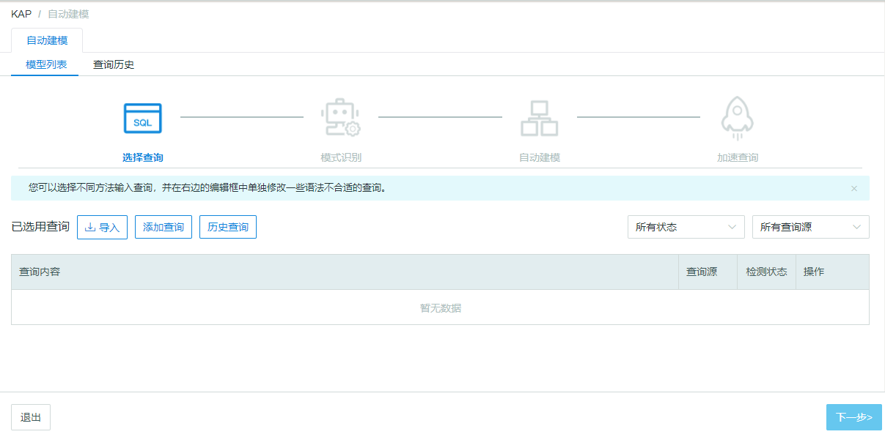
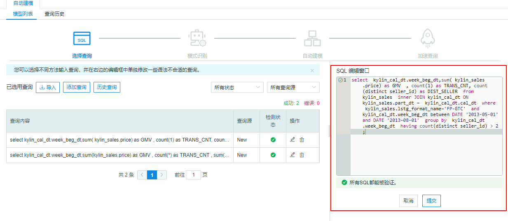
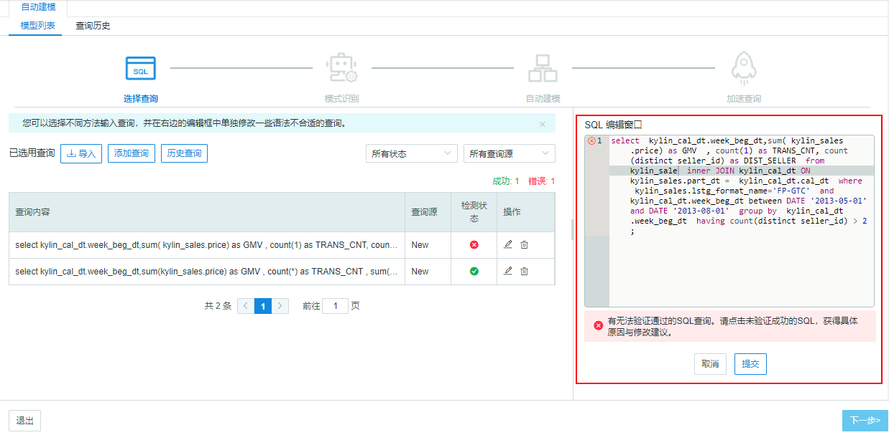

## Enter Auto-Modeling

Start KAP and create a project, then you can click *Auto-Modeling* to access this module,

If you have Auto-Modeling history, you will access the *Task List* page. Click *Auto Model* and start a new Auto-Modeling process.

If you do not have records of auto-modeling, you will access the *Guide* page. This page will lead you to import source table, including Hive, RDBMS and Kafka.

After you have imported souce tables, you can click *Auto-Modeling* to start building models.

## SQL import and edit

You can check query content, souce, status and actions on Query Input page. And you can filter SQLs by status and source. What's more, you can edit or delete SQLs.

Click **Exit** you will back to Task List page or Guide page.

### SQL import

There are three ways to import SQLs, including importing from files, adding new SQLs and importing from query history.

- **Import from files**

You can choose the files you need in the pop-up window after you click *Import* button.

> Notice: The size of the file should less than 1M, and the file format should be stored as text file.

- **Add New SQLs**

You can import new SQLs after you click *New* button. When you choose to submit, the system will check  whether the SQL statement is right or not. If there are some errors, the SQL statement needs to be revised.

- **Import from Query History**

If you want to accelerate SQL statements which you have submitted previously, you can choose them from **History Query**. Click the button and you can choose the needed SQL statements from the pop-up window.

> Notice: The type in Query History includes Pushdown and Slow.

### SQL Edit

You can edit or delete the SQL statements after importing them. It should be noticed that the Next button can be only clicked when all SQL statements are *right*.

Click **Edit** button, then you can check the content and status on the right of the page.

If you want to correct the wrong SQL statements, you can click the button in Edit Box to check the error messages.

## Query History

The Query History includes all SQL statements you have submitted in Insight page. You can check the query content, latency, start time and type. Also you can filter by the type of queries.

The type includes Slow and Pushdown. The default latency time is 90s, so the query will be classfied as Slow if it responded over 90s. This parameter can be changed in `kylin.query.badquery-alerting-seconds` in file `$KYLIN_HOME/conf/kylin.properties`.

You can choose SQL statements and click *Export*, which can export SQLs as txt file.

