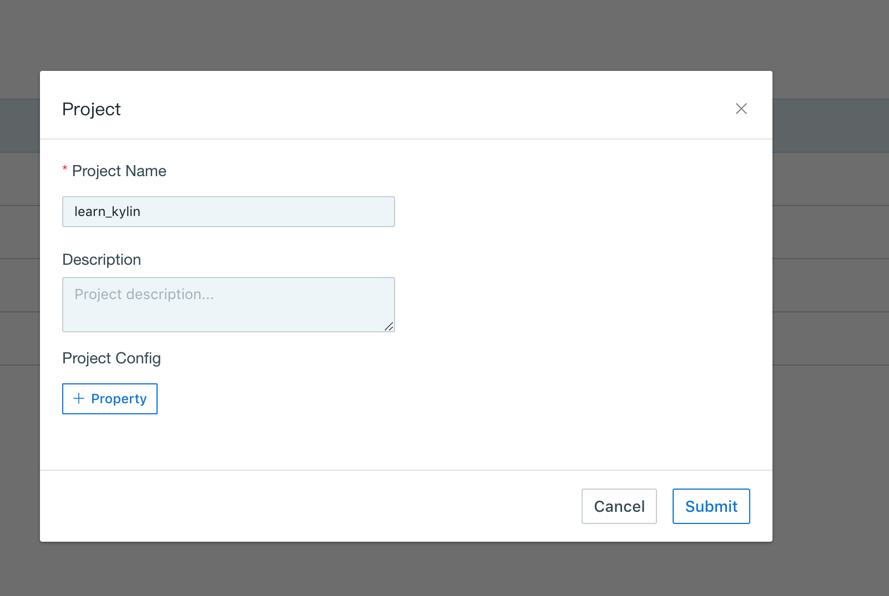
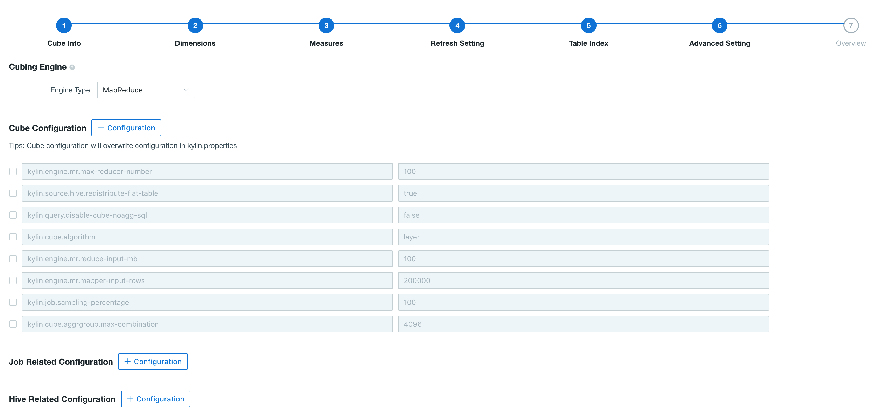

## Configuration Overriding

Some of the configuration properties in `$KAP_HOME/conf/` could be overridden through KAP GUI. Configuration overriding has two scopes: project level and cube level. The priority order can be stated as: cube level configurations > project level configurations > configuration files.  

### Project-level Configuration Overriding

At the Project Management page, open the edit page for one of projects, user could add configuration properties, which would override property values in configuration files, as the figure below shown: 

The configuration of kylin.query.force-limit can be overridden at project level.

### Cube-level Configuration Overriding

At the `Advanced Setting` phase in cube design, user could rewrite property values to override those in project level and configuration files, as the figure below shown: 

The configuration of kylin.query.disable-cube-noagg-sql can be overridden at Cube level.

### Overriding Properties In kylin.properties

The configurations below can be overridden at cube level and project level.

- `kylin.cube.cuboid-scheduler`, default is org.apache.kylin.cube.cuboid.DefaultCuboidScheduler;
- `kylin.cube.algorithm`, default is auto, other valid values include inmem, layer;
- `kylin.cube.algorithm.layer-or-inmem-threshold`, default is 7;
- `kylin.cube.aggrgroup.max-combination`, default is 4096;

> Note: **DO NOT** set this parameter over 10000. Otherwise it will consume a lot of CPU and memory resources when calculating the dimension combination, may lead to browser unstable or KAP crash. If there are a number of dimensions in the Cube, it is recommended to set multiple Aggregation Groups (AGG). 

- `kylin.cube.aggrgroup.is-mandatory-only-valid`, default is false;
- `kylin.engine.mr.config-override.`, default is empty string;
- `kylin.engine.mr.reduce-input-mb`, default is 500;
- `kylin.engine.mr.max-reducer-number`, default is 500;
- `kylin.engine.mr.mapper-input-rows`, default is 1000000;
- `kylin.hbase.default.compression.codec`, default is none, other valid values include snappy, lzo, gzip, lz4;
- `kylin.job.sampling-percentage`, default is 100;
- `kylin.snapshot.max-cache-entry`, default is 500;
- `kylin.snapshot.max-mb`, default is 300;
- `kylin.storage.hbase.region-cut-gb`, default is 5.0;
- `kylin.storage.hbase.hfile-size-gb`, default is 2.0;
- `kylin.storage.hbase.min-region-count`, default is 1;
- `kylin.storage.hbase.max-region-count`, default is 500;
- `kylin.storage.partition.max-scan-bytes`, default is 3221225472, i.e. 3G;

### Overriding Properties in kylin_hive_conf.xml

KAP allows overriding properties in kylin_hive_conf.xml through KAP GUI. Replace original values by the following Key-Value format：

kylin.hive.config.override *key* = *value*

### Overriding Properties In kylin_job_conf.xml And kylin_job_conf_inmem.xml

KAP allows overriding kylin_job_conf.xml and kylin_job_conf_inmem.xml through KAP GUI. Replace original values by the following Key/Value format：

kylin.job.mr.config.override *key* = *value*

