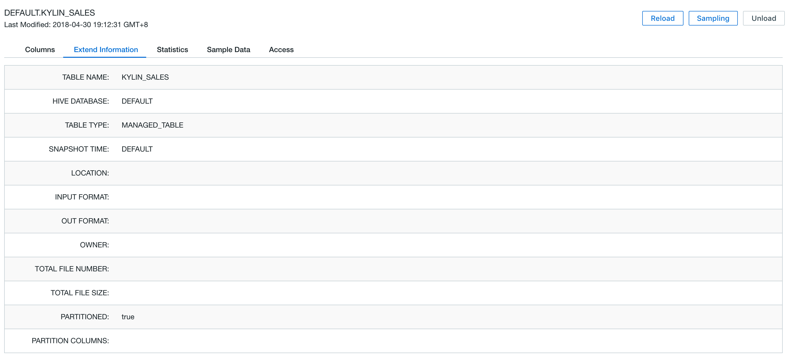

## Data Sampling

This chapter will introduce table sampling and how to utilize it in Kyligence Enterprise.

### What is Table Sampling?

Kyligence Enterprise uses table sampling for collecting statistical information of source tables, including column cardinality, formats, etc., which is helpful for following data modeling and cube design.

### Why Table Sampling?

Kyligence Enterprise can use it to generate optimal query plans for users.

### How to Use

Step 1. Login Kyligence Enterprise and select the required project.

Step 2. Click the `Studio` on the navigation bar and select *Data Source*  to see the plan-to-collect tables.

Step 3. Select the sample tables and click `Sampling` in the upper right.

Step 4. Adjust sample size; Drag the sampling bar to adjust the sample size in the pop-up window; Kyligence Enterprise scans the whole table by default.

> Notice: Click Data Source and select one or multiple tables to adjust sample size if metadata is not loaded.
>
> The sampling range is from 20%-40%-60%-80%-100%. The higher the sampling ratio is, the more accurate the sampling result will be. But it may consume more resources. Users can adjust the ratio according to actual resource configuration (see [recommended configuration](../config/recommend_settings.en.md )).

Step 5. Click `Submit` and start table sampling.

Step 6. Click `Monitor` on the left side then you can view table sampling status.

> Notice: If the data source is Kafka, the job for table sampling will not show in the Monitor while Kyligence Enterprise will still finish the table sampling.

Step 7. Once you have done sampling, return to *Data Source* section and select specific tables for details.

A detailed statistical sampling includes the following information; you can switch to the corresponding tab to view it.

- Column
- Extend Information
- Feature Data
- Sample Data

