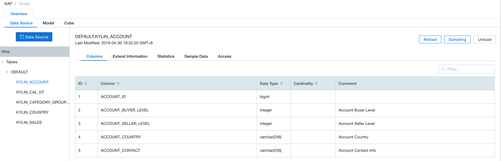

## Import Data from Hive

Kyligence Enterprise supports accessing *Hive* tables. 

This chapter will introduce how to access hive tables as data source. Following are the instructions.


### Prepare Sample Datasets

You can import the Kyligence Enterprise built-in sample data into Hive using executable scripts.

The script is `sample.sh`. Its default storage path is the bin directory under `KYLIN_HOME`

```shell
$KYLIN_HOME/bin/sample.sh
```

> Note: After sample.sh is executed, it is required to choose **Reload Metadata** under the **System** page. Otherwise, there will be errors in data modeling. 


Once the script is complete, execute the following commands in Hive shell to confirm the tables are imported successfully.

```hive
hive
```

Check the imported hive tables

```shell
hive> show tables;
```

Check the details of imported hive tables

```shell
hive> select count(*) from kylin_sales;
```


### Create Project with Hive Data Source

**Step 1:** Log in to Kyligence Enterprise Web UI, then add a new project by clicking the `+` at the top right on Web UI. Type project name (required) and descriptions on the pop-up page; click `OK` to finish creating a project.


**Step 2:** Select `Data Source` under *Studio* section of your project. Click the blue `Data Source` button and select Hive as data source (as shown below).


**Step 3:** Click `NEXT` and enter the *Load Hive Table Metadata* page; you can select tables you want from *Hive Table* on the left. Keyword search is also supported.

**Step 4:** Click `sync` to load the data. 


> Note: By default, Kyligence Enterprise does not select data sample. Users have options to do it and select sample size.

**Step 5**: Once the synchronization is finished, select specific tables and check the details under *Data Source* section.


