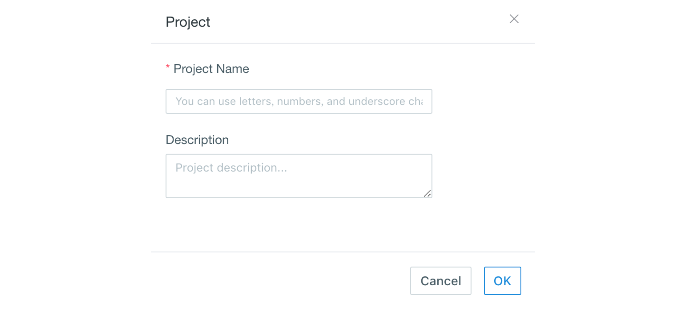
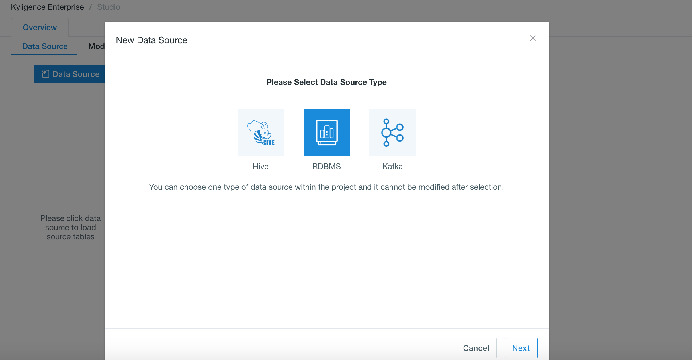

## Import Data from Impala

Kyligence Enterprise supports Impala as data source since version 3.2. 


### Prerequisites

You need to follow the steps below to connect to Impala:

- Download official [Impala JDBC Driver](https://www.cloudera.com/downloads/connectors/impala/jdbc/2-6-4.html).  Unzip the file and find 2 versions of JDBC(JDBC4 and JDBC4.1). Please use ImpalaJDBC41.jar as Impala JDBC driver.
- Download Kyligence impala adaptor from [Kyligence Account](http://download.kyligence.io/#/addons)
- Copy ImpalaJDBC41.jar and Kyligence impala adaptor to `$KYLIN_HOME/ext`. Restart Kyligence Enterprise to take effect.
- Copy ImpalaJDBC41.jar and Kyligence impala adaptor to `<sqoop_installation_directory>/lib`, check global parameters, and add `kylin.source.jdbc.sqoop-home=<sqoop_path>` to `kylin.properties`. *<sqoop_path>* is the file where the sqoop command locates.


### Connection Configuration

Users can set the following configurations in **project configuration** or **global configuration**.

| Parameter                        | Value                                                        |
| -------------------------------- | ------------------------------------------------------------ |
| kylin.source.jdbc.driver         | io.kyligence.kap.impala.jdbc41.WrappedDriver                 |
| kylin.source.jdbc.connection-url | jdbc:impala-wrapped://&lt;HOST&gt;:&lt;PORT&gt;/&lt;DATABASE&gt; |
| kylin.source.jdbc.user           | &lt;Impala Username&gt;                                      |
| kylin.source.jdbc.pass           | &lt;Impala Password&gt;                                      |
| kylin.source.jdbc.dialect        | impala                                                       |
| kylin.source.default             | 16                                                           |
| kylin.source.jdbc.adaptor        | io.kyligence.kap.impala.jdbc41.WrappedDriver                 |

To enable query pushdown, following configuration is required:

```properties
kylin.query.pushdown.runner-class-name=io.kyligence.kap.query.pushdown.PushdownRunnerSDKImpl
```


### Set Up Impala Data Source for a Project

To set up Impala data source for a specific project, followings are the steps:

**Step 1:** Log in to Kyligence Enterprise Web UI, then add a new project by clicking the `+` at the top right on Web UI. Type project name (required) and descriptions on the pop-up page; click `OK` to finish creating a project.




**Step 2:** Select `Data Source` under *Studio* section of your project. Click the blue `Data Source` button and select **RDBMS** as data source (as shown below).



**Step 3:** Set configuration in project configuration.

```properties
kylin.source.jdbc.sqoop-home=/usr/hdp/current/sqoop-client
kylin.source.jdbc.driver=io.kyligence.kap.impala.jdbc41.WrappedDriver
kylin.source.jdbc.connection-url=jdbc:impala-wrapped://HOST:PORT/DATABASE
kylin.source.jdbc.user=<username>
kylin.source.jdbc.pass=<password>
kylin.source.jdbc.dialect=impala
kylin.source.default=16
kylin.source.jdbc.adaptor=io.kyligence.kap.impala.jdbc41.WrappedDriver
```

**Step 4:** After setting configurations, you can connect your project with Impala data source.

**Step 5:** Click `NEXT` and enter the *Load Table Metadata* page; you can select tables you want from *Table* on the left. Click `sync` to synchronize/load the data. 
