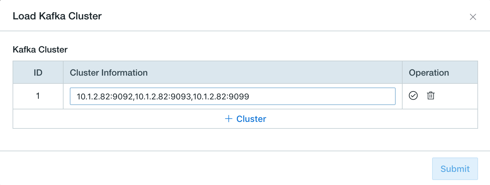
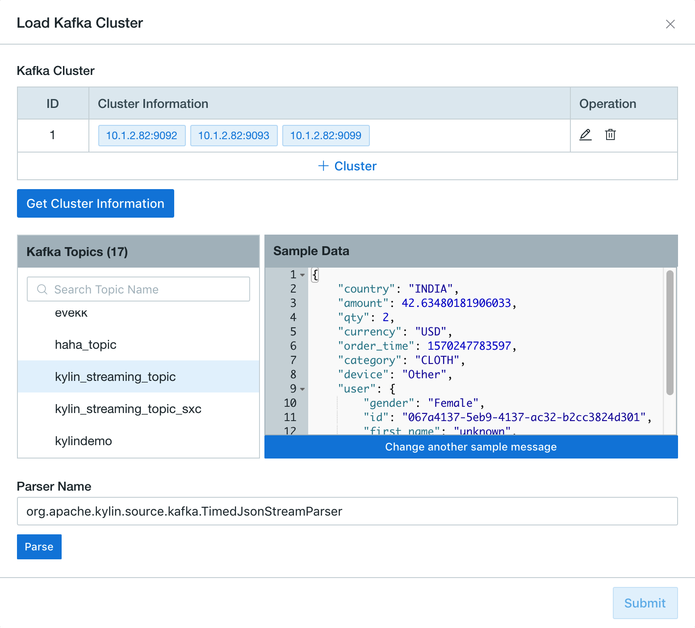
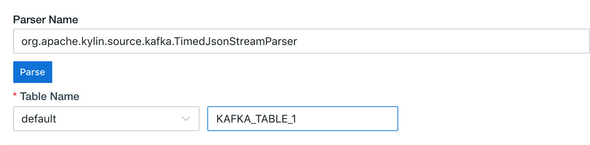
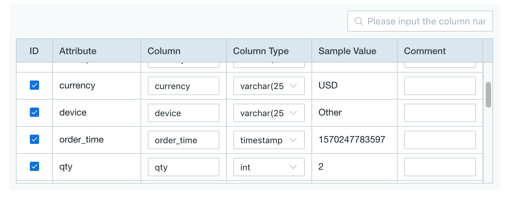
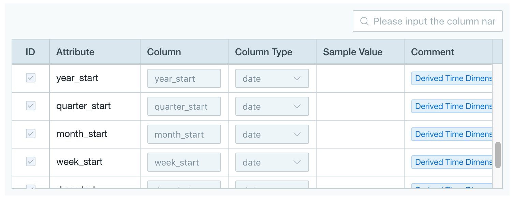
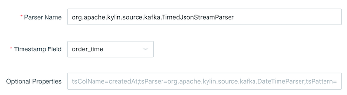
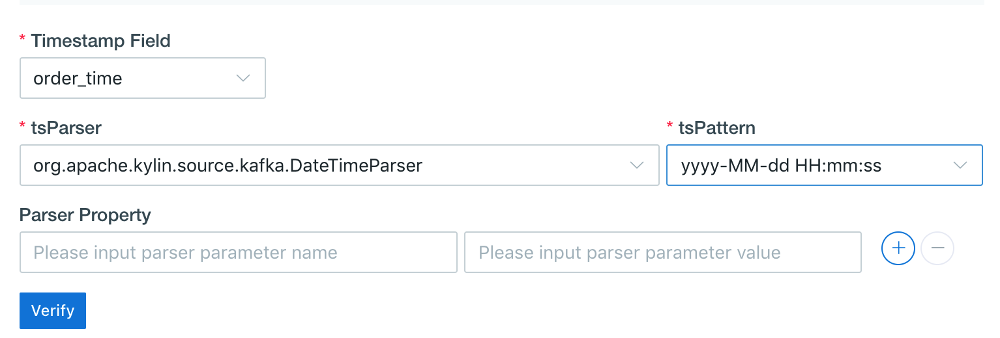
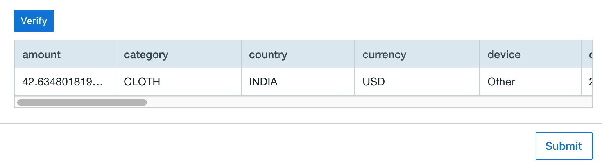

## Import Data from Kafka

This chapter introduces how to import streaming data from Kafka and define a table.

### Prerequisites

Your Kafka version should be **v2.11-0.11.0.1** or above.

### Deploy Kafka Broker for Quick Test

To help quick test, the following steps introduce how to deploy a Kafka broker on the node where Kyligence Enterprise is deployed. If you have installed Kafka cluster already, please skip this section.

> **Note:**
> 
> If Kafka binaries is not deployed on the node where Kyligence Enterprise is deployed, please copy the *same version* of the Kafka binary package from Kafka nodes and extract at any path on the node where Kyligence Enterprise is deployed (for example `/usr/local/kafka_2.11-0.11.0.1`) and set `KAFKA_HOME` to that path. Make sure all the jars for Kafka client are in the `$KAFKA_HOME/libs/` directory.


1. Download Kafka installation package and unzip.
   ```sh
   curl -s https://archive.apache.org/dist/kafka/0.11.0.1/kafka_2.11-0.11.0.1.tgz | tar -xz -C /usr/local/
   ```
2. Specify the environment variable `KAFKA_HOME`.

   ```sh
   export KAFKA_HOME=/usr/local/kafka_2.11-0.11.0.1
   ```
3. Start a Kafka broker
   ```sh
   $KAFKA_HOME/bin/kafka-server-start.sh $KAFKA_HOME/config/server.properties &
   ```

### Create Kafka Topic and Generate Data for Quick Test

To help quick test, the following steps introduce how to create a Kafka topic and generate streaming data. If you already have Kafka topics, please skip this part.

The following example assumes that Kafka broker runs on 127.0.0.1:9092 and ZooKeeper runs on 127.0.0.1:2181. 

1. Create a topic named as **kylin_streaming_topic**:
   ```sh
   $KAFKA_HOME/bin/kafka-topics.sh --create --zookeeper 127.0.0.1:2181 --replication-factor 1 --partitions 3 --topic kylin_streaming_topic
   ```
2. Start a Kafka producer.
   Kyligence Enterprise provides a producer tool to generate streaming data and put it to Kafka topic continuously.
   ```sh
   $KYLIN_HOME/bin/kylin.sh org.apache.kylin.source.kafka.util.KafkaSampleProducer --topic kylin_streaming_topic --broker 127.0.0.1:9092
   ```
   This producer tool sends 100 records to Kafka per second. Please keep it running during the simulation.
3. Meanwhile you can check the streaming data using Kafka consumer.
   ```sh
   $KAFKA_HOME/bin/kafka-console-consumer.sh --bootstrap-server 127.0.0.1:9092 --topic kylin_streaming_topic --from-beginning
   ```

### Define a Table from Streaming Data

Kyligence Enterprise supports extracting streaming data into tables and implementing near real-time processing (micro-batch) of streaming data.

1. Create a new project in Web UI to import Kafka data.

2. Select the project to import Kafka data. Navigate to **Studio**->**Data Source**, click **Data Source**, and choose **Kafka**, click **Next**.

   
   
3. On the **Load Kafka Topic** page, click **+Cluster** input the Kafka broker info, include the IP address and the port (like `127.0.0.1:9092`). If there are more than one Kafka broker, please separate them by commas, click  √ to check Kafka cluster info. If there are invalid brokers, please remove them and check again. 
  
   > **Tips**: The system remembers configured Kafka clusters for later reuse.
   
   
   
4. Click **Get Cluster Information** and select a Kafka topic (like `kylin_streaming_topic`). Then a sample message will be shown in the right panel, click **Convert**.
  
   > **Note**: 
   > 1. Only JSON message will be shown as sample data at the moment. For message in other formats, it won't be shown as sample data.
   > 2. The Parser used for JSON message is `org.apache.kylin.source.kafka.TimedJsonStreamParser`. For message in other formats, you may need use customized implementation parser, will be introduced in later section.

   
   
5. Define a table name for the streaming data, like `KAFKA_TABLE_1`. This table will be used for modeling later.
   

6. Confirm the columns and the column types in the table schema.
  - You can customize the column name, column type, comment for each column. The column name shoud be non-repetitive.

  - Make sure there is at least one column of type **timestamp**. It represents the data time of a record.

  - Based on the above timestamp column, the system automatically derives 7 time columns of different granularity, which are **year_start, quarter_start, month_start, week_start, day_start, hour_start, minute_start**. These time columns are mandatory on all Kafka tables for your convenience.

  - The derived timestamp columns generated by the system automatically, they are immutable.

  - The **minute_start** column is critical for later model design and cube design. In models and cubes that use Kafka table as fact table, the **minute_start** will be a mandatory dimension and segment merge will perform along the **minute_start** as time dimension.

     > **Note**: If your Kafka message contains fields of the same names, please modify the column name.
     
     

     

7. Set the parser and the parser properties

   

   

   - `Timestamp Field`: The data time column of the record (like `order_time`). The parser generates 7 time columns based on the timestamp.

   - `tsParser`: The timestamp parser. It controls how a `Timestamp` object is created from the above Timestamp Field.
       - `org.apache.kylin.source.kafka.DefaultTimeParser`,then `Timestamp` object is created by converting from `Long` value, like system milliseconds, to `Timestamp` object. For example, timestamp 1549008564973 will be parsed to 2019-02-01 16:09:24 when using `tsTimezone=GMT+8`. The default time zone is `GMT+0`.
       - `org.apache.kylin.source.kafka.DateTimeParser`,  then `Timestamp` object is created by converting from `String` value according to the given `tsPattern`, namely the string format of timestamp
       
  - `Parser Property`: You may specify addition properties to further customize the behavior of the customized implementation Parser.
       
8. Click **Verify**, the sample table will be shown in WebUI

    

9. Click **Submit** and a Kafka table has been imported.

### Additional Configuration for Kafka Data Source

#### Configure Kafka Admin Client 

Kyligence Enterprise provides following entries to set additional Kafka Admin Client configuration:

- `$KYLIN_HOME/conf/kylin-kafka-admin.xml`. See example:

  ```xml
  <configuration>
    <property>
        <name>request.timeout.ms</name>
        <value>20000</value>
    </property>
    <property>
        <name>client.id</name>
        <value>kyligence</value>
    </property>
  </configuration>  
  ```

- `$KYLIN_HOME/conf/kylin.properties`. 
  Configure with prefix `kylin.source.kafka.config-override.`. It will override property value of Kafka consumer configuration (including `$KYLIN_HOME/conf/kylin-kafka-admin.xml`). See example:

  ```properties
  kylin.source.kafka.admin.config-override.client.id=kyligence
  ```

#### Configure Kafka Consumer

Kyligence Enterprise provides following entries to set additional Kafka consumer configuration:
- `$KYLIN_HOME/conf/kylin-kafka-consumer.xml`. See example:

  ```xml
  <configuration>
    <property>
        <name>session.timeout.ms</name>
        <value>10000</value>
    </property>
    <property>
        <name>request.timeout.ms</name>
        <value>20000</value>
    </property>
  </configuration>  
  ```
- `$KYLIN_HOME/conf/kylin.properties`:
  Configure with prefix `kylin.source.kafka.config-override.`. It will override property value of Kafka consumer configuration (including `$KYLIN_HOME/conf/kylin-kafka-consumer.xml`). See example:
  
  ```properties
  kylin.source.kafka.config-override.client.id=kyligence
  ```

More information about Kafka configuration can be found at https://kafka.apache.org/21/documentation.html#consumerconfigs.

> 1. Need to configure Kafka Admin Client and Kafka Consumer both when setting `client.id` property
> 2. Kafka configurations in `kylin.properties` will override property values in xml configuration files

### Notes and Limitations

- In project with Kafka as data source, you can also load Hive tables. However Kafka table must be used as fact table.
- Kafka table cannot reload at the moment, which will be fixed soon. For now, you can first delete the original Kafka table and then create a new one with the same name.
- JSON message is supported by default at the moment. More formats please use customized implementation parser.
- When defining table schema, please manually check the column types recommended by the system. In certain cases, they may not be the wanted types. Also, the `Float` type is known to cause query error on streaming data under some special condition. Recommend to use `Double` type whenever possible.
- Since v3.4.1, the product mandates the **minute_start** column be defined as dimension of models and cubes using Kafka table. This is important for auto segment merge to work properly. Old models and cubes without the **minute_start** dimension will be shown as BROKEN.
- Kafka table does not support query pushdown.
- Kafka table and its related model and cube does not support import and export functions, which will be fixed in future release.
- Since v3.4.2, the older version customized implementation parser need to re-implement.

## Customized Implementation Kafka Message Parser

The system provides Kafka message parser for JSON format by default. For message in other formats, you need to implement a customized implementation message parser. Now introduce how to use Java to implement a customized implmentation message parser.

> Notice: Java development skills required

### How to Implement

Kyligence Enterprise ships a sample that shows how to implement a customized implementation parser from compiling source code to packaging and deployment. Below is more details about the sample.

#### Step 1. Setup Development Environment

Unzip `$KYLIN_HOME/samples/example-kafka-parser.tar.gz`. This is the sample project with pom.xml and maven project defined. Import it into your Java IDE.

Add Kyligence Enterprise library `$KYLIN_HOME/tool/kylin-tool-kap-[version].jar` to your project lib directory and to your classpath.

The sample creates a customized implementation Kafka parser project example `ExampleKafkaParser`, used to parse the Kafka message.

#### Step 2. Implement Customized Implementaion Parser

The extension point of the customized implementation parser includes a class **CustomKafkaParserBase**, it has two methods need to be overrided.

- `flattenMessage(ByteBuffer byteBuffer)` (Required): to deserialize Kafka message, and parse the message to key value pairs, those key value pairs used to define the columns of streaming table
- `parse(ByteBuffer byteBuffer)` (Optional): to retrieve values of streaming table columns from Kafka message

Below introduces how to implement class **CustomKafkaParserBase**, use `ExampleKafkaParser` as example.

The class `ExampleKafkaParser` extends `CustomKafkaParserBase` abstract super class，it overrides `flattenMessage(ByteBuffer byteBuffer)` method.

```java
public class ExampleKafkaParser extends CustomKafkaParserBase {
    private static final Logger logger = LoggerFactory.getLogger(ExampleKafkaParser.class);
    public ExampleKafkaParser(List<TblColRef> allColumns, Map<String, String> properties) {
        super(allColumns, properties);
    }
    @Override
    public Map<String, Object> flattenMessage(ByteBuffer byteBuffer) {
        Map<String, Object> flatMap = new LinkedHashMap<>();
        try {
            byte[] bytes = byteBuffer.array();
            // fill code here
            // 1. deserialize byte array

            // 2. extract to key - value, and put into flatMap

        } catch (Exception e) {
            throw new KafkaMessageParseException("Error when flatten message: " + e);
        } finally {
            // fill code here
            // close resources if any
        }
        return flatMap;
    }
}
```

For method `flattenMessage()`, the argument of method is the serialized Kafka message. First, need to convert the serialized Kafka message to the byte array, then deserialize it. Next parse the deserialized Kafka message to key value pairs, and put them into the flatMap. Note that here the flatMap should be instance of `LinkedHashMap` to keep the order. This collection of key value pairs will be shown in the Web UI as bellow.

 

 As the figure, the **Attribute** is the key of the flatMap, and the **Sample Value** is the value of the flatMap.

 > Note：
 > 1. Generally do not need to  override the method `parse()` unless neccessary.
 > 2. When adding common java dependencies to `pom.xml`, please set the `scope` as `provided` to avoid class conflicting
 > 3. The result of method `flattenMessage()` should keep the order

#### Step 3. Package and Deploy

1. Pack you code into a jar file by using maven

```
mvn clean package assembly:single
```

The built jar file with dependencies should be found under the target folder.

2. Deploy the jar file

- Put the jar file to the folder `$KYLIN_HOME/ext`.
- Create a folder `$KYLIN_HOME/mr-lib`, put the jar file to the folder `$KYLIN_HOME/mr-lib`
- Add property `kylin.engine.mr.lib-dir` in `kylin.properties`, set as `$KYLIN_HOME/mr-lib`

3. Restart Kyligence Enterprise

Fill the customized implementation parser full name (which includes package name and class name) in **Parser Name** during the creating streaming table step. Click **Parse** button to verify. 