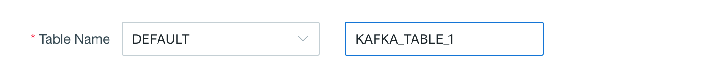

## Import Data from Kafka

This section introduces how to import Kafka data source and define a table from streaming.


### Preparation

Before starting this tutorial, please make sure that you have already prepared a Hadoop environment which has installed version *2.3* or above and *Kafka v2.10-0.10.1.0* or above. In this tutorial, we use Hortonworks HDP 2.4 Sandbox VM as the Hadoop environment.

It is unnecessary to deploy Kafka Broker and Kyligence Enterprise in the same node. 

> **Note:** If Kafka Broker has not been deployed in Kyligence Enterprise node, it is highly recommended that you copy the Kafka binary package with the same version and extract it to any path of Kyligence Enterprise's start node (such as: `/usr/local/kafka_2.10-0.10.1.0`), and set KAFKA_HOME to point to this path, thus ensuring there is a Kafka client library under the directory `KAFKA_HOME/libs`.

In this article, we assume that user has not installed Kafka Broker, and has not deployed and/or started Kafka Broker. The user who has installed Kafka Broker can skip this step.

```sh
curl -s 
https://archive.apache.org/dist/kafka/0.10.1.0/kafka_2.10-0.10.1.0.tgz | tar -xz -C /usr/local/
cd /usr/local/kafka_2.10-0.10.1.0/
./bin/kafka-server-start.sh config/server.properties &
```

Please make sure that the environment variable `KAFKA_HOME` has been exported successfully before Kyligence Enterprise starts.

```sh
export KAFKA_HOME=/usr/local/kafka_2.10-0.10.1.0
```


### Create Sample Kafka Topic and Simulate Streaming Data (Optional)

> **Tips**: 
>
> 1. The step to create Kafka Topic is optional. Users who have Kafka Topic may ignore this step.
>
> 2. The following example assumes that Kafka Broker runs on 127.0.0.1:9092 and ZooKeeper runs on 127.0.0.1:2181. Users may change the IP address to their address accordingly. 

Firstly, we create a topic named as "kylindemo":

```sh
./bin/kafka-topics.sh --create --zookeeper 127.0.0.1:2181 --replication-factor 1 --partitions 3 --topic kylindemo
```

Secondly, we need to start a producer to continuously put sample data into this topic. Kyligence Enterprise has a Producer to produce data. Here we presume Kyligence Enterprise is installed under ${KYLIN_HOME}.

```sh
cd $KYLIN_HOME
./bin/kylin.sh 
org.apache.kylin.source.kafka.util.KafkaSampleProducer --topic kylindemo --broker 127.0.0.1:9092
```

This tool sends 100 records to Kafka per second. Please keep it running during this tutorial. You can check the sample messages by running kafka-console-consumer.sh.

```sh
cd $KAFKA_HOME
bin/kafka-console-consumer.sh --bootstrap-server 127.0.0.1:9092 --topic kylindemo --from-beginning
```


### Define a Table from Streaming

**Step 1:** Please create a new project and select *Kafka* as the data source.


**Step 2:** Input your broker info. Under the field *Host*, please fill in your own IP address which the Jobs run in YARN cluster can access.


**Step 3:** Click √ to confirm your broker info, then click *Get Cluster Info* to select the topic kylindemo. The kafka sample message will appear in the right box after *Convert* button is clicked.


**Step 4:** You need to give a logic table name for this streaming data source. The name will be used for SQL query later. Please enter "KAFKA_TABLE_1" in the **Table Name** field.


**Step 5:** Review the table schema, make sure there is at least one column chosen as *timestamp*.


**Step 6:** Set parser

Parser Name: org.apache.kylin.source.kafka.TimedJsonStreamParser (default), you can also use customized parser.

Parser Timestamp Field: you are required to set a timestamp field for the parser. In this example, we use order_time.

ParserProperties: Properties of the parser should as least include the timestamp field. In this example, tsColName=order_time. You can further define customized properties.

tsColName: refers to the timestamp field.

tsParser: refers to the timestamp parser, which parses the value of tsColName into a timestamp.

> **Note:** tsParser has two built-ins, one is org.apache.kylin.source.kafka.DefaultTimeParser, which parses the long timestamp value (epoc time) into timestamp.
>
> Another built-in parser is org.apache.kylin.source.kafka.DateTimeParser, which parses the time expression of string type into timestamp according to the given tsPattern; if tsPattern is not specified, default format is "yyyy-MM-dd HH:mm:ss.

tsPattern: refers to the time pattern for use by tsParser.


**Step 7:** Click **Submit**. Now, you have defined message flow form Kafka as fact table successfully.
