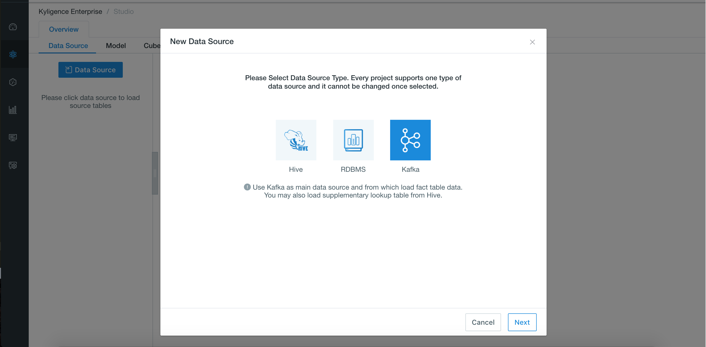

## Import Data from Kafka

This chapter introduces how to import streaming data from Kafka and define a table.

### Prerequisites

Your Kafka version should be **v2.11-0.11.0.1** or above.

### Deploy Kafka Broker for Quick Test

To help quick test, the following steps introduce how to deploy a Kafka broker on the node where Kyligence Enterprise is deployed. If you have installed Kafka cluster already, please skip this section.

> **Note:**
> 
> If Kafka binaries is not deployed on the node where Kyligence Enterprise is deployed, please copy the *same version* of the Kafka binary package from Kafka nodes and extract at any path on the node where Kyligence Enterprise is deployed (e.g. `/usr/local/kafka_2.11-0.11.0.1`) and set `KAFKA_HOME` to that path. Make sure all the jars for Kafka client are in the `$KAFKA_HOME/libs/` directory.


1. Download Kafka installation package and unzip.
   ```sh
   curl -s https://archive.apache.org/dist/kafka/0.11.0.1/kafka_2.11-0.11.0.1.tgz | tar -xz -C /usr/local/
   ```
2. Specify the environment variable `KAFKA_HOME`.

   ```sh
   export KAFKA_HOME=/usr/local/kafka_2.11-0.11.0.1
   ```
3. Start a Kafka broker
   ```sh
   $KAFKA_HOME/bin/kafka-server-start.sh $KAFKA_HOME/config/server.properties &
   ```

### Create Kafka Topic and Generate Data for Quick Test

To help quick test, the following steps introduce how to create a Kafka topic and generate streaming data. If you already have Kafka topics, please this part.

The following example assumes that Kafka broker runs on 127.0.0.1:9092 and ZooKeeper runs on 127.0.0.1:2181. 

1. Create a topic named as **kylin_streaming_topic**:
   ```sh
   $KAFKA_HOME/bin/kafka-topics.sh --create --zookeeper 127.0.0.1:2181 --replication-factor 1 --partitions 3 --topic kylin_streaming_topic
   ```
2. Start a Kafka producer.
   Kyligence Enterprise provides a producer tool to generate streaming data and put it to Kafka topic continuously.
   ```sh
   $KYLIN_HOME/bin/kylin.sh org.apache.kylin.source.kafka.util.KafkaSampleProducer --topic kylin_streaming_topic --broker 127.0.0.1:9092
   ```
   > Note:
   > 1. This producer tool sends 100 records to Kafka per second.
   > 2. Please keep it running during the simulation.
3. Meanwhile you can check the streaming data using Kafka consumer.
   ```sh
   $KAFKA_HOME/bin/kafka-console-consumer.sh --bootstrap-server 127.0.0.1:9092 --topic kylin_streaming_topic --from-beginning
   ```

### Define a Table from Streaming Data

Kyligence Enterprise supports extracting streaming data into tables and implementing near real-time processing (micro-batch) of streaming data.

1. Create a new project in Web UI to import Kafka data.

2. Navigate to **Studio**->**Data Source**, click **Data Source**, and choose **Kafka**, click **Next**.
   
   
3. On the **Load Kafka Topic** page, click **+Cluster** input the Kafka broker info, include the IP address and the port (e.g., `127.0.0.1:9092`). If there are more than one Kafka broker, please separate them by commas, click  √ to check Kafka cluster info. If there are invalid brokers, please remove them and check again. 
   
   
4. Click **Get Cluster Info** to select a Kafka topic (e.g., `kylin_streaming_topic`), and the sample data of Kafka data will be shown in the right panel, click **Convert**.
   
   
5. Define a table name (e.g., `KAFKA_TABLE_1`) for streaming data from that topic, and this table will be used for modeling later.
   
   
6. Confirm column and corresponding column type in the table schema.

  **Caution:**
  
  - Make sure there is a data time column with column type as **timestamp**. It represents the time of a record.
  - Kyligence Enterprise generates 7 time column automatically based on the above data time column, which are **year_start, quarter_start, month_start, week_start, day_start, hour_start, minute_start**. Please make sure **minute_start** is chosen to guarantee the following procedures running smoothly, the other derived time dimensions can be chosen according to your actual needs.
     
  
7. Set parser
   

   - Parser Name: `org.apache.kylin.source.kafka.TimedJsonStreamParser` by default, you can also use customized parser.
   - Timestamp Field: The data time column of the record (e.g., `order_time`). The parser generates 7 time columns based on the timestamp.
   - Optional Properties: To further define customized properties, please specify **tsParser** and **tsPattern** as described in the property format suggested in the input box.
   - Parser properties: To define more properties for the parser
     - tsParser: specifies a timestamp field, which parses the value of `tsColName` into timestamp value. Kyligence Enterprise ships two parsers.
       - The default parser is `org.apache.kylin.source.kafka.DefaultTimeParser`, which parses the Long value (unix time) to timestamp. For example, timestamp1549008564973 will be parsed to 2019-02-01 08:09 when using `tsTimezone=GMT+8`. If `tsTimezone` is not specified, the default value is `GMT+0`.
       - Another parser is `org.apache.kylin.source.kafka.DateTimeParser`, which parses the time expression of String data type into timestamp according to the given tsPattern; if `tsPattern` is not specified, default format is "yyyy-MM-dd HH:mm:ss.
     - tsPattern: specifies the time pattern for the use of tsParser.

8. Click **Submit** and all the steps of importing Kafka tables have been finished.

### Additional Configuration for Kafka Data Source
Kyligence Enterprise provides following entries to set additional Kafka consumer configuration:
* `$KYLIN_HOME/conf/kylin-kafka-consumer.xml`. See example:

  ```xml
  <configuration>
    <property>
        <name>session.timeout.ms</name>
        <value>10000</value>
    </property>
    <property>
        <name>request.timeout.ms</name>
        <value>20000</value>
    </property>
  </configuration>  
  ```
* `$KYLIN_HOME/conf/kylin.properties`:
  Configure with prefix `kylin.source.kafka.config-override.`. It will override property value of Kafka consumer configuration (including `$KYLIN_HOME/conf/kylin-kafka-consumer.xml`). See example:
  
  ```properties
  kylin.source.kafka.config-override.client.id=kyligence
  ```

Full configuration list: https://kafka.apache.org/21/documentation.html#consumerconfigs

