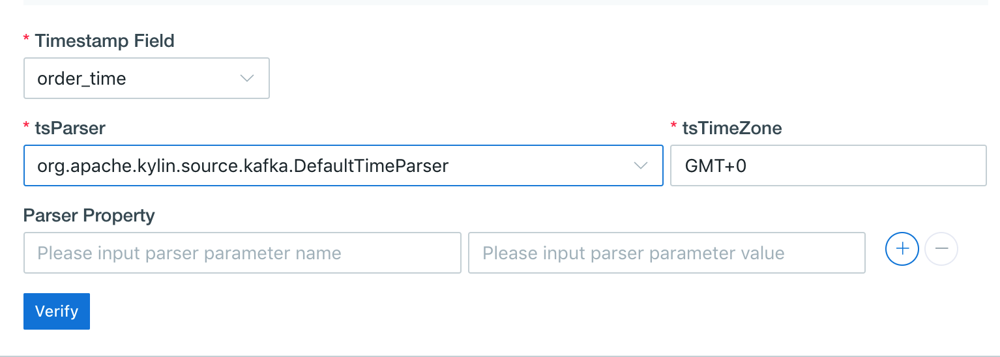

## Import Data from Kafka

This chapter introduces how to import streaming data from Kafka and define a table.

### Prerequisites

Your Kafka version should be **v2.11-0.11.0.1** or above.

### Deploy Kafka Broker for Quick Test

To help quick test, the following steps introduce how to deploy a Kafka broker on the node where Kyligence Enterprise is deployed. If you have installed Kafka cluster already, please skip this section.

> **Note:**
> 
> If Kafka binaries is not deployed on the node where Kyligence Enterprise is deployed, please copy the *same version* of the Kafka binary package from Kafka nodes and extract at any path on the node where Kyligence Enterprise is deployed (for example `/usr/local/kafka_2.11-0.11.0.1`) and set `KAFKA_HOME` to that path. Make sure all the jars for Kafka client are in the `$KAFKA_HOME/libs/` directory.


1. Download Kafka installation package and unzip.
   ```sh
   curl -s https://archive.apache.org/dist/kafka/0.11.0.1/kafka_2.11-0.11.0.1.tgz | tar -xz -C /usr/local/
   ```
2. Specify the environment variable `KAFKA_HOME`.

   ```sh
   export KAFKA_HOME=/usr/local/kafka_2.11-0.11.0.1
   ```
3. Start a Kafka broker
   ```sh
   $KAFKA_HOME/bin/kafka-server-start.sh $KAFKA_HOME/config/server.properties &
   ```

### Create Kafka Topic and Generate Data for Quick Test

To help quick test, the following steps introduce how to create a Kafka topic and generate streaming data. If you already have Kafka topics, please skip this part.

The following example assumes that Kafka broker runs on 127.0.0.1:9092 and ZooKeeper runs on 127.0.0.1:2181. 

1. Create a topic named as **kylin_streaming_topic**:
   ```sh
   $KAFKA_HOME/bin/kafka-topics.sh --create --zookeeper 127.0.0.1:2181 --replication-factor 1 --partitions 3 --topic kylin_streaming_topic
   ```
2. Start a Kafka producer.
   Kyligence Enterprise provides a producer tool to generate streaming data and put it to Kafka topic continuously.
   ```sh
   $KYLIN_HOME/bin/kylin.sh org.apache.kylin.source.kafka.util.KafkaSampleProducer --topic kylin_streaming_topic --broker 127.0.0.1:9092
   ```
   This producer tool sends 100 records to Kafka per second. Please keep it running during the simulation.
3. Meanwhile you can check the streaming data using Kafka consumer.
   ```sh
   $KAFKA_HOME/bin/kafka-console-consumer.sh --bootstrap-server 127.0.0.1:9092 --topic kylin_streaming_topic --from-beginning
   ```

### Define a Table from Streaming Data

Kyligence Enterprise supports extracting streaming data into tables and implementing near real-time processing (micro-batch) of streaming data.

1. Create a new project in Web UI to import Kafka data.

2. Select the project to import Kafka data. Navigate to **Studio**->**Data Source**, click **Data Source**, and choose **Kafka**, click **Next**.
   
   
3. On the **Load Kafka Topic** page, click **+Cluster** input the Kafka broker info, include the IP address and the port (like `127.0.0.1:9092`). If there are more than one Kafka broker, please separate them by commas, click  √ to check Kafka cluster info. If there are invalid brokers, please remove them and check again. 
  
   > **Tips**: The system remembers configured Kafka clusters for later reuse.
   
   
   
4. Click **Get Cluster Information** and select a Kafka topic (like `kylin_streaming_topic`). Then a sample message will be shown in the right panel, click **Convert**.
  
   > **Note**: Only JSON message is supported at the moment. Please ensure there is at least one message in the topic to be shown as sample data.
   
   
   
5. Define a table name for the streaming data, like `KAFKA_TABLE_1`. This table will be used for modeling later.
   

6. Confirm the columns and the column types in the table schema.

  - Make sure there is at least one column of type **timestamp**. It represents the data time of a record.

  - Based on the above timestamp column, the system automatically derives 7 time columns of different granularity, which are **year_start, quarter_start, month_start, week_start, day_start, hour_start, minute_start**. These time columns are mandatory on all Kafka tables for your convenience.

  - The **minute_start** column is critical for later model design and cube design. In models and cubes that use Kafka table as fact table, the **minute_start** will be a mandatory dimension and segment merge will perform along the **minute_start** as time dimension.

     > **Note**: If your Kafka message contains fields of the same names, they will be overwritten by the system derived time columns.
     
     

7. Set the parser
   

   - Parser Name: `org.apache.kylin.source.kafka.TimedJsonStreamParser` by default, you can also use customized implementation to parse the JSON message.
   - Timestamp Field: The data time column of the record (like `order_time`). The parser generates 7 time columns based on the timestamp.
   - Optional Properties: You may specify addition properties to further customize the behavior of the default `TimedJsonStreamParser`.
   - Parser properties: To define more properties for the parser
     - `tsParser`: The timestamp parser. It controls how a `Timestamp` object is created from the above Timestamp Field.
       
       If set to `org.apache.kylin.source.kafka.DefaultTimeParser`, then `Timestamp` object is created by converting from `Long` value, like system milliseconds, to `Timestamp` object. For example, timestamp 1549008564973 will be parsed to 2019-02-01 16:09:24 when using `tsTimezone=GMT+8`. If `tsTimezone` is not specified, the default time zone is `GMT+0`.
       
   
    If set to `org.apache.kylin.source.kafka.DateTimeParser`,  then `Timestamp` object is created by converting from `String` value according to the given `tsPattern`. If `tsPattern` is not specified, the default format is `yyyy-MM-dd HH:mm:ss`.
       
     - `tsPattern`: The string format of timestamp, used by `tsParser`.
     
       
   
8. Click **Submit** and a Kafka table has been imported.

### Additional Configuration for Kafka Data Source

Kyligence Enterprise provides following entries to set additional Kafka consumer configuration:
* `$KYLIN_HOME/conf/kylin-kafka-consumer.xml`. See example:

  ```xml
  <configuration>
    <property>
        <name>session.timeout.ms</name>
        <value>10000</value>
    </property>
    <property>
        <name>request.timeout.ms</name>
        <value>20000</value>
    </property>
  </configuration>  
  ```
* `$KYLIN_HOME/conf/kylin.properties`:
  Configure with prefix `kylin.source.kafka.config-override.`. It will override property value of Kafka consumer configuration (including `$KYLIN_HOME/conf/kylin-kafka-consumer.xml`). See example:
  
  ```properties
  kylin.source.kafka.config-override.client.id=kyligence
  ```

More information about Kafka configuration can be found at https://kafka.apache.org/21/documentation.html#consumerconfigs.

### Notes and Limitations

- In project with Kafka as data source, you can also load Hive tables. However Kafka table must be used as fact table and Hive table must be used as lookup table.
- Kafka table cannot reload at the moment, which will be fixed soon. For now, you can first delete the original Kafka table and then create a new one with the same name.
- Only JSON message is supported at the moment. More formats will be supported in later release.
- When defining table schema, please manually check the column types recommended by the system. In certain cases, they may not be the wanted types. Also, the `Float` type is known to cause query error on streaming data under some special condition. Recommend to use `Double` type whenever possible.
- Since v3.4.1, the product mandates the **minute_start** column be defined as dimension of models and cubes using Kafka table. This is important for auto segment merge to work properly. Old models and cubes without the **minute_start** dimension will be shown as BROKEN.
- Kafka table does not support query pushdown.
- Kafka table and its related model and cube does not support import and export functions, which will be fixed in future release.

