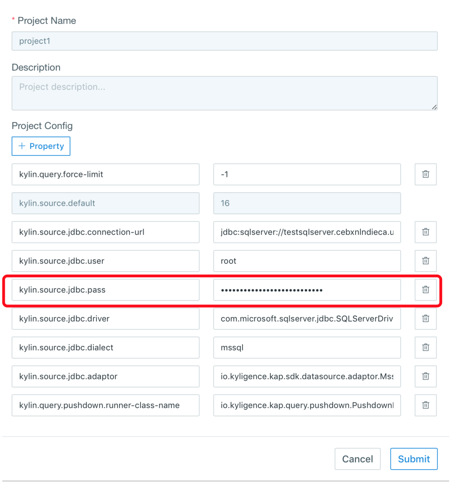
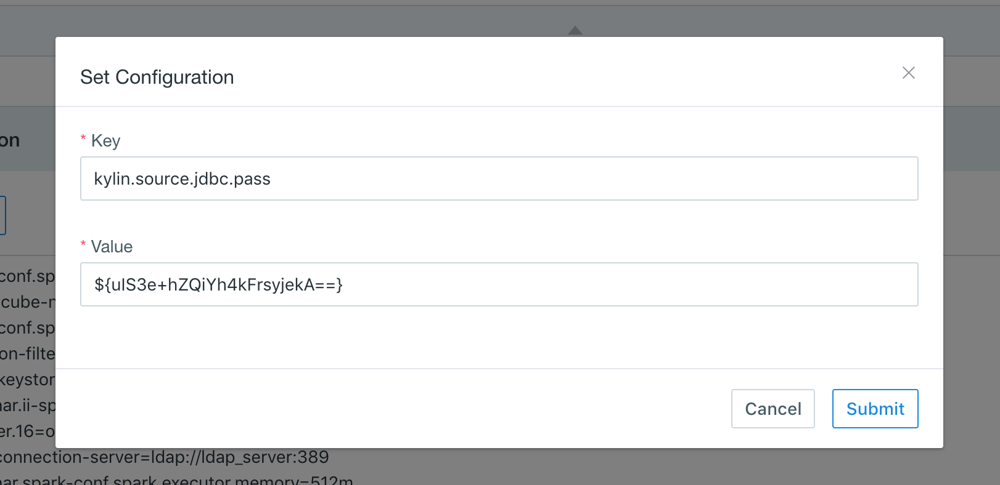

## Import Data from RDBMS


### Hide/Encrypt Database Password

- **In Project Configuration**

In project configuration, your database password configured in `kylin.source.jdbc.pass` is automatically hidden and encrypted, as shown below:



- **In System Configuration**

On the *System* page, you can also configure RDBMS data source at the system level. To protect your database password, we suggest you encrypt it before writing it into the configuration file. Kyligence Enterprise provides an encryption tool to encrypt your database password. The encryption steps are as follows:

**Step 1:** Execute the command below in directory `$KYLIN_HOME/tomcat/webapps/kylin/WEB-INF/lib` to encrypt the password:

```sh
java -classpath kap.jar:spring-beans-4.3.10.RELEASE.jar:spring-core-4.3.10.RELEASE.jar:commons-codec-1.7.jar org.apache.kylin.rest.security.PasswordPlaceholderConfigurer AES yourpassword
```

> **Note:** The encrypted password is in the form of ${xxxxxxxxx}. To prevent the system from identifying your original password as an encrypted password, it is recommended to avoid the format of ${xxxxxxxxx} when setting your database password.


**Step 2:** Configure property `kylin.source.jdbc.pass` on the *System* page with the encrypted password, which will be automatically recognized.


