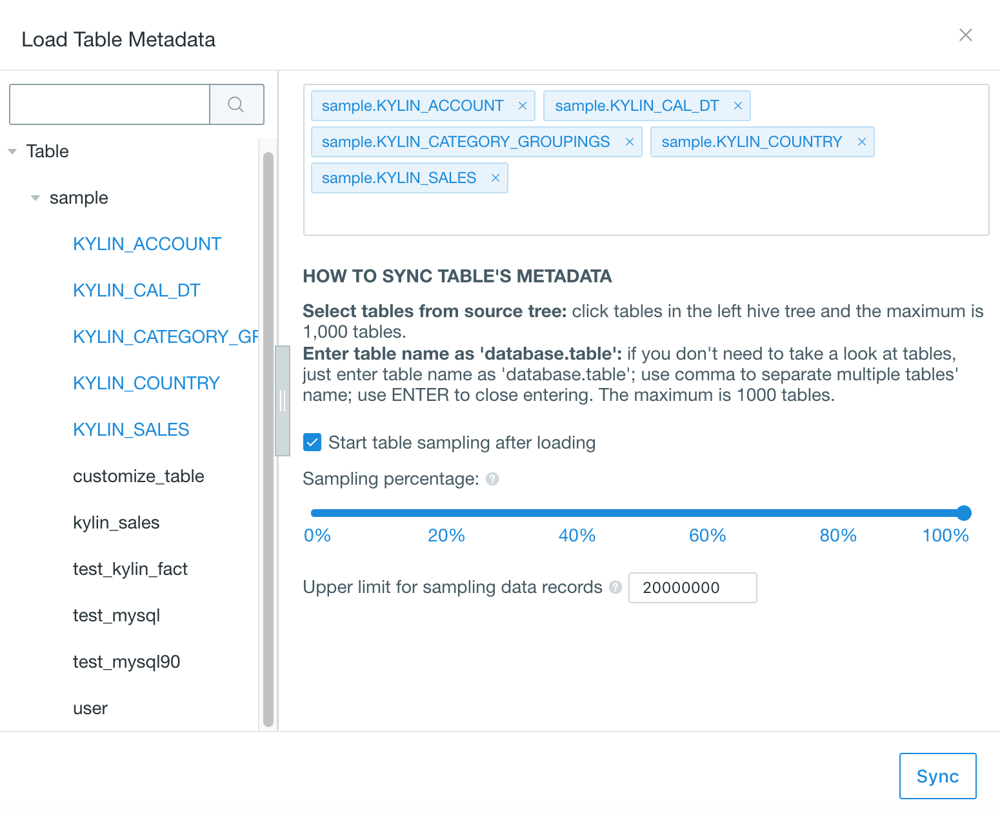

## Import Data from RDBMS

Kyligence Enterprise can connect RDBMS as data source through JDBC API.

> This solution requires customization and is not recommended to use in production environment, please contact Kyligence Service Team if you want to adopt this.

### Environment Prerequisites

In order to connect RDBMS as data source, following requirements are necessary:

- sqoop client installed
- authorized to create files in `<sqoop_installation_dir>\lib` directory

### Preparation

Following steps are required before connecting to RDBMS:

- Download official JDBC Driver for RDBMS, and copy to both `<sqoop_installation_dir>\lib` and `$KYLIN_HOME/ext` directories.
- Download Data Source Adaptor from [Kyligence Download](http://download.kyligence.io/#/addons), and copy to `$KYLIN_HOME/ext` directory.
- Configure `kylin.source.jdbc.sqoop-home=<sqoop_path>` in `kylin.properties` file, where *<sqoop_path>* is the directory where the sqoop command locates.
- Restart Kyligence Enterprise to take effect.

> **Note:**  `kylin.source.jdbc.sqoop-home=<sqoop_path>` must be added in `kylin.properties` file, which cannot be applied in project configuration.

### Connection configuration

You can set the following configurations in *kylin.properties* or *project configuration*:

| Parameter                        | Description                                                  |
| -------------------------------- | ------------------------------------------------------------ |
| kylin.source.jdbc.driver         | JDBC Driver Class Name                                       |
| kylin.source.jdbc.connection-url | JDBC Connection String                                       |
| kylin.source.jdbc.user           | JDBC Connection Username                                     |
| kylin.source.jdbc.pass           | JDBC Connection Password                                     |
| kylin.source.jdbc.dialect        | Dialect to the data source                                   |
| kylin.source.jdbc.adaptor        | Data Source Adaptor class name                               |

To enable query pushdown, following configration is required:

```properties
kylin.query.pushdown.runner-class-name=io.kyligence.kap.query.pushdown.PushdownRunnerSDKImpl
```

#### Password Privacy Protection

In project configuration, your database password configured in `kylin.source.jdbc.pass` is automatically hidden and encrypted, as shown below:


Kyligence Enterprise provides an encryption tool to encrypt your database password, so that you can configure with encrypted words. Run following command in `$KYLIN_HOME/tomcat/webapps/kylin/WEB-INF/lib` directory, you will get the encrypted words. 

```sh
java -classpath kap.jar:spring-beans-4.3.14.RELEASE.jar:spring-core-4.3.14.RELEASE.jar:commons-codec-1.7.jar org.apache.kylin.rest.security.PasswordPlaceholderConfigurer AES yourpassword
```

The encrypted words are in the form like ${xxxxxxxxx}, you can use that to set the value of `kylin.source.jdbc.pass` in configuration.

> **Note:** To prevent the system from identifying your original password as an encrypted words, it is recommended to avoid the format of ${xxxxxxxxx} when setting your database password.


### Create Project with RDBMS Data Source

**Step 1:**：Log in to Kyligence Enterprise Web UI, then add a new project by clicking the `+` at the top right on Web UI. Type project name (required) and descriptions on the pop-up page; click `OK` to finish creating a project.


**Step 2:** Select `Data Source` under *Studio* section of your project. Click the blue `Data Source` button and select RDBMS as data source (as shown below).


**Step 3:** Click `NEXT` and enter the *Load RDBMS Table Metadata* page; you can select tables you want from RDBMS on the left. Keyword search is also supported.

**Step 4:** Click `sync` to load the data. 



> **Note:** Table sampling after loading is enabled by default. Table sampling results will help optimize the model design and cube design. We highly recommend you enable table sampling.

**Step 5**: Once the synchronization is finished, select specific tables and check the details under *Data Source* section.