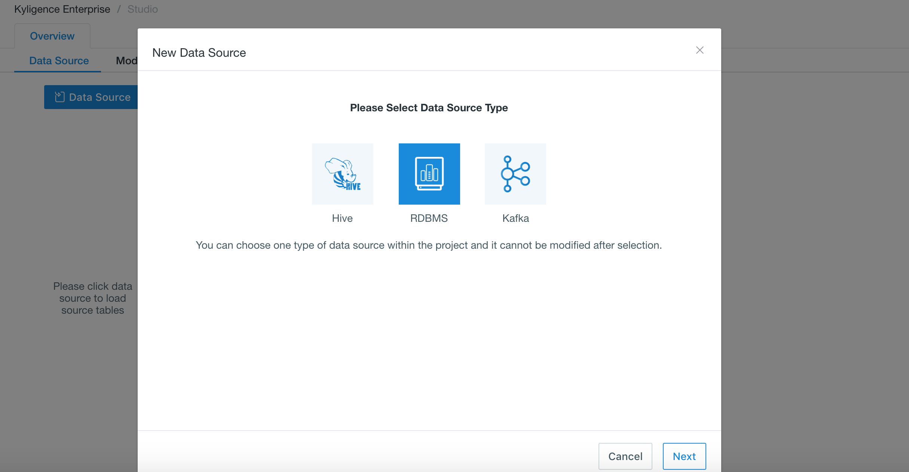

## Import Data from GBase

GBase is supported as data source since Kyligence Enterprise 3.3.0, including version GBase8a and higher versions. To load GBase tables, put GBase driver jar in  `$KYLIN_HOME/ext` and restart Kyligence Enterprise to take effect.  The recommended driver is `gbase-connector-java-8.3.81.51-build-53.6-bin.jar`.

Then please set the following configurations in `kylin.properties` or in *project configuration*:

| Parameter                        | Description                |
| -------------------------------- | :------------------------- |
| kylin.source.jdbc.driver         | JDBC Driver Class Name     |
| kylin.source.jdbc.connection-url | JDBC Connection String     |
| kylin.source.jdbc.user           | JDBC Connection Username   |
| kylin.source.jdbc.pass           | JDBC Connection Password   |
| kylin.source.jdbc.dialect        | Dialect to the data source |
| kylin.source.jdbc.adaptor        | JDBC Data Source Adaptor   |

To enable query pushdown, following configration is required:

```properties
kylin.query.pushdown.runner-class-name=io.kyligence.kap.query.pushdown.PushdownRunnerSDKImpl
```

> **Note:**  `kylin.source.jdbc.sqoop-home=<sqoop_path>` should be added in `kylin.properties` , which cannot be applied in project configuration. Sqoop_path is the path of your sqoop directory. 

### Create Project with GBase Data Source

**Step 1:** Log in to Kyligence Enterprise Web UI, then add a new project by clicking the **+** at the top right on Web UI. Type project name (required) and descriptions on the pop-up page; click **OK** to finish creating a project.


**Step 2:** Select **Data Source** under **Studio** section of your project. Click the blue **Data Source** button and select RDBMS as data source (as shown below).



**Step 3:** Set following configuration in project configuration:

```properties
kylin.source.jdbc.sqoop-home=/usr/hdp/current/sqoop-client
kylin.source.jdbc.driver=org.gjt.mm.gbase.Driver
kylin.source.jdbc.connection-url=jdbc:gbase://<host>:<port>/<database_name>
kylin.source.jdbc.user=<username>
kylin.source.jdbc.pass=<password>
kylin.source.jdbc.dialect=gbase8a
kylin.source.jdbc.adaptor=io.kyligence.kap.sdk.datasource.adaptor.Gbase8aAdaptor
```

**Step 4:** After all configurations above, you can load GBase tables on Web UI now.

**Step 5:** Click **NEXT** and enter the **Load GBase Table Metadata** page; you can select tables you want from the left panel.
