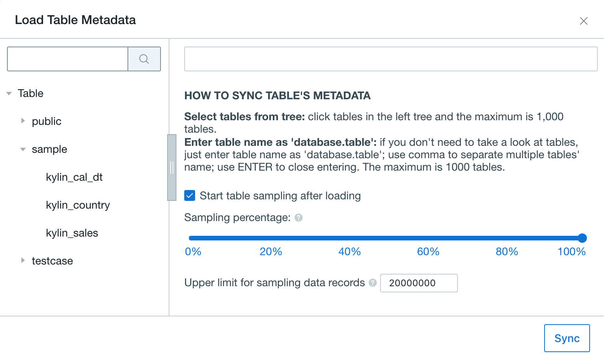

## Import Data from Greenplum

Kyligence Enterprise supports Greenplum as data source since v3.0. Supported Greenplum version is 5.3.0

You can refer to [Import Data from RDBMS](README.md) to configure connection, and this article will introduce specific configuration for Greemplum.

### Drivers

- Use official Greenplum JDBC Driver ([greenplum.jar](https://www.progress.com/jdbc/pivotal-greenplum))
- Use embeded Data Source Adaptor for Greemplum

### Configure Connection

Please refer to [Import Data from RDBMS](README.md) to configure. Following is an example connecting with Greemplum:

```properties
kylin.source.jdbc.driver=com.pivotal.jdbc.GreenplumDriver
kylin.source.jdbc.connection-url=jdbc:pivotal:greenplum://<HOST>:<PORT>;DatabaseName=<DATABASE_NAME>
kylin.source.jdbc.user=<username>
kylin.source.jdbc.pass=<password>
kylin.source.jdbc.dialect=greenplum
kylin.source.jdbc.adaptor=io.kyligence.kap.sdk.datasource.adaptor.GreenplumAdaptor
```

To enable query pushdown, following configration is required:

`kylin.query.pushdown.runner-class-name=io.kyligence.kap.query.pushdown.PushdownRunnerSDKImpl`

> **Note:**  `kylin.source.jdbc.sqoop-home=<sqoop_path>` should be added in `kylin.properties` , which cannot be applied in project configuration. Sqoop_path is the path of your sqoop directory. 

### Create Project

**Step 1:** Log in to Kyligence Enterprise Web UI, then add a new project by clicking the **+** at the top right on Web UI. Type project name (required) and descriptions on the pop-up page; click **OK** to finish creating a project.

**Step 2:** Select the project you just created on the upper corner of the web UI, all our following operations will be within the project.

> **Note:** Choose RDBMS to connect Greenplum as data source.


**Step 3:** Synchronize tables from Greenplum to Kyligence Enterprise.

> **Note:** Schema, table name and field name are case sensitive in Greenplum, only lowercase is supported in current version.



> **Note:** Table sampling after loading is selected by default. Table sampling results will help optimize the model design and cube design. User can also turn it off and adjust the sampling percentage.
