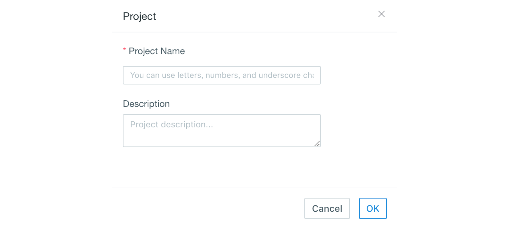
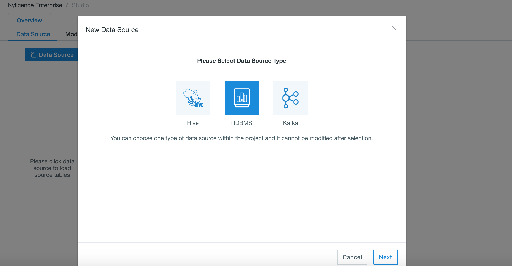
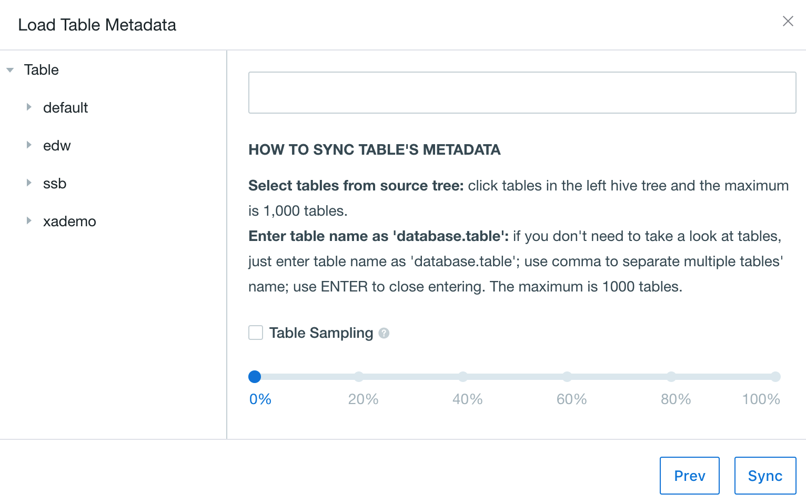
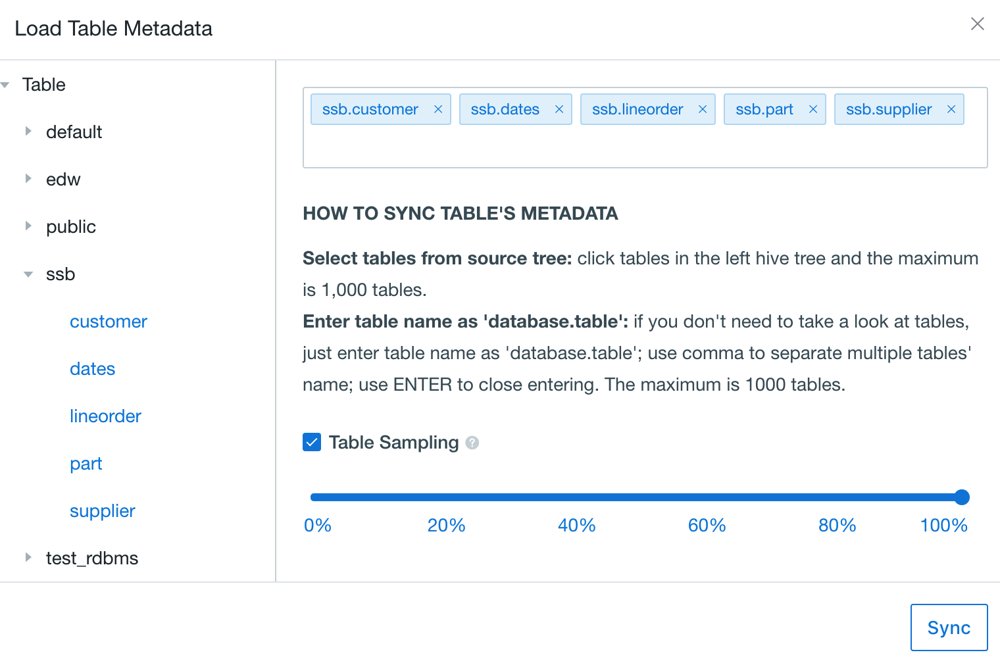

## Import Data from Greenplum

Greenplum is supported as the default data source since Kyligence Enterprise 3.0. In order to load the Greenplum tables, Greenplum Driver Jar package is needed to put in  `$KYLIN_HOME/ext`.  The jar package is also needed to copy to `<sqoop_installation_directory>/lib`, because *sqoop* is used in the process of cube building.

Then, please set the following configurations in *kylin.properties* or *project configuration*:

| Parameter                        | Description                                                  |
| -------------------------------- | ------------------------------------------------------------ |
| kylin.source.jdbc.driver         | JDBC Driver Class Name                                       |
| kylin.source.jdbc.connection-url | JDBC Connection String                                       |
| kylin.source.jdbc.user           | JDBC Connection Username                                     |
| kylin.source.jdbc.pass           | JDBC Connection Password                                     |
| kylin.source.jdbc.dialect        | Dialect to the data source (Currently only support greenplum and default) |
| kylin.source.default             | Type of Data Source (16 for Greenplum and RDBMS)             |
| kylin.source.jdbc.adaptor        | JDBC Data Source Adaptor                                     |

To enable query pushdown, following configration is required:

`kylin.query.pushdown.runner-class-name=io.kyligence.kap.query.pushdown.PushdownRunnerSDKImpl`

> Tips:  `kylin.source.jdbc.sqoop-home=<sqoop_path>` should be added in `kylin.properties` , which cannot be applied in project configuration. Sqoop_path is the path of your sqoop directory. 


### Create Project

Using Greenplum as an example, we connect Greenplum data source with Greenplum Driver, followings are the steps:

**Step 1:** Download Greenplum Driver jar package, and put it under `$KYLIN_HOME/ext` and `<sqoop_installation_directory>/lib`.

**Step 2:** In Kyligence Enterprise, project is the workspace of tables, models and cubes. To create a sample project, open the web UI of Kyligence Enterprise and click the plus icon at the top to create a new project like below.



**Step 3:** Select the project you just created on the upper corner of the web UI, all our following operations will be within the project.

> **Note:** If you want to use Greenplum as the data source, you need to choose RDBMS in the current version.



**Step 4:** Set following configuration in project configuration:

```properties
kylin.source.jdbc.driver=com.pivotal.jdbc.GreenplumDriver
kylin.source.jdbc.connection-url=jdbc:pivotal:greenplum://<HOST>:<PORT>;DatabaseName=<DATABASE_NAME>
kylin.source.jdbc.user=<username>
kylin.source.jdbc.pass=<password>
kylin.query.pushdown.runner-class-name=io.kyligence.kap.query.pushdown.PushdownRunnerSDKImpl
kylin.source.jdbc.dialect=greenplum
kylin.source.default=16
kylin.source.jdbc.sqoop-home=/usr/hdp/current/sqoop-client/bin
```

**Step 5:** After the configuration finished users can access Greenplum data source on Web UI now.


### Synchronize Greenplum Table

Greenplum tables need to be synchronized into Kyligence Enterprise before they can be used. To make things easy, we synchronize by using the following button to load tables.



In the dialog box, expand the ssb schema and select the desired five tables.



After importing, the system will automatically scan the tables to collect basic statistics of the data. Wait a few minutes we can view the details under the "Data Source" tab.
