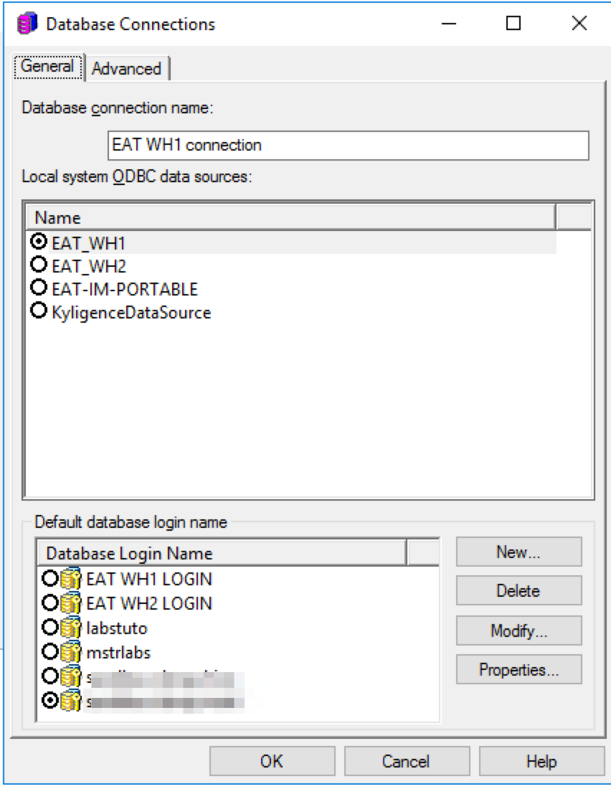

# Install & Configure Kyligence ODBC Driver on Linux

In this section, we will introduce how to install Kyligence ODBC driver (linux version) and configure DSN. 

### Install ODBC Driver

1. Download Kyligence ODBC driver (Linux version) from [Kyligence Account Center](http://account.kyligence.io).

2. Uncompress package

   `tar zxf KyligenceODBC_linux.tar.gz`

   > *Note：please donot uncompress Kyligence ODBC Driver under root folder, otherwise BI servers might not be able to access necessary files because of authoriztaion.*

2. Setup environment param of third-party libs

   `cd ODBC_DRIVER/`
   `source setenv.sh`

4. Check library dependency

   `ldd libKyligenceODBC64.so`
   Expect output shall be:

   ```
   linux-vdso.so.1 =>  (0x00007fff3b5fe000)
   libboost_system.so.1.64.0 => /root/ODBC_DRIVER/ThirdParty/libboost_system.so.1.64.0 (0x00007f0083093000)
   libboost_thread.so.1.64.0 => /root/ODBC_DRIVER/ThirdParty/libboost_thread.so.1.64.0 (0x00007f0082e70000)
   libboost_chrono.so.1.64.0 => /root/ODBC_DRIVER/ThirdParty/libboost_chrono.so.1.64.0 (0x00007f0082c69000)
   libz.so.1 => /lib64/libz.so.1 (0x00007f0082a4b000)
   libcpprest.so.2.9 => /root/ODBC_DRIVER/ThirdParty/libcpprest.so.2.9 (0x00007f0082564000)
   libstdc++.so.6 => /lib64/libstdc++.so.6 (0x00007f008225c000)
   libdl.so.2 => /lib64/libdl.so.2 (0x00007f0082058000)
   libicudata_sb64.so.53 => /root/ODBC_DRIVER/ThirdParty/libicudata_sb64.so.53 (0x00007f00809cf000)
   libicui18n_sb64.so.53 => /root/ODBC_DRIVER/ThirdParty/libicui18n_sb64.so.53 (0x00007f0080578000)
   libicuuc_sb64.so.53 => /root/ODBC_DRIVER/ThirdParty/libicuuc_sb64.so.53 (0x00007f00801e6000)
   libcrypto.so.1.1 => /root/ODBC_DRIVER/ThirdParty/libcrypto.so.1.1 (0x00007f007fd81000)
   libssl.so.1.1 => /root/ODBC_DRIVER/ThirdParty/libssl.so.1.1 (0x00007f007fb15000)
   libm.so.6 => /lib64/libm.so.6 (0x00007f007f813000)
   libgcc_s.so.1 => /lib64/libgcc_s.so.1 (0x00007f007f5fc000)
   libpthread.so.0 => /lib64/libpthread.so.0 (0x00007f007f3e0000)
   libc.so.6 => /lib64/libc.so.6 (0x00007f007f01f000)
   librt.so.1 => /lib64/librt.so.1 (0x00007f007ee16000)
   libboost_random.so.1.64.0 => /root/ODBC_DRIVER/ThirdParty/libboost_random.so.1.64.0 (0x00007f007ec10000)
   libboost_filesystem.so.1.64.0 => /root/ODBC_DRIVER/ThirdParty/libboost_filesystem.so.1.64.0 (0x00007f007e9f6000)
   libboost_atomic.so.1.64.0 => /root/ODBC_DRIVER/ThirdParty/libboost_atomic.so.1.64.0 (0x00007f007e7f4000)
   libboost_date_time.so.1.64.0 => /root/ODBC_DRIVER/ThirdParty/libboost_date_time.so.1.64.0 (0x00007f007e5e3000)
   libboost_regex.so.1.64.0 => /root/ODBC_DRIVER/ThirdParty/libboost_regex.so.1.64.0 (0x00007f007e2ef000)
   libssl.so.10 => /lib64/libssl.so.10 (0x00007f007e082000)
   libcrypto.so.10 => /lib64/libcrypto.so.10 (0x00007f007dc9b000)
   /lib64/ld-linux-x86-64.so.2 (0x00007f0084311000)
   libgssapi_krb5.so.2 => /lib64/libgssapi_krb5.so.2 (0x00007f007da4e000)
   libkrb5.so.3 => /lib64/libkrb5.so.3 (0x00007f007d769000)
   libcom_err.so.2 => /lib64/libcom_err.so.2 (0x00007f007d564000)
   libk5crypto.so.3 => /lib64/libk5crypto.so.3 (0x00007f007d332000)
   libkrb5support.so.0 => /lib64/libkrb5support.so.0 (0x00007f007d123000)
   libkeyutils.so.1 => /lib64/libkeyutils.so.1 (0x00007f007cf1e000)
   libresolv.so.2 => /lib64/libresolv.so.2 (0x00007f007cd04000)
   libselinux.so.1 => /lib64/libselinux.so.1 (0x00007f007cadf000)
   libpcre.so.1 => /lib64/libpcre.so.1 (0x00007f007c87d000)
   liblzma.so.5 => /lib64/liblzma.so.5 (0x00007f007c658000)
   ```

   Bad output, which has "not found" libraries:

   ```
   linux-vdso.so.1 =>  (0x00007ffe92dde000)
   libboost_system.so.1.64.0 => not found
   libboost_thread.so.1.64.0 => not found
   libboost_chrono.so.1.64.0 => not found
   libz.so.1 => /lib64/libz.so.1 (0x00007f36f3ed1000)
   libcpprest.so.2.9 => not found
   libstdc++.so.6 => /lib64/libstdc++.so.6 (0x00007f36f3bc8000)
   libdl.so.2 => /lib64/libdl.so.2 (0x00007f36f39c4000)
   libicudata_sb64.so.53 => not found
   libicui18n_sb64.so.53 => not found
   libicuuc_sb64.so.53 => not found
   libcrypto.so.1.1 => not found
   libssl.so.1.1 => not found
   libm.so.6 => /lib64/libm.so.6 (0x00007f36f36c0000)
   libgcc_s.so.1 => /lib64/libgcc_s.so.1 (0x00007f36f34a9000)
   libpthread.so.0 => /lib64/libpthread.so.0 (0x00007f36f328d000)
   libc.so.6 => /lib64/libc.so.6 (0x00007f36f2ecc000)
   /lib64/ld-linux-x86-64.so.2 (0x00007f36f516a000)
   ```

   ​

### Create DSN (Linux 64bit) using unixODBC

We suggest to use unixODBC(http://www.unixodbc.org/) to manage ODBC connection info.

1. Install unixODBC for Redhat and CentOS

   `sudo yum install unixODBC-devel -y` 

   For Ubuntu, install with below scripts

   `sudo apt-get install unixODBC-devel`

2. Add Kyligence ODBC to config files

   **Driver configuration** – /etc/odbcinst.ini (or /usr/local/etc/odbcinst.ini)

   ```
   [{DriverName}]
   APILevel=1
   ConnectFunctions=YYY
   Description={Description}
   Driver={DriverPath}
   Setup={DriverPath}
   DriverODBCVer=03.80
   SQLLevel=1
   Locale=en-US
   ```

   **DSN configuration** – /etc/odbc.ini (or /usr/local/etc/odbc.ini)

   ```
   [{DSName}]
   Driver = {DriverName}
   PORT = {KapPort}
   PROJECT = {KapProject}
   SERVER = {KapUrl}
   ```

   Sample config: 

   **/etc/odbcinst.ini**

   ```
   [KyligenceODBC]
   APILevel=1
   ConnectFunctions=YYY
   Description=Sample 64-bit Kyligence ODBC Driver
   Driver=/home/kylin/KyligenceODBC/ODBC_DRIVER/libKyligenceODBC64.so
   Setup=/home/kylin/KyligenceODBC/ODBC_DRIVER/libKyligenceODBC64.so
   DriverODBCVer=03.80
   SQLLevel=1
   Locale=en-US
   ```

   **/etc/dobc.ini**

   ```
   [KyligenceDataSource]
   Driver = KyligenceODBC
   PORT = 80
   PROJECT = learn_kylin
   SERVER = http://kapdemo.chinaeast.cloudapp.chinacloudapi.cn
   ```

   > *Note: please ensure DSN info in odbc.ini is consistent with DSN info in BI client tools, otherwise BI reports/applications cannot connect to data source when it's published to BI server.*

3. Test connection with cmd tool "isql DSN [UID '[PWD]']

   `isql KyligenceDataSource ADMIN 'KYLIN'`

4. Send a query to test 

   `SQL> select count(*) from kylin_sales;`
   expect the results

   ```
   +---------------------+
   | EXPR$0              |
   +---------------------+
   | 4957                |
   +---------------------+
   SQLRowCount returns 1
   1 rows fetched
   ```


### Trouble shooting

1. SQL cannot connect       

   a. check the configurations are correct including odbc.ini and odbcinst.ini
   b. make sure execute source setenv.sh

2. (11560) Unable to locate SQLGetPrivateProfileString function.

   This can be solved by following command:   

   `export LD_PRELOAD=/usr/lib/libodbcinst.so`

### Appendix:

#### Create DSN in MicroStrategy Linux Intelligence Server

1. From a Linux console window, browse to HOME_PATH, where HOME_PATH is the MicroStrategy Installation directory.

2. Modify the ODBC.ini file to add new DSN to connect. 

3. To create a new DSN, modify the configuration below with your KAP connection information.

   ```
   [DSN_Name]
   ConnectionType=Direct
   Driver=<ODBC_HOME>/libKyligenceODBC64.so
   PORT=<PORT_NUMBER>
   PROJECT=<PROJECT_NAME>
   SERVER=<SERVER_NAME>
   ```

4. To Map the DSN with ODBC, add below setting on the top of your ODBC.ini file. 

   ```
   [ODBC Data Sources]
   <DSN_Name>=KyligenceODBC
   ```

   For example, you may configure your connection to DSN name "EAT1_WH" as below.

   ```
   [ODBC Data Sources]
   KyligenceDataSource=KyligenceODBC

   [EAT_WH1]
   ConnectionType=Direct
   Driver=/home/kylin/ODBCDriver/libKyligenceODBC64.so
   PORT=57070
   PROJECT=mstr
   SERVER=http://106.75.137.52
   ```

5. After you finished configuring the DSN, it is recommended that you restart your MSTR Intelligence Server so that the new created DSN will be taked into effective in MicroStrategy. 

6. You can then connect to your MicroStrategy Linux I-Server and create a new database instance based on the DSN.

   

