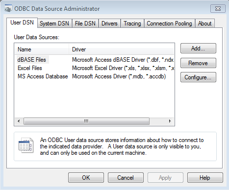
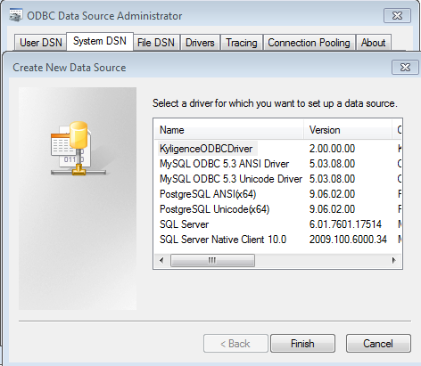
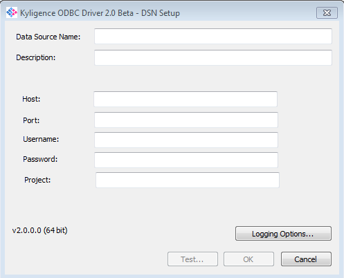
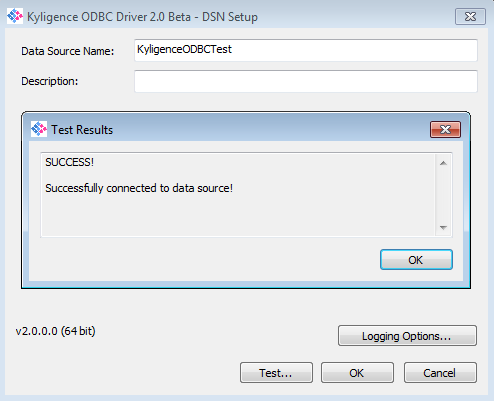

# Install & Configure Kyligence ODBC Driver on Windows

In this section, we will take Windows 7 as an example to introduce how to install Kyligence ODBC driver (windows version) and do follow-up configuration steps. 

## Prerequisites

1. Microsoft Visual C++ 2015

   During the installation of Kyligence ODBC Driver, Microsoft VC++ will be installed first and redistributable is already embedded in the installation package. If Microsoft Visual C++ 2015 is already installed on your machine, this step will be skipped.

2. A running KAP server

   Kyligence ODBC Driver will connect to a KAP server to verify whether the connection works, so make sure the KAP is running properly.

## Installation

1. If you have previously installed Kyligence ODBC driver, please uninstall it first.

2. Apply and [Download](http://account.kyligence.io) Kyligence ODBC driver, and install it.

   For 32-bit application, please install and use kyligence_odbc.x86.exe.

   For 64-bit application, Please install and use kyligence_odbc.x64.exe.

## Configure the DSN

1. Open ODBC Data Source Manager:

   32-bit ODBC driver: click **start -> operation** to open C:\Windows\SysWOW64\odbcad32.exe

   64-bit ODBC driver: select **Control Panel -> Administrative Tools** to open **ODBC Data Source Administrator**

   

2. Switch to **System DSN** tab, click **Add** and select **KyligenceODBCDriver** in the pop-up driver selection box, then click **Finish**.

   


1. In the pop-up window, input the KAP server information, as shown in the figure: 

   

Where, the parameters are described as below: 

- Data Source Name: name of data source
- Host: KAP server address
- Port: KAP server port number
- Username: username to login KAP
- Password: password to login KAP 
- Project: the name of the KAP project to use for the query

1. Click **Test**

   Once it connects to the data source successfully, the following dialog will appear.

   

## ODBC Connection String

Some BI tools support connect data source with ODBC connection string. In that case, you may use below connection string as reference:

```
DRIVER={KyligenceODBCDriver};SERVER=locahost;PORT=7070;PROJECT=learn_kylin
```

Please replace SERVER, PORT and PROJECT with your KAP settings.

## Special Reminder

If you want to use Kyligence ODBC driver to connect to KAP in other client applications, the configuration is similar to this example. For more information, please see [Connect with BI tools](../integration/README.md) chapter of KAP manual.