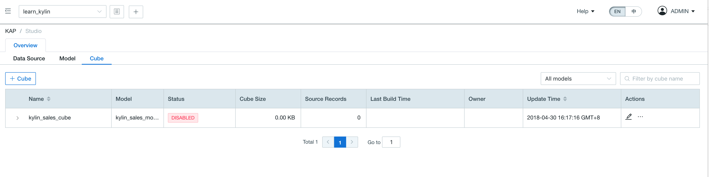
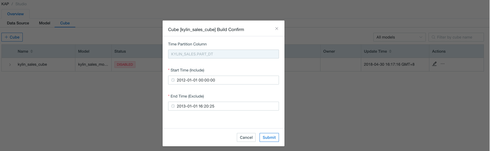
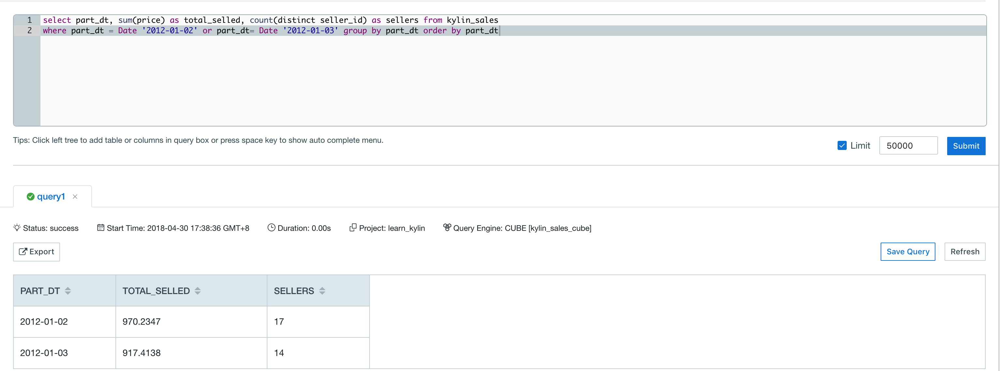

## Install Validation

Kyligence Enterprise provides you with a lightweight set of sample data. You can easily import the corresponding metadata and dataset by running the sample script to verify the correctness of the installation.

### Import Sample Data and Cube

Run the following command to import sample data:

```shell
$KYLIN_HOME/bin/sample.sh
```

The script will create 5 Hive tables and import data into it, then automatically create sample projects, models and Cube definitions.

After running successfully, you will see the following information in the console:

```shell
Sample cube is created successfully in project 'learn_kylin'.
Restart Kylin Server or click Web UI => System Tab => Reload Metadata to take effect
```

### Reload Metadata

Please use the `ADMIN` account to log in to Kyligence Enterprise, enter *System* page, click *Reloaded Metadata*, and load the metadata into the system. After the load is successful, please refresh the browser page. You will see the item named `learn_kylin `in the drop-down list. Click to select the project and enter the next step.

### Build Cube

Enter *Studio* page and click *Cubes*, you will see the sample Cube named `kylin_sales_cube`, as shown in the figure:



Click *Action -> Build*, pick up an end date later than *2012-01-01*, and click *Submit*.



At the *Monitor* page, click *Refresh* to check the build progress, until 100%.


### Execute SQL

When the cube is built successfully, at the *Insight* page, 5 sample hive tables would be shown at the left panel. User could input query statements against these tables. For example: 

```sql
select part_dt, sum(price) as total_selled, count(distinct seller_id) as sellers from kylin_sales

where part_dt = Date '2012-01-02' or part_dt= Date '2012-01-03' group by part_dt order by part_dt
```

The query result will be displayed at the *Insight* page.



You can also use the same SQL statement to query on Hive to verify the result and response speed of the query.
