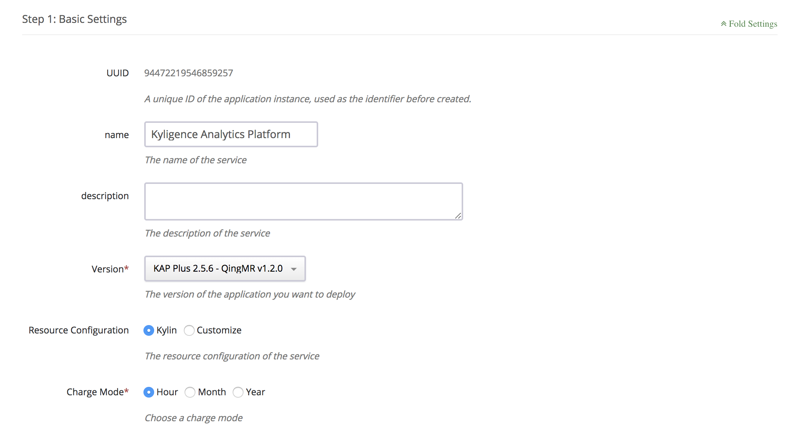
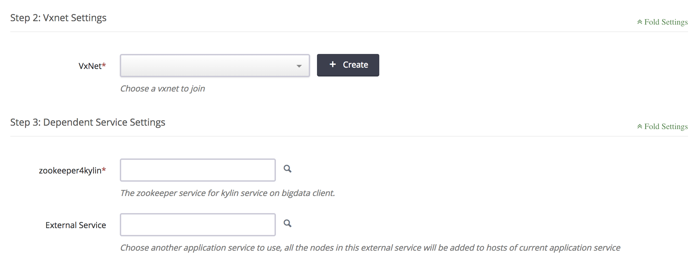

## Deployment on QingCloud AppCenter

### QingCloud AppCenter

QingCloud AppCenter is an enterprise applications delivery platform provided by QingCloud, including a series of applications in big data ecosystem, such as Hadoop, Zookeeper etc, and can reduce the efforts and complexity of development, deployment and maintanence in the cloud.

In QingCloud AppCenter, KAP presents as a standard application, which allows users to provision a new cluster including Hadoop, Hive, KAP in one click. In the meantime, KAP also acts as a part of QingCloud's Hadoop service (QingMR), where users can select to install KAP as an application while deploying the QingMR service.

### Install KAP

#### Install from KAP App

Prerequisite: A ready zookeeper service is required.

1) Go to KAP Application webpage: [Kyligence Enterprise](https://appcenter.qingcloud.com/apps/app-oi15yp53/Kyligence%20Enterprise), and Click "Deploy on QingCloud" button to start provision.

2) Type the basic information, like Resource Configuration, Charge Model etc.



3) Select dependency components, like VxNet and Zookeeper service.



4) Set environment configuration according to performance requirements and cluster size. For more information about the configuration, please refer to: [Recommended Configuration](../../config/recommend_settings.en.md)

5) After agreed "User Agreement", click "Submit" button. You KAP will be there after several minutes.

#### Install from QingMR

Please refer to: [QingCloud Documentation](https://docs.qingcloud.com/product/big_data/QingMR/README.html) (In Chinese)

### **Request Trial License and Login**

On the first time visiting, KAP will ask for a license. If you don’t have a license, you can easily request a free trial license here. Click ”Apply Evaluation License“, fill in your email address, organization name and person name, and then click ”Submit“. It will download a trial license immediately and then you can go ahead. After the trial expires (two months), you can contact Kyligence to purchase a formal license.


The initial administrator username is ”ADMIN“ and the password is ”KYLIN“. Enter it and then click ”Submit“ to login. At the first login, KAP will ask you to update the password to a stronger one. Please remember the new password for future login.

### **Play with Sample Cube**

The installation will create a sample “kylin_sales_cube” (as well as sample tables in Apache Hive) in the “learn_kylin” project. In the left navigation, click ”Studio“ -> ”Cube“ then you will see the sample cube. It is in “DISABLED” status, you need build it before query. Click ”Actions“ -> ”Build“, and then pick an end date like ‘2014-01-01’, KAP will start a build job.


You can monitor the build progress on KAP’s  ”Monitor“ tab; After the build is finished (progress 100%), the Cube status is changed to “Ready”, that means you can query it with ANSI-SQL in the “Insight” page, e.g.:

```
select part_dt, sum(price) as total_selled, count(distinct seller_id) as sellers from kylin_sales group by part_dt order by part_dt;
```

KAP will return results quickly. You can run the same query in to compare the performance.


Now you know how to use KAP to accelerate your data analysis. But writing SQL is still troublesome for most users. You can use KyAnalyzer to analyze the data by drag-and-drop.

### **Use KyAnalyzer for Agile BI**

Log in KyAnalyzer with the same user as KAP, in the ” Console” page, click “Sync Cubes from Kylin”, select the “kylin_sales_cube” to sync. The Cube will be imported to KyAnalyzer.


Click the “New query” to open a new page, click the refresh button beside “Cubes” to see the new loaded model, select “kylin_sales” in the dropdown list. Now you see the measures and dimensions. Click one measure and one dimension, it will query the data and generate a data table.


By clicking the “Chart Mode” icon in the upper right corner, KyAnalyzer will generate diagram based on the table, as below shows. Isn’t it easy?


Congratulations! You have built your first Cube and created the first chart by drag-and-drop. You can also integrate KAP with more visualization tools like Tableau, PowerBI/Excel. For detailed information, please refer to related pages in the chapter of **Integrate with the 3rd party**.

### SSH Login to server

In order to login to KAP server via SSH, a VPN is required. Then access KAP server with internal IP. About how to configure VPN, please refer to: [VPN Configuration](https://docs.qingcloud.com/product/network/vpn) (In Chinese).

