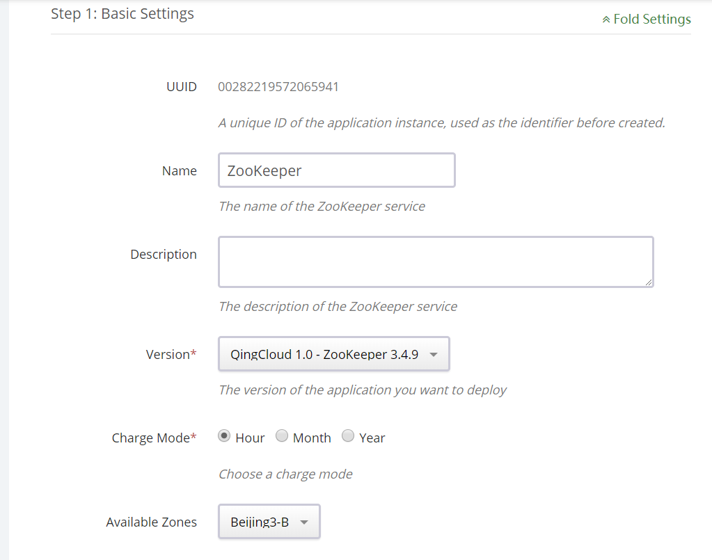
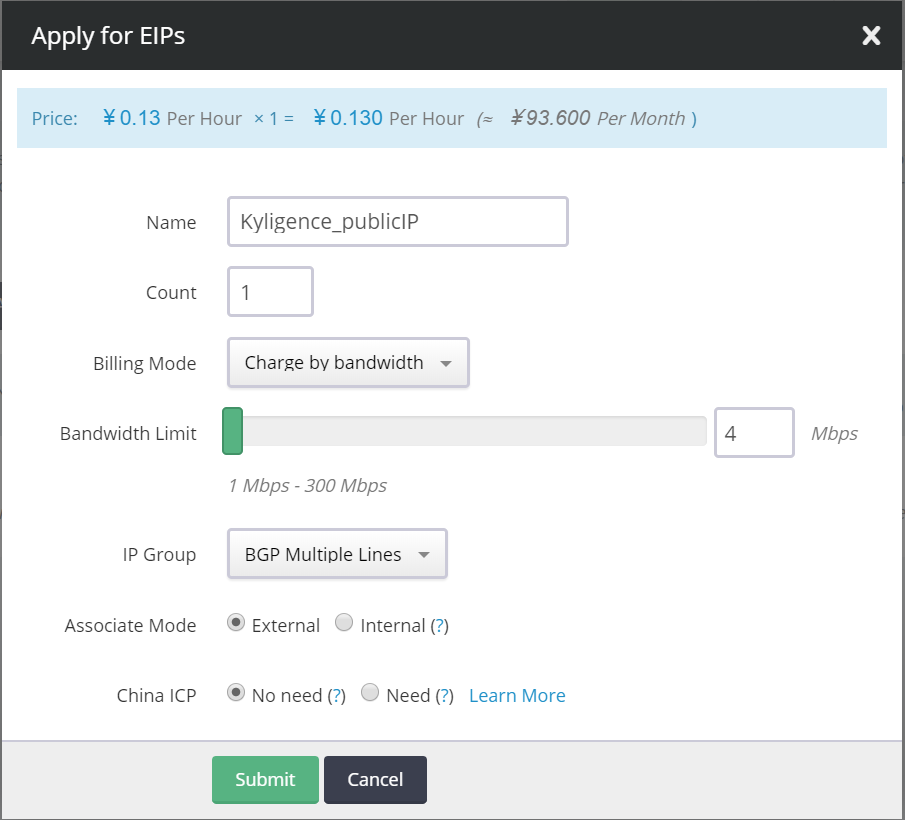
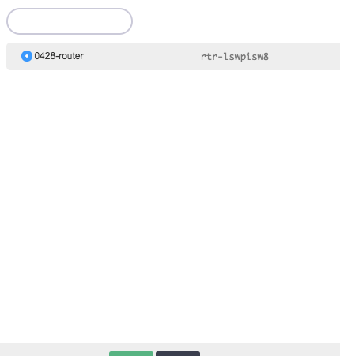
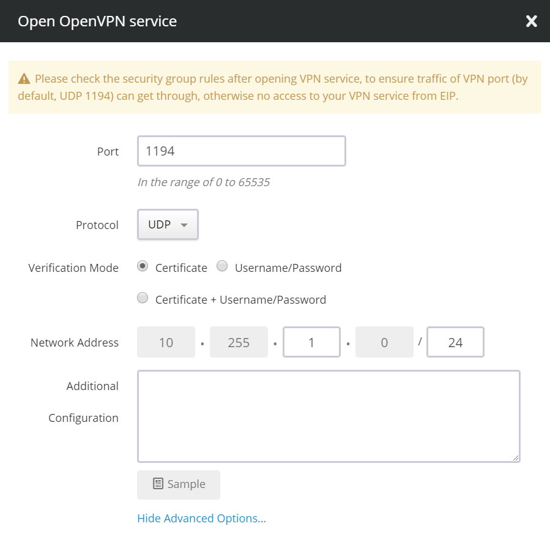
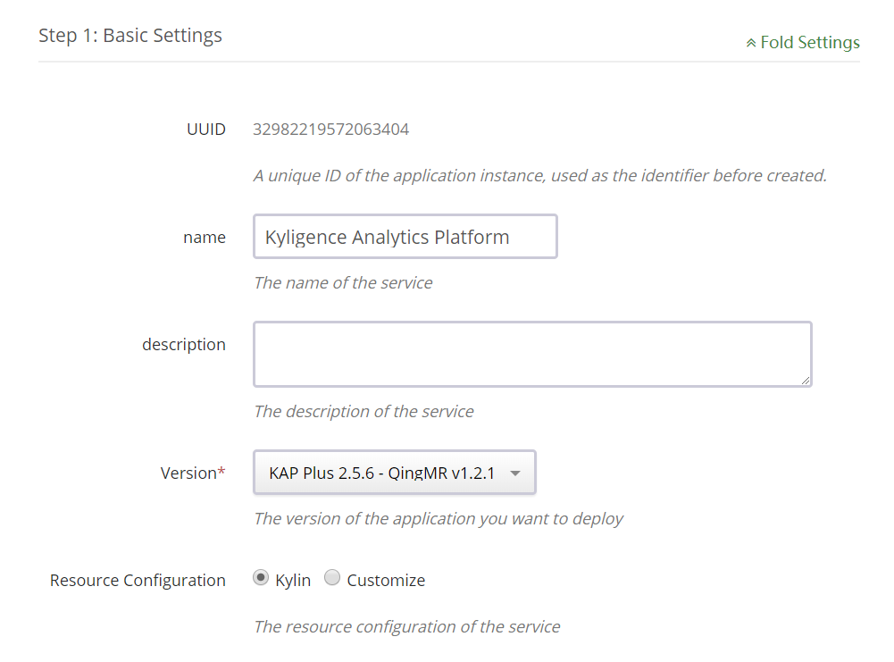
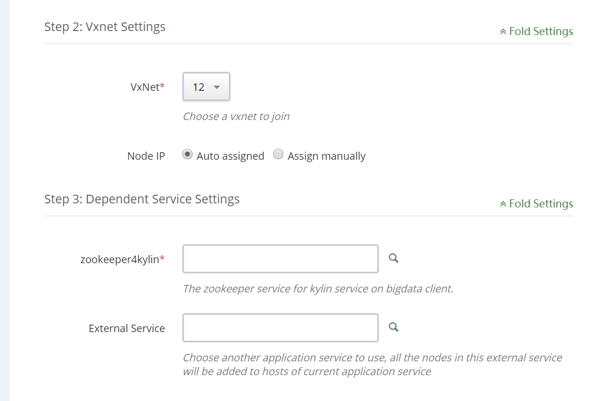

## Deployment on QingCloud AppCenter

### QingCloud AppCenter

QingCloud AppCenter is an enterprise applications delivery platform provided by QingCloud, including a series of applications in big data ecosystem, such as Hadoop, Zookeeper etc, and can reduce the efforts and complexity of development, deployment and maintanence in the cloud.

In QingCloud AppCenter, Kyligence Enterprise presents as a standard application, which allows users to provision a new cluster including Hadoop, Hive, Kyligence Enterprise in one click. In the meantime, Kyligence Enterprise also acts as a part of QingCloud's Hadoop service (QingMR), where users can select to install KAP as an application while deploying the QingMR service.

### Install Kyligence Enterprise

#### Precondition: Zookeeper, network configuration

1) Since Kyligence Enterprise needs to rely on ZooKeeper for cluster state management, it is necessary to deploy ZooKeeper clusters first. If you already have ZooKeeper clusters, this step can be ignored.

2) Create ZooKeeper cluster: select "big data platform" - > "ZooKeeper"



3) Network configuration: when creating Kyligence cluster or ZooKeeper cluster, system prompts to create private network. According to the hint, we can successfully create the routers and private networks needed, and bind the private network to the router.


4) Create a public network IP



After creating the public network IP, you need to bind to the previously created router.



5) Configure VPN, enter "router", select "VPN service", and recommend "Open VPN" service here. For more info, you can refer to [VPN configuration](https://docs.qingcloud.com/product/network/vpn)



6) Configure firewalls: open the 1194 port for OpenVPN services.

7) We recommend using [Tunnelblick](https://tunnelblick.net/) as the client of VPN services.

#### Install Kyligence Enterprise in the application market

1) Open Kyligence Enterprise web UI: [Kyligence Enterprise](https://appcenter.qingcloud.com/apps/app-oi15yp53/Kyligence%20Enterprise), click the "deploy to QingCloud" button on the right.

2) Input basic information, such as resource allocation type, charging mode, etc.



3) Choose the private network and Zookeeper services to rely on.

> You can quickly deploy a Zookeeper service through the Zookeeper application in AppCenter, and then select the created Zookeeper service here.



4) Configure environment parameters according to performance requirements and cluster size. For reference, please refer to the ：[recommend settings](../../config/recommend_settings.en.md)

5) After the user agreement is agreed, click “Submit” button. After a few minutes, your Kyligence Enterprise service is created.

After creating a Kyligence Enterprise service, you can first access the private network created by VPN, and then access the Kyligence Enterprise services through the Kyligence Enterprise server's intranet IP, such as the http://< intranet IP>: 7070/kylin

#### Install from QingMR

Please refer to: [QingCloud Documentation](https://docs.qingcloud.com/product/big_data/QingMR/README.html) (In Chinese)

### **Request Trial License and Login**

On the first time visiting, Kyligence Enterprise will ask for a license. If you don’t have a license, you can easily request a free trial license here. Click ”Apply Evaluation License“, fill in your email address, organization name and person name, and then click ”Submit“. It will download a trial license immediately and then you can go ahead. After the trial expires (two months), you can contact Kyligence to purchase a formal license.


The initial administrator username is ”ADMIN“ and the password is ”KYLIN“. Enter it and then click ”Submit“ to login. At the first login, KAP will ask you to update the password to a stronger one. Please remember the new password for future login.

### **Play with Sample Cube**

The installation will create a sample “kylin_sales_cube” (as well as sample tables in Apache Hive) in the “learn_kylin” project. In the left navigation, click ”Studio“ -> ”Cube“ then you will see the sample cube. It is in “DISABLED” status, you need build it before query. Click ”Actions“ -> ”Build“, and then pick an end date like ‘2014-01-01’, Kyligence Enterprise will start a build job.


You can monitor the build progress on KAP’s  ”Monitor“ tab; After the build is finished (progress 100%), the Cube status is changed to “Ready”, that means you can query it with ANSI-SQL in the “Insight” page, e.g.:

```
select part_dt, sum(price) as total_selled, count(distinct seller_id) as sellers from kylin_sales group by part_dt order by part_dt;
```

Kyligence Enterprise will return results quickly. You can run the same query in to compare the performance.


Now you know how to use Kyligence Enterprise to accelerate your data analysis. But writing SQL is still troublesome for most users. You can use KyAnalyzer to analyze the data by drag-and-drop.

### **Use KyAnalyzer for Agile BI**

Log in KyAnalyzer with the same user as Kyligence Enterprise, in the ” Console” page, click “Sync Cubes from Kylin”, select the “kylin_sales_cube” to sync. The Cube will be imported to KyAnalyzer.


Click the “New query” to open a new page, click the refresh button beside “Cubes” to see the new loaded model, select “kylin_sales” in the dropdown list. Now you see the measures and dimensions. Click one measure and one dimension, it will query the data and generate a data table.


By clicking the “Chart Mode” icon in the upper right corner, KyAnalyzer will generate diagram based on the table, as below shows. Isn’t it easy?


Congratulations! You have built your first Cube and created the first chart by drag-and-drop. You can also integrate Kyligence Enterprise with more visualization tools like Tableau, PowerBI/Excel. For detailed information, please refer to related pages in the chapter of **Integrate with the 3rd party**.

### SSH Login to server

In order to login to Kyligence Enterprise server via SSH, a VPN is required. Then access Kyligence Enterprise server with internal IP. About how to configure VPN, please refer to: [VPN Configuration](https://docs.qingcloud.com/product/network/vpn) (In Chinese).

