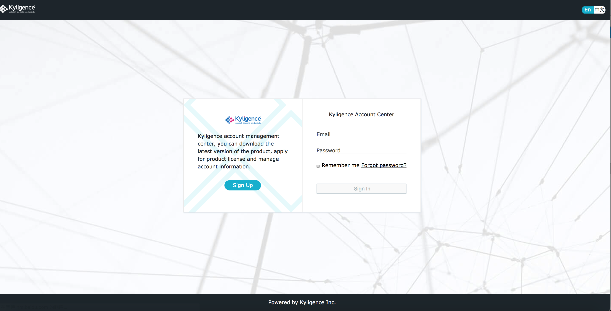
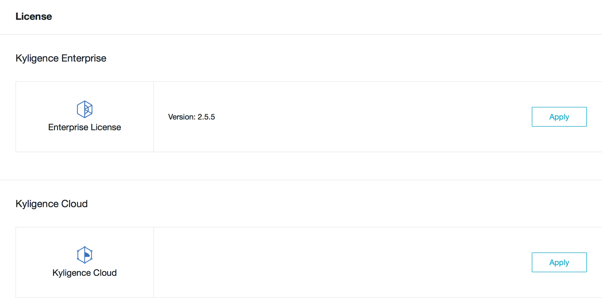
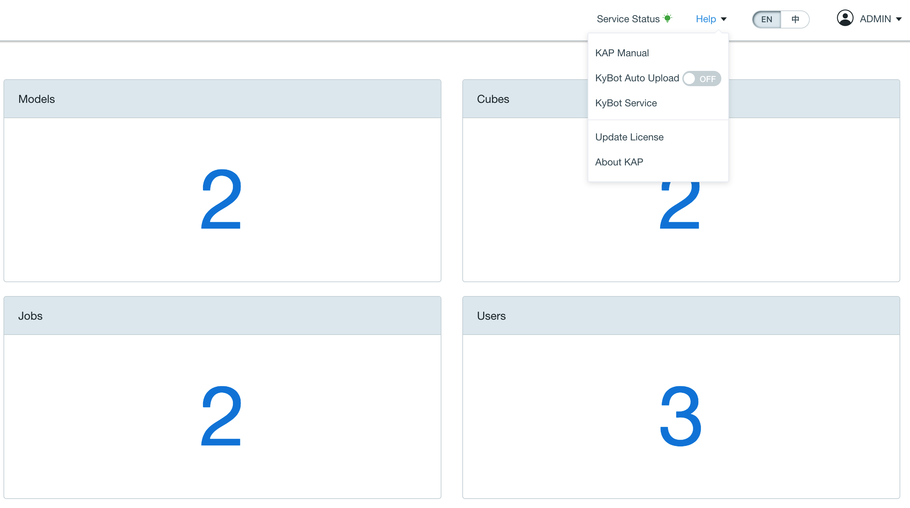
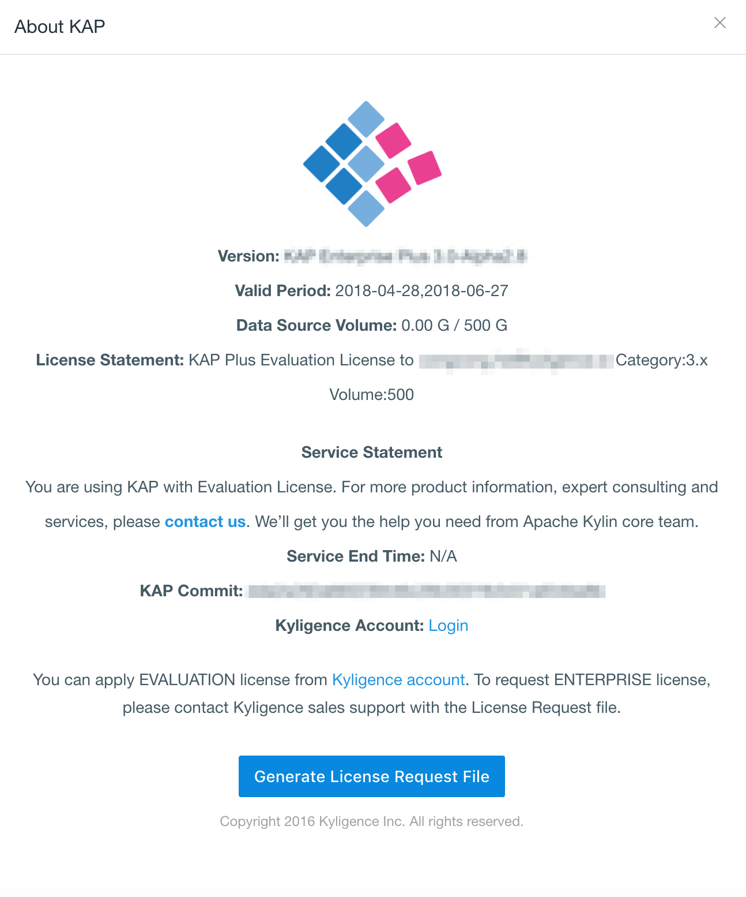
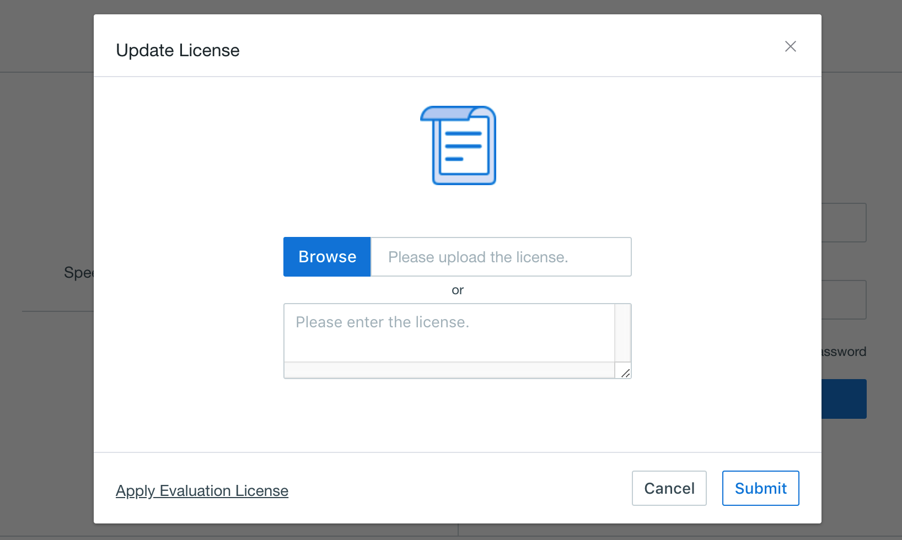

## License Application and Update

License is the precondition to use KAP. After installing and deploying KAP, you need apply for license to use KAP. There are KAP license, KAP Plus license and KyBot license in KAP products. Both KAP license and KAP Plus license include Evaluation License (Evaluation Period for each: Two months) and Official License. KyBot online service includes Basic, Standard and Professional Versions. The Professional Version provides more services and SLA support. The license of KAP and KAP Plus is different, so their application process varies a little. This article will introduce how to apply for KAP license and KAP Plus license.

### Application Process

To apply for KAP license and KAP Plus license, do the following: 

- Use your account to login to [Kyligence Account Center](http://account.kyligence.io/). If you do not have an account, please sign up first. If you already have an account, use you account to login.

- After login, select the license of **KAP Plus** based on your requirement. If you apply for KAP Plus Evaluation License, fill in an application form first. When you are approved to use KAP Plus, you will received a notification email with the license sent by the system. 

- If you want to purchase **Official License** of KAP Plus, you need to provide **License Request File**. Click **Help -> About KAP** in KAP Plus or KAP.   

   And then click **Generate License Request File**. You will get the request file.

### Load and Updatae License File

After receiving the LICENSE file (Evaluation License or Official License) and installing KAP Plus, you need to load the LICENSE file to make KAP Plus effective. To load the file, do the following:

In KAP login page, click **Help -> Upload License**, you will see **Upload License** window. Click **Browse** and locate the place which you save the LICENSE file. And then click **Open -> Submit** to upload it to KAP; you may also copy the content of LICENSE file to this window directly.

In addition, you may copy it to KAP's installation directory to start KAP. 

If you need to update the license, you can use the above methods to update. It should be noted that if you copy the new license in the KAP's install directory to replace, KAP may need to restart.

> Note: You cannot login KAP if the license has expired.
