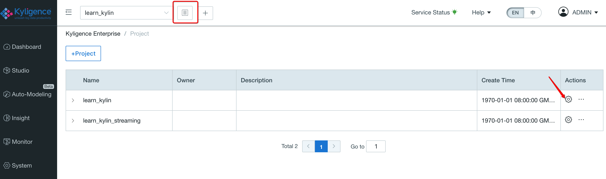
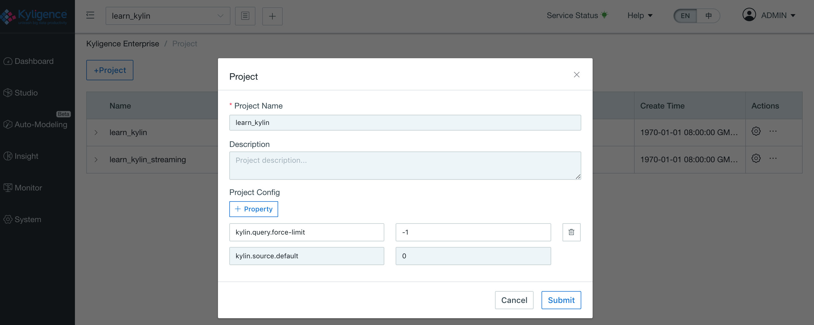
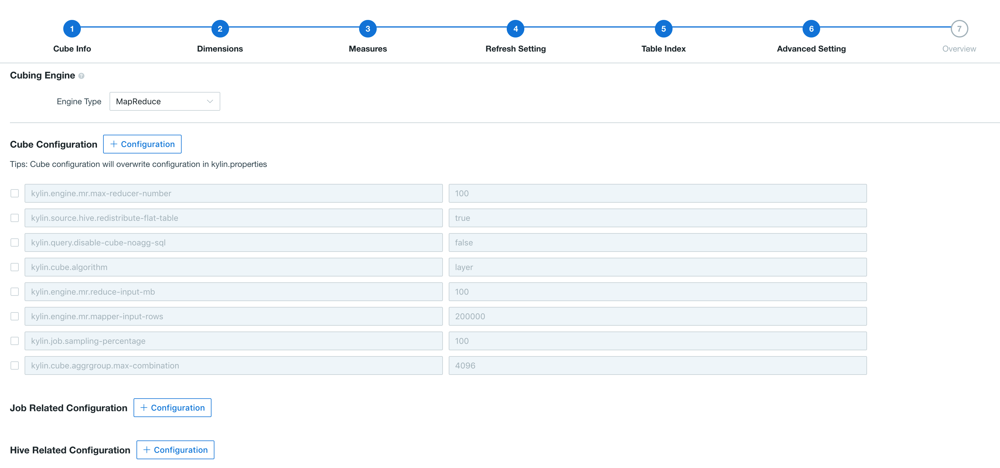
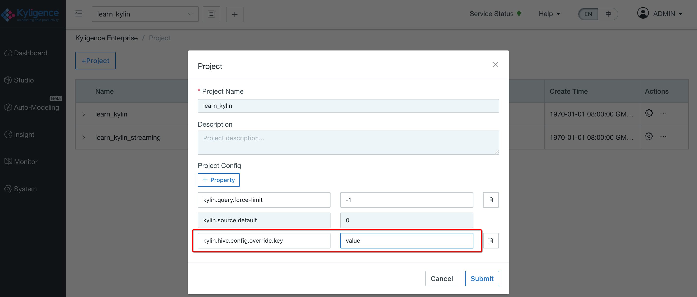
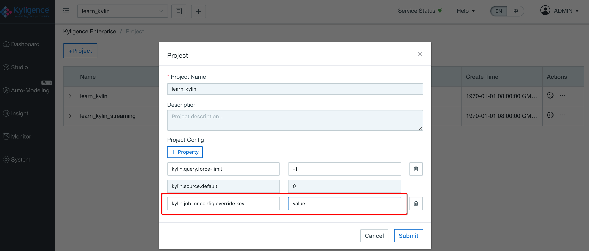

## Configuration Override

Some of the configuration properties in `$KYLIN_HOME/conf` could be overridden through Kyligence Enterprise GUI. Configuration overriding has two scopes: Project level and Cube level. The priority order can be stated as: Cube level configurations > Project level configurations > configuration files.  

Configuration files as below on ``$KYLIN_HOME/conf``:
``kylin.properties``,``kylin_hive_conf.xml``,``kylin_job_conf.xml`` and ``kylin_job_conf_inmem.xml``.

### Project-level Configuration Override

The user could open the edit page for one of the projects on the Project Management Page and add configuration properties which could override property values in configuration files, as the figure below shown:

> Note: The configuration of ``kylin.query.force-limit`` can **only** be overridden at Project level.

### Cube-level Configuration Override

At the `Advanced Setting` phase in cube design, user could rewrite property values to override those in project level and configuration files, as the figure below shown: 

The configuration of kylin.query.disable-cube-noagg-sql can be overridden at Cube level.

### Overriding Properties In kylin.properties

The configurations in ``kylin.properties`` list below can be overridden at Cube level and Project level.

- All parameter start with `kylin.engine.mr.config-override.`, default is empty string;

- `kylin.cube.cuboid-scheduler`, default is org.apache.kylin.cube.cuboid.DefaultCuboidScheduler;

- `kylin.cube.algorithm`, default is auto, other valid values include inmem, layer;

- `kylin.cube.algorithm.layer-or-inmem-threshold`, default is 7;

- `kylin.cube.aggrgroup.is-mandatory-only-valid`, default is false;

- `kylin.engine.mr.reduce-input-mb`, default is 500;

- `kylin.engine.mr.max-reducer-number`, default is 500;

- `kylin.engine.mr.mapper-input-rows`, default is 1000000;

- `kylin.hbase.default.compression.codec`, default is none, other valid values include snappy, lzo, gzip, lz4;

- `kylin.job.sampling-percentage`, default is 100;

- `kylin.snapshot.max-cache-entry`, default is 500;

- `kylin.snapshot.max-mb`, default is 300;

- `kylin.storage.hbase.region-cut-gb`, default is 5.0;

- `kylin.storage.hbase.hfile-size-gb`, default is 2.0;

- `kylin.storage.hbase.min-region-count`, default is 1;

- `kylin.storage.hbase.max-region-count`, default is 500;

- `kylin.storage.partition.max-scan-bytes`, default is 3221225472, i.e. 3G;

- `kylin.cube.aggrgroup.max-combination`, default is 4096;

  > **Note:** **DO NOT** set this parameter over 10000. Otherwise it will consume a lot of CPU and memory resources when calculating the dimension combination, may lead to browser unstable or Kyligence Enterprise Instance crash. If there exist a lot of dimensions in the Cube, it is recommended to set multiple Aggregation Groups (AGG).

- `kylin.source.hive.flat-table-storage-format`, default is SEQUENCEFILE, other valid value is TEXTFILE;

- `kylin.source.hive.flat-table-field-delimiter`, default is ‘ \u001F’, other valid values are ‘\t’, ‘\n’;

  > **Note: Only** when `kylin.source.hive.flat-table-storage-format`=TEXTFILE, the system would apply the configuration  `kylin.source.hive.flat-table-field-delimiter`

- `kylin.snapshot.force-reuse-enabled`，default is `false`，whether to reuse dimension table snapshots;

Configurations only supported at cube level

- `kylin.materialized-view.force-reuse-enabled`, default is `false`. Whether to reuse materialized views when building cube. For view dimension tables, if you choose to store them as snapshots, the build task of cube will first materialize the view and use that materialized view to build the flat table and snapshot. When this parameter is set to true, the materialized view will be stored in the project of current cube and will not be cleaned up as a temporary table after the build task is completed. Cube that has enabled the reuse of materialized views will look for views that have been materialized within the scope of its project and will use them in the build task without rematerialized. The refresh dimension table snapshot function can be used to update the reused materialized view, the function can be seen in [Cube and Segment management](../../model/segment_manage.en.md) or [Segment management API](../../rest/segment_manage_api.en.md). **Do not configure this parameter at the system or project level**, Otherwise, functions such as table sampling will be unavailable.

  > **Note:** Because snapshots of view dimension tables are built using materialized views, when reuse materialized views is enabled, the multiple builds of dimension table snapshots will not change if the reuse dimension table snapshots is not enabled. Therefore, when there are view-dimension tables stored in the form of snapshots, it is recommended to turn on the reuse materialized view and the reuse dimension table snapshot at the same time, and update the materialized view and dimension table snapshot periodically with the refresh dimension table snapshot function.

### Override Hive Properties 

Kyligence Enterprise allows overriding properties in `kylin_hive_conf.xml` through Kyligence Enterprise Web GUI. Replace original values by the following Key-Value format：

**Cube level**:

kylin.hive.config.override.key = value

**Project level**:

kylin.hive.config.override.key = value

### Overriding Build Properties

Kyligence Enterprise allows overriding ``kylin_job_conf.xml`` and ``kylin_job_conf_inmem.xml`` through Kyligence Enterprise Web GUI. Replace original values by the following Key-Value format：

**Cube level**:

kylin.job.mr.config.override.key = value

**Project level**:

kylin.job.mr.config.override.key = value

