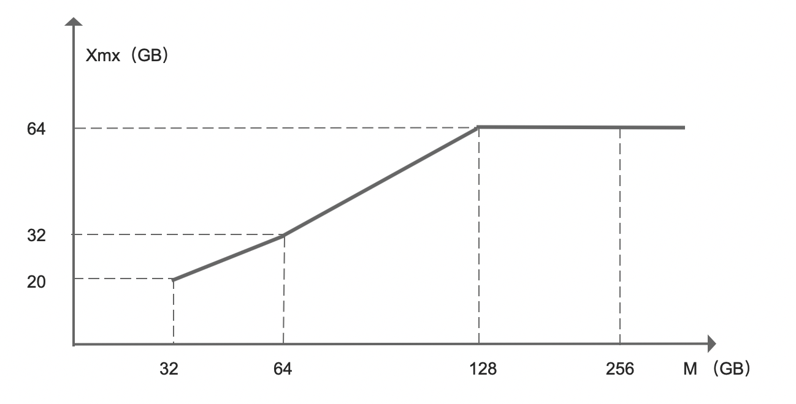

## Basic Configuration

The file **kylin.properties** occupies an important position among all Kyligence Enterprise configurations. This section will give detailed explanations of some common properties in it. 

User could put the customized config items into **kylin.properties.override**, the items in this file will override the default value in **kylin.properties** at runtime. The benefit is easy to upgrade. In the system upgrade, put the **kylin.properties.override** together with new version **kylin.properties**. 

* **kylin.metadata.url**

  Kyligence Enterprise metadata path is specified by this property. The default value is **kylin_metadata** table in HBase while users can customize it to store metadata into any other table. When deploying multiple Kyligence Enterprise instances on a cluster, it's necessary to specify a unique path for each of them to guarantee the isolation among them. For example, the value of this property for Production instance could be `kylin_metadata_prod`, while that for Staging instance could be `kylin_metadata_staging`, so that Production instance wouldn't be interfered by operations on Staging instance. 

* **kylin.env.hdfs-working-dir**

  Working path of Kyligence Enterprise instance on HDFS is specified by this property. The default value is `/kylin` on HDFS, with HTable name in metadata path as the sub-directory. For example, suppose the metadata path is ``kylin_metadata@hbase``, the HDFS default path should be `/kylin/kylin_metadata`. Please make sure the user running Kyligence Enterprise instance has read/write permissions on that directory. 

* **kylin.server.mode**

  Kyligence Enterprise instance running mode is specified by this property. Optional values include `all`, `job` and `query`, among them `all` is the default one. **job** mode means the Kyligence Enterprise instance schedules Cube task only; **query** mode means the instance serves SQL queries only; **all** mode means the instance handles both of them.

* **kap.server.schema-editable**
  
  This parameter specifies whether the metadata in the Kyligence Enterprise instance is editable and defaults to true. When this parameter is set to false, the editing function of metadata and the corresponding REST APIs will be disabled, including: 1. loading table from data source and loading kafka streaming config. 2. creating model, editing model or cloning model. 3. create cube, editing cube or cloning cube. 4. automatic modeling. Load data source table REST API see [data source API](../../rest/data_source_api.en.md), clone model REST API see [model API](../../rest/model_api.en.md), clone cube REST API see [manage cube API](../../rest/cube_api/cube_manage_api.en.md).

* **kylin.source.hive.database-for-flat-table**

  This property specifies which Hive database intermediate tables will locate in. The default value is **default**. If the user running Kyligence Enterprise doesn't have permission to access **default** database, it's adequate to alter the property to use databases with other names. 

* **kylin.storage.hbase.compression-codec**

  The compression algorithm used in HTables created by Kyligence Enterprise is specified by this property. The default value is **none**, which means no compression adopted. Choose appropriate compression algorithm, such as **snappy**, **lzo**, **gzip** or **lz4**, according to support for those algorithms in your situation. 

* **kylin.security.profile**

  Kyligence Enterprise instance security profile is specified by this property. Optional values include **ldap** and **testing**, among them **testing** is the default one which means testing account enabled. You can alter its value to plug into existing enterprise authentication systems, such as **ldap**. For more information, refer to section [Security and Access Control](../../security/README.md). 
  
* **kylin.security.job-list-visible-for-query-enabled**
  
  This property specifies whether query user could see the job list in current project. The default value is *false*, which means only operation user could see the job list in current project. When this property is set to *true* , query user could see the job list in the current project. This configuration can be overridden at **project** level.
  
* **kylin.security.allow-non-admin-generate-job-diag-package**

  This property specifies Kyligence Enterprise's query user could generate job diagnostic package. The default value is *false*. When this property and *kylin.security.job-list-visible-for-query-enabled* set to *true* at the same time, query, operation, and project-admin user could generate job diagnostic package in the current project.

* **kylin.web.timezone**

  Time zone used for Kyligence Enterprise Rest service is specified by this property. The default value is **GMT+8**. You can alter it according to the requirement of your applications. 

* **kylin.source.hive.client**

  Type of hive command line is specified by this property. Option values include  **cli** and **beeline**, among them **cli** is the default one, which means Hive CLI is adopted. You can alter it to **beeline** if Hive beeline is the only supported command line. 

* **kylin.source.hive.beeline-params**

  This configuration is required when **beeline** is set in previous property. For example, if you want to execute SQL with beeline in the way below:

  ```sh
  beeline -n root -u 'jdbc:hive2://localhost:10000' -f abc.sql
  ```

  Please set the value of the property as:

  ```shell
  kylin.source.hive.beeline.params=-n root -u 'jdbc:hive2://localhost:10000'
  ```

* **kylin.query.force-limit**

  Some BI tools always send query like `select * from fact_table`, but the process may stuck if the table size is extremely large. LIMIT clause helps in this case, and setting the value of this property to a positive integer make Kyligence Enterprise append LIMIT clause if there's no one. For instance the value is 1000, query "select \** from fact\_table" will be transformed to "select \** from fact\_table limit 1000". This configuration can be overridden at **project** level.

* **kylin.query.disable-cube-noagg-sql**

  Cube stores the pre-processed data, which is different from original data in most cases. It results in inaccurate answer from Cube if the query has no aggregation function. 
  This configuration is used to address the issue. If it's set to **true**, Cube is forbidden to answer queries that contain no aggregation functions, such as query `select ** from fact_table limit 1000`, Table Index or Query Pushdown will answer the query instead of Cube in this case. This configuration can be overridden at **Cube** level.

* **kylin.query.convert-create-table-to-with (Beta)**

  Some BI software will send Create Table statement to create a permanent or temporary table in the data source. If this setting is set to true, the create table statement in the query will be converted to a with statement, when a later query utilizes the table that the query created in the previous step, the create table statement will be converted into a subquery, which can hit on a Cube if there is one to serve the query. 

* **kap.smart.conf.model.cc.enabled**

  Using SQL statements to generate model, the calculated columns will be needed if SQL statements may contain expressions. If this setting is set to true, Kyligence Enterprise will automatically generate the calculated columns and those calculated columns will be set as dimension.

  > Only these functions are currently supported : SUM({EXPR}), AVG({EXPR}), array[{INDEX}], CASE .. WHEN ..

* **kylin.query.pushdown.cache-enabled**

  This property specifies the function of cache enabled. The default value is true. If this setting is set to false, the function will be closed. 
  
* **kylin.query.pushdown.permissive-enabled**

  This property specifies whether permissive mode is enabled. The default value is false. If this setting is set to true, pushdown engine will execute queries that were parsed failed in Calcite Parser. Also, you can query tables that are not loaded into Kyligence Enterprise.

* **kylin.query.max-result-rows**

  This property specifies the maximum number of rows that a query can return. When multiple limits, such as limit clause, `kylin.query.force-limit` property and JDBC `Statement.setMaxRows()` method, are set along with this property, the smallest value will be selected as the maximum row number for the return data. This property applies on all ways of executing queries, including Web UI, Asynchronous Query, JDBC Driver and ODBC Driver. This configuration can be overridden at **project** level. For this property to take effect, it needs to be a positive integer less than or equal to 2147483647. The default value is 0, meaning no limit on the result.

* **kylin.cube.is-automerge-enabled**

  The auto merge function is enabled by default. If this setting is set to false, the function will be closed. Although the auto merge thresholds were set, the merge job would not be built.

* **kap.job.merge-dict-on-yarn**

  The Merge dictionary job is a memory-consuming job, which may cause OOM in the Kyligence Enterprise process. If this function is enabled, the Merge dictionary step will be executed on YARN and completed using MapReduce job. This function is off by default. If you encounter OOM at Merge dictionary step or the memory is tight, you can set this configuration to true.

* **kap.storage.columnar.start-own-spark**

  This property specifies whether starting the spark query cluster. The default value is true. If this setting is set to false, the function will be closed. In Read/Write Deployment, the property is recommended set as false in job cluster.

* **kap.storage.init-spark-at-starting**

  This property specifies that spark query cluster will be started together when Kyligence Enterprise is started. The default value is true. If this setting is set to false, the function will be closed. 

* **kap.storage.columnar.spark-conf.spark.yarn.queue**

  This property specifies the yarn queue which is used by spark query cluster.

* **kap.storage.columnar.spark-conf.spark.master**

  Spark deployment is normally divided into **Spark on YARN**, **Spark on Mesos**, and **standalone**. We usually use Spark on Yarn as default. This property enables Kyligence Enterprise to use standalone deployment, which could submit jobs to the specific spark-master-url.

* **kylin.source.hive.default-varchar-precision**

  The string datatype is not supported in Kyligence Enterprise. Therefore, the string column will transform into varchar automatically.  This property specifies the maximum length of the transformed filed and the default value is 4096.

* **kylin.metadata.hbase-client-scanner-timeout-period**

  This property specifies the timeout threshold of scanning operation and the default value is 10000 ms.

* **kylin.metadata.hbase-rpc-timeout**

  This property specifies the timeout threshold of rpc operation and the default value is 5000 ms.

* **kylin.metadata.hbase-client-retries-number**

  This property specifies the retry times of HBase and the default value is 1.

* **kylin.job.retry**

  This property specifies the auto retry times for error jobs. Tefault value is 0, which means job will not auto retry when it's in error. This property applies on every steps within a job and it will be reset if that step is finished.

* **kylin.job.retry-interval**

  This property specifies the time interval to retry an error job and the default value is 30000 ms. This property is valid only when the job retry property is set to be 1 or above.

* **kylin.dictionary.shrunken-from-global-enabled**

  This property specifies whether to enable shrunken dictionary. When you use count_distinct(bitmap) on a large cardinality column in your cube, maybe you will find build base cuboid step cannot finished within a reasonable period because it need frequent dictionary cache swap. Shrunken dictionary is an optimization option which help to reduce dictionary cache swap. The default value is `true`.

* **kylin.engine.mr.mapper-input-rows**
  
  While building, in the Redistribute Flat Hive Table step, the flat table is saved as small pieces of equal size, and each small piece contains the number of rows specified by this parameter. This parameter will affect the number of mappers in the next few steps. If the resources are sufficient and the concurrency is not enough, you can reduce this value to add more mappers. The default value is 1000000, which means that each evenly divided block contains one million rows.

* **kylin.engine.mr.reduce-input-mb**  
  
  Before starting the MR Job, the total amount of data received by the reducer is estimated based on the input, and then divided by this parameter to obtain the number of reducers. If there is data skew, that is, a certain Cuboid is particularly large, which causes a special time to be spent in a Reducer during construction, which slows down the overall construction speed, you can adjust this parameter. The parameter indicates how much input data each reducer is responsible for. The default is 500 MB. By reducing the parameter value, the number of Reducers can be increased, and one Reducer is responsible for fewer cuboids / shards.

* **kylin.engine.mr.min-reducer-number** 
  
  Used in conjunction with `kylin.engine.mr.reduce-input-mb`, the minimum number of reducers in M/R jobs, the default value is 1.

* **kylin.engine.mr.max-reducer-number** 

  Used with `kylin.engine.mr.reduce-input-mb`, the maximum number of reducers in M/R jobs, the default value is 500.

* **kylin.engine.mr.uhc-reducer-count** 

  By default, a Reducer is assigned to each column in the Extract Fact Table Distinct Column step. For ultra-high columns, it will cause a bottleneck on a Reducer. This parameter can be used to increase the number of Reducers. A setting of 5 indicates that 5 reducers are allocated for each UHC column. This parameter can be overridden at the cube level.
  
* **kylin.engine.mr.table-ext-col-divisor-for-mapper-enabled** 

  This property specifies whether to take column count as factor when calculating mapper number of table sampling job, the default value is `false`. This configuration can be overridden at **project** level.

* **kylin.engine.mr.table-ext-col-divisor-for-mapper** 

  When `kylin.engine.mr.table-ext-col-divisor-for-mapper-enabled=true`, this property will take effect. It specifies the column divisor for mapper number of table sampling job, default value is `20`. The formula is **wantedMapperCount=`ceil((rowCount/1,000,000,000) * (columnCount/columnDivisor))`**, `rowCount` stands for row number of table, `columnCount` stands for column number of table. Please note that wantedMapperCount may not equal to the actual mapper number of table sampling job. This configuration can be overridden at **project** level.
  
* **kap.metric.diagnosis.graph-writer-type**

  This property specifies whether to write Kyligence Enterprise metrics into InfluxDB. Default value is `BLACK_HOLE`, which means not written. When the value is set to `INFLUX`, metric info will be written to InfluxDB.
  
* **kap.metric.diagnosis.influxDB-database**

  This property specifies database name for saving Kyligence Enterprise metric info in InfluxDB, default value is `KAP_METRIC`.

* **kap.metric.diagnosis.influxDB-address**

  This property specifies InfluxDB address which Kyligence Enterprise connected to.
  
* **kap.metric.diagnosis.influxDB-username**

  This property specifies username of InfluxDB, default value is `root`.
  
* **kap.metric.diagnosis.influxDB-password**

  This property specifies password of InfluxDB, default value is `root`. We support plaintext and encrypted password for this property, empty password is not supported.
  Encryption method: run `$KYLIN_HOME/bin/kylin.sh io.kyligence.kap.tool.general.CryptTool AES your_password` to get encrypted password，we take the encrypted password as `encrypted_pass`, then configure `kap.metric.diagnosis.influxDB-password=${encrypted_pass}`.

* **kylin.engine-yarn.application-name.hive.enabled**

  This property specifies whether to use `host_port` as the suffix of `yarn` application name submitted by the `hive` command. The default value is `false` and this property can only be set at **system** level.

  > When the `Hive` authorization method is `SQLStdAuth`, enabling this property will cause a build error. You need to add `park.app.name|mapredjob.name|hive.session.id` to the parameter `hive.security.authorization.sqlstd.confwhitelist` in hive-site.xml.

### JVM Configuration Setting

In `$KYLIN_HOME/conf/setenv.sh` (for version lower than 2.4, `$KYLIN_HOME/bin/setenv.sh`), two sample settings for `KYLIN_JVM_SETTINGS` environment variable are given. The default setting use relatively less memory. You can comment it and then uncomment the next line to allocate more memory for Kyligence Enterprise. The default configuration is: 

```
export KYLIN_JVM_SETTINGS="-server -Xms1g -Xmx4g -XX:+UseG1GC -XX:MaxGCPauseMillis=200 -XX:G1HeapRegionSize=16m -XX:MetaspaceSize=128m -XX:MaxMetaspaceSize=512m -XX:+PrintFlagsFinal -XX:+PrintReferenceGC -verbose:gc -XX:+PrintGCDetails -XX:+PrintGCTimeStamps -XX:+PrintGCDateStamps -XX:+PrintAdaptiveSizePolicy -XX:+UnlockDiagnosticVMOptions -XX:+G1SummarizeConcMark  -Xloggc:$KYLIN_HOME/logs/kylin.gc.$$  -XX:+UseGCLogFileRotation -XX:NumberOfGCLogFiles=10 -XX:GCLogFileSize=64M"
# export KYLIN_JVM_SETTINGS="-server -XX:+UseG1GC -Xms24g -Xmx24g -XX:MaxGCPauseMillis=200 -XX:G1HeapRegionSize=32m -XX:MetaspaceSize=256m -XX:+PrintFlagsFinal -XX:+PrintReferenceGC -verbose:gc -XX:+PrintGCDetails -XX:+PrintGCTimeStamps -XX:+PrintGCDateStamps -XX:+PrintAdaptiveSizePolicy -XX:+UnlockDiagnosticVMOptions -XX:+G1SummarizeConcMark  -Xloggc:$KYLIN_HOME/logs/kylin.gc.$$  -XX:+UseGCLogFileRotation -XX:NumberOfGCLogFiles=10 -XX:GCLogFileSize=64M"
```

We recommend that the JVM heap memory parameters -Xmx and -Xms using the same configuration in the production environment and adjust them according to the physical memory of the Kyligence Enterprise node.
The calculation rule reference formula is as follows, the horizontal axis (independent variable) is the physical memory of the node, and the vertical axis (dependent variable) is the recommended value of -Xmx, the unit of them is GB:




**Note:**  Generally, we strongly recommend that the physical memory of Kyligence Enterprise nodes is not less than 64GB. In some special cases evaluated by experts, the actual physical memory may be less than this value, so this type of calculation is also included in the calculation rules. At the same time, due to differences in the actual operating environment of the application, Kyligence experts may give more targeted adjustment suggestions. In this case, expert suggestions are preferred.

### Enable Email Notification

Kyligence Enterprise can send email notification on job complete/fail. To enable this, edit `conf/kylin.properties`, set the following parameters: 

```properties
kylin.job.notification-enabled=true|false
kylin.job.notification-mail-enable-starttls=true|false
kylin.job.notification-mail-host=your-smtp-server
kylin.job.notification-mail-port=your-smtp-port
kylin.job.notification-mail-username=your-smtp-account
kylin.job.notification-mail-password=your-smtp-pwd
kylin.job.notification-mail-sender=your-sender-address
kylin.job.notification-admin-emails=administrator-address
```

Restart Kyligence Enterprise server to take effective. 

One example:

```properties
kylin.job.notification-enabled=true
kylin.job.notification-mail-enable-starttls=true
kylin.job.notification-mail-host=smtp.office365.com
kylin.job.notification-mail-port=587
kylin.job.notification-mail-username=kylin@example.com
kylin.job.notification-mail-password=mypassword
kylin.job.notification-mail-sender=kylin@example.com
```

To disable, set `kylin.job.notification-enabled` back to `false`.

Administrator will get notifications for all jobs. Modeler and Analyst need entering email address into the `Notification List` at the first page of Cube wizard, and then will get notifications for that Cube.

*  Notes for Kyligence Enterprise Warm Start after Config Parameters Modified

The parameters defined in kylin.properties (global) will be loaded by default when Kyligence Enterprise is started. Once being modified, they will not take effect until Kyligence Enterprise is restarted.

For the parameters of Hive and MapReduce, when the modifications are defined in kylin_hive_conf.xml, kylin_job_conf.xml and kylin_job_conf_inmem.xml, Kyligence Enterprise needs not to be restarted, but the build Job shall be resubmitted. Each time the build Job is submitted to Yarn, the modified parameters will be read in real time. Please note that the configuration items will override the default parameters (such as hive-stie.xml and mapred-site.xml) in Hadoop cluster and can also be overwritten by Project and Cube configuration overriding.

### Recommended Configurations for Production

The configuration files of Kyligence Enterprise include: 

- *kylin.properties*, the major configuration file of the system; 

- *kylin_hive_conf.xml*, applies to Hive jobs launched by the system; 

- *kylin_job_conf.xml*, applies to MapReduce jobs launched by the system; 

- *kylin_job_conf_inmem.xml*, applies to the special MapReduce jobs that have high demand of memory.

The following recommended configurations are classified according to the size of the cluster, system performance could be influenced by other external system parameters. Here our recommending configurations are based on experience.

*Sandbox* refers the testing environment for single machine sandbox virtual machine, dual core, 10 GB internal storage, 10 GB hard disk.

*Prod* represents recommended configuration for the production environment, usually, the Hadoop cluster consisting of at least 5 nodes, single machine 32 core, 128 GB internal storage, 20 TB hard disk.

> Tip: The product ships with sample configurations for *Sandbox* and *Prod* profiles. *Sandbox* is used as default profile and can be switched by rebuild soft link:
>
> ```bash
> cd $KYLIN_HOME/conf
> 
> # Use sandbox(min) profile
> ln -sfn profile_min profile
> 
> # Or use production(prod) profile
> ln -sfn profile_prod profile
> ```


**kylin.properties**

| Properties Name                                  | Sandbox    | Prod       |
| ------------------------------------------------ | ---------- | ---------- |
| kylin.job.max-concurrent-jobs                    | 10         | 20         |
| kylin.job.sampling-percentage                    | 100        | 100        |
| kylin.engine.mr.yarn-check-interval-seconds      | 10         | 10         |
| kylin.engine.mr.reduce-input-mb                  | 100        | 500        |
| kylin.engine.mr.max-reducer-number               | 100        | 500        |
| kylin.engine.mr.mapper-input-rows                | 200000     | 1000000    |
| kylin.cube.algorithm                             | auto       | auto       |
| kylin.cube.algorithm.layer-or-inmem-threshold    | 8          | 8          |
| kylin.cube.aggrgroup.max-combination             | 4096       | 4096       |
| kylin.dictionary.max.cardinality                 | 5000000    | 5000000    |
| kylin.snapshot.max-mb                            | 300        | 300        |
| kylin.query.scan-threshold                       | 10000000   | 10000000   |
| kylin.query.memory-budget-bytes                  | 3221225472 | 3221225472 |
| kylin.query.derived-filter-translation-threshold | 100        | 100        |

| Properties Name                                          | Sandbox | Prod  |
| -------------------------------------------------------- | ------- | ----- |
| kap.storage.columnar.spark-conf.spark.driver.memory      | 512m    | 8192m |
| kap.storage.columnar.spark-conf.spark.executor.memory    | 512m    | 4096m |
| kap.storage.columnar.spark-conf.spark.yarn.am.memory     | 512m    | 4096m |
| kap.storage.columnar.spark-conf.spark.executor.cores     | 1       | 5     |
| kap.storage.columnar.spark-conf.spark.executor.instances | 1       | 4     |
| kap.storage.columnar.page-compression                    | N/A     | N/A   |
| kap.storage.columnar.ii-spill-threshold-mb               | 128     | 512   |


**kylin_hive_conf.xml**

| Properties Name                                  | Sandbox   | Prod                                      |
| ------------------------------------------------ | --------- | ----------------------------------------- |
| dfs.replication                                  | 2         | 2                                         |
| hive.exec.compress.output                        | true      | true                                      |
| hive.auto.convert.join.noconditionaltask         | true      | true                                      |
| hive.auto.convert.join.noconditionaltask.size    | 100000000 | 100000000                                 |
| mapreduce.map.output.compress.codec              | N/A       | org.apache.hadoop.io.compress.SnappyCodec |
| mapreduce.output.fileoutputformat.compress.codec | N/A       | org.apache.hadoop.io.compress.SnappyCodec |
| mapreduce.output.fileoutputformat.compress.type  | BLOCK     | BLOCK                                     |
| mapreduce.job.split.metainfo.maxsize             | -1        | -1                                        |


**kylin_job_conf.xml**

| Properties Name                                  | Sandbox | Prod                                      |
| ------------------------------------------------ | ------- | ----------------------------------------- |
| mapreduce.job.split.metainfo.maxsize             | -1      | -1                                        |
| mapreduce.map.output.compress                    | true    | true                                      |
| mapreduce.map.output.compress.codec              | N/A     | org.apache.hadoop.io.compress.SnappyCodec |
| mapreduce.output.fileoutputformat.compress       | true    | true                                      |
| mapreduce.output.fileoutputformat.compress.codec | N/A     | org.apache.hadoop.io.compress.SnappyCodec |
| mapreduce.output.fileoutputformat.compress.type  | BLOCK   | BLOCK                                     |
| mapreduce.job.max.split.locations                | 2000    | 2000                                      |
| dfs.replication                                  | 2       | 2                                         |
| mapreduce.task.timeout                           | 3600000 | 3600000                                   |


**kylin_job_conf_inmem.xml**

| Properties Name                                  | Sandbox  | Prod                                      |
| ------------------------------------------------ | -------- | ----------------------------------------- |
| mapreduce.job.split.metainfo.maxsize             | -1       | -1                                        |
| mapreduce.map.output.compress                    | true     | true                                      |
| mapreduce.map.output.compress.codec              | N/A      | org.apache.hadoop.io.compress.SnappyCodec |
| mapreduce.output.fileoutputformat.compress       | true     | true                                      |
| mapreduce.output.fileoutputformat.compress.codec | N/A      | org.apache.hadoop.io.compress.SnappyCodec |
| mapreduce.output.fileoutputformat.compress.type  | BLOCK    | BLOCK                                     |
| mapreduce.job.max.split.locations                | 2000     | 2000                                      |
| dfs.replication                                  | 2        | 2                                         |
| mapreduce.task.timeout                           | 7200000  | 7200000                                   |
| mapreduce.map.memory.mb                          | 1024     | 4096                                      |
| mapreduce.map.java.opts                          | -Xmx700m | -Xmx3700m                                 |
| mapreduce.task.io.sort.mb                        | 100      | 200                                       |
