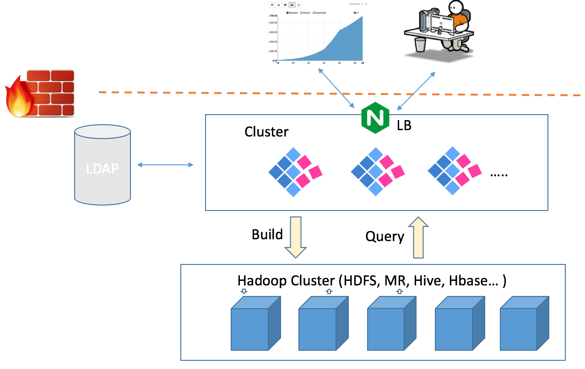

## Cluster (Load Balance) Deployment
Kyligence Enterprise instance is stateless as all state information is stored in HBase or JDBC database. So running Kyligence Enterprise on multiple node in a cluster is a good practice for better load balance and higher availability.



### Kyligence Enterprise Instance Configuration

To organize multiple Kyligence Enterprise nodes in a cluster, please make sure these nodes share the same Hadoop cluster and HBase cluster. Then follow the steps:

1. In the configuration files `$KYLIN_HOME/conf/kylin.properties` of each Kyligence Enterprise node, keep all nodes' `kylin.metadata.url` are same. Make sure all Kyligence Enterprise nodes use the same HBase Metastore;

   > If to turn on high availability on job engine, please refer to  [Configuration](adv_install_ha.en.md).

  

### Load Balance Configuration

A Load Balancer, such as Apache HTTP Server and Nginx Server, is required to distribute requests in cluster. User sends requests to Load Balancer, then Load Balancer redirects requests to nodes according to some strategy. If the node handling the request fails, Load Balancer will retry to send the request to other node. Users who need to submit query requests can access Kyligence Enterprise through the address of Load Balancer. A good practice in this case is integrating LDAP in user and role management.

For example, in Nginx we can simply create a configuration file for Kyligence Enterprise site(eg. kylin.conf) with following content:

```shell
upstream kylin {
    server 1.1.1.1:7070; #Kylin Server 1
    server 1.1.1.2:7070; # Kylin Server 2
}
server {
    listen       8080;
    location / {
        proxy_pass http://kylin;
    }
}
```

By default, Nginx dispatches the requests to instances one by one. If one Kyligence Enterprise instance crashed, Nginx will remove it automatically. In this case, requests from one client may reach different instances, where user sessions are not shared by all instances. As a result, some requests will fail due to unauthentication. 

Simply using ip_hash in Nginx can save this, by dispatch requests to a Kyligence Enterprise instance according to client's IP address.

By the other side, ip_hash will bring workload imbalances to Kyligence Enterprise servers, especially when few servers visit Kyligence Enterprise frequently, resulting in most requests send to few Kyligence Enterprise severs. To solve this, we can save user sessions to Redis cluster(or MySQL, MemCache), to share sessions among all Kyligence Enterprise instances. Simply updating tomcat configuration files will make this work:

1. Execute the following command to download Redis Jar, and put in `$KYLIN_HOME/tomcat/lib`

   ```sh
   wget http://central.maven.org/maven2/redis/clients/jedis/2.0.0/jedis-2.0.0.jar
   wget http://central.maven.org/maven2/org/apache/commons/commons-pool2/2.2/commons-pool2-2.2.jar
   wget https://github.com/downloads/jcoleman/tomcat-redis-session-manager/tomcat-redis-session-manager-1.2-tomcat-7-java-7.jar
   ```
2. Edit `$KYLIN_HOME/tomcat/conf/context.xml`, and add these items:
   ```xml
   <Valve className="com.radiadesign.catalina.session.RedisSessionHandlerValve" />
   <Manager className="com.radiadesign.catalina.session.RedisSessionManager" host="localhost" port="6379" database="0" maxInactiveInterval="60"/>
   ```
   Host and port point to the address of the Redis cluster.
