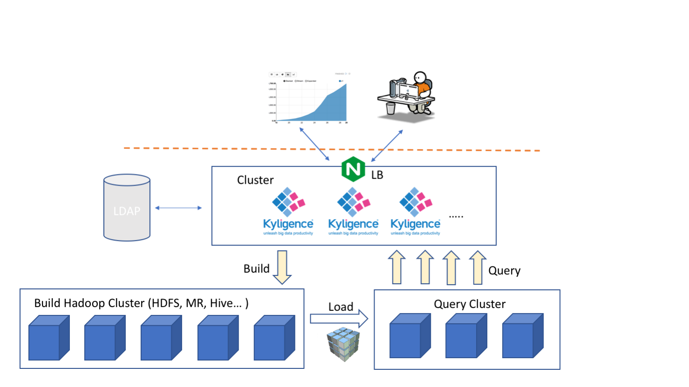

## Read/Write Separation Deployment

To achieve stable query performance, it is critical that exclusive resource is allocated for Kyligence Enterprise. The read/write separation deployment is designed for such resource isolation.

The read/write separation deployment requires two separate Hadoop clusters, called the **Build Cluster** and the **Query Cluster** respectively. Logically, the two clusters always exist even for normal deployment and they just share the same physical cluster. Kyligence Enterprise uses the build cluster to build cubes, and query cluster to execute online queries. In build cluster it has lots of data writes, while in the query cluster, it's mainly about data reads. By splitting the two clusters physically, known as the **Build Cluster** (Write Cluster) and the **Query Cluster** (Read Cluster), read operations can be well isolated from the write operations. As a result, the overall system performance and stability can be greatly improved.

Below is the architecture of read/write separation deployment.



### Prerequisites

The read/write separation deployment will deploy Kyligence Enterprise in two separate Hadoop clusters. We call the two groups of nodes that will host Kyligence Enterprise as **Build Servers** and **Query Servers** respectively.

Since there are the interactions between the two Hadoop clusters, the read/write separation deployment is much more complicated than normal deployment. **Please do read following instructions very carefully.**

1. Please confirm the Hadoop versions of build cluster and query cluster are identical, and they're suppported version by Kyligence Enterprise.

2. Please check that **Build Servers** have the Hadoop client of **Build Cluster** installed. Check commands like `hdfs`、`mapred`、`hive` are all working properly and can access cluster resources.

3. Please check that **Query Servers** have Hadoop client of **Query Cluster** installed. Check commands like `hdfs`、`mapred`、`hive` are all working properly and can access cluster resources.

4. If the two clusters have enabled the HDFS NameNode HA, please check and make sure their HDFS nameservice names are different; If they are the same, please change one of them to avoid conflict.

5. On **Build Servers**, please configure and check the `hdfs` command can access HDFS resources in the **query cluster**.

   > **Tips:**:
   > - Have a test run `hadoop fs -ls hdfs://{query-cluster}/` on the build servers.
   > - If Hadoop HA is enabled, you will need to configure the nameservice for the query cluster.

6. Please check the two clusters can access each other without manually inputting any user creditial.

   > **Tips**: As a test, on any build server try to copy some HDFS files from/to the read cluster. The copy must succeed without any extra mamual interaction.

7. Please make sure the network latency between the two clusters is low enough, as there will be many data movements inbetween during cube build.

8. If  Kerberos is enabled, please check the following:

   - The build cluster and the query cluster belong to different realms.
   - The cross-realm trust between the two clusters is configured properly.

### Install and Configure Read/Write Separation Deployment

Follow the below instructions to install Kyligence Enterprise in the build cluster and query cluster, and configure them to set up a read/write separation deployment.

1. First of all, on all the **Build Servers** and **Query Servers**, uncompress Kyligence Enterprise software package to the same location. This location will be referenced as `$KYLIN_HOME` later.

2. On all the **Build Servers** and **Query Servers**, modify `$KYLIN_HOME/conf/kylin.properties` to setup the same metastore and storage location for all of them.

   > **Note**: 
   > - RDBMS metastore is required here. Please find more information in [Use RDBMS as Metastore](../rdbms_metastore/README.md).
   > - The data storage location must point to the query cluster HDFS.

   ```properties
   # Please find more information in the JDBC metastore configuration document
   kylin.metadata.url=...
   
   # The storage location must point to the the query cluster HDFS
   kylin.storage.columnar.file-system=hdfs://{query-cluster}:8020/
   kylin.storage.columnar.separate-fs-enable=true
   
   # The Zookeeper service address of the query cluster, like "host1:port1,host2:port2,..."
   kylin.env.zookeeper-connect-string=...
   ```

3. On all **Build Servers** and **Query Servers**, modify `$KYLIN_HOME/conf/kylin.properties` to setup the same Hive source for all of them.

   > **Note**: The example below assumes using beeline as Hive client. If you use Hive CLI, please adjust accordingly.

   ```properties
   kylin.source.hive.client=beeline
   kylin.source.hive.beeline-shell=beeline
   kylin.source.hive.beeline-params=...
   ```

   For better performance, we assume your Hive source is connected with build cluster. In order to let the query servers access Hive in build cluster, **please copy the build cluster's** `hive-site.xml` **into the query servers'** `$KYLIN_HOME/conf` **folder**.

4. On **Build Servers**, modify `$KYLIN_HOME/conf/kylin.properties` to set the server mode.

   ```properties
   kylin.server.mode=job
   ```

5. On **Query Servers**, modify `$KYLIN_HOME/conf/kylin.properties` to set the server mode.

   ```properties
   kylin.server.mode=query
   ```

6. If Kerberos is enabled, please do follow the steps below:

   - Configure [Kerberos Intergration](../../security/kerberos.en.md) in both clusters, and confirm:

     - The build cluster and the query cluster belong to different realms.
     - The cross-realm trust between the two clusters is configured properly.

   - On **Query Servers**, modify `$KYLIN_HOME/conf/kylin.properties`

     ```properties
     kap.storage.columnar.spark-conf.spark.yarn.access.namenodes=hdfs://{query-cluster},hdfs://{build-cluster}
     ```

   - On **Build Servers**, modify `$KYLIN_HOME/conf/kylin.properties`

     ```properties
     kap.storage.columnar.spark-conf.spark.yarn.access.namenodes=hdfs://{query-cluster},hdfs://{build-cluster}    
     kylin.engine.spark-conf.spark.yarn.access.namenodes=hdfs://{query-cluster},hdfs://{build-cluster}
     ```

   - On **Build Servers**, modify `$KYLIN_HOME/conf/kylin_job_conf.xml`

     ```xml
     <property>
         <name>mapreduce.job.hdfs-servers</name>
         <value>hdfs://{build-cluster}/,hdfs://{query-cluster}/</value>
     </property>
     ```
   
7. If pushdown is enabled, please copy build cluster's `hive-site.xml` into query servers' `$KYLIN_HOME/conf` folder.

   - Because spark context starts in read cluster, so you need copy the build cluster's `hive-site.xml` to the query servers‘ `$KYLIN_HOME/conf` folder.

8. Run `sample.sh`

   - In build cluster you can run `sample.sh` directly with command `$KYLIN_HOME/bin/sample.sh`. In query cluster you need to specify the build cluster's path by using `$KYLIN_HOME/bin/sample.sh hdfs://{build-cluster}/tmp/kylin`.

Now read/write separation deployment is configured. It is ready to start all Kyligence Enterprise servers.
