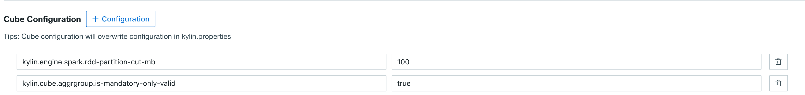

## Build Cube on Spark

There are two engines available in Kyligence Enterprise to build a cube. They are MapReduce and Spark, and MapReduce is set as default. For some scenarios, you might also switch the engine to Spark. 

In this section, we will introduce how to configure Spark as cube build engine.

### Prerequisites
To run Spark on YARN, you need to specify environment variable `HADOOP_CONF_DIR`, which is the directory that contains the client side configuration files for Hadoop. In many Hadoop distributions, the directory is `/etc/hadoop/conf`. But the system not only needs to access HDFS, YARN and Hive, but also HBase if HBase is the metastore, so the default directory might not have all necessary files. In this case, you need to create a new directory and copy or link those client files (core-site.xml, hdfs-site.xml, yarn-site.xml, hive-site.xml and hbase-site.xml) there.

> **Note**: In HDP 2.4, there is a conflict between hive-tez and Spark, so you need to change the default engine from “tez” to “mr” when copying.

```shell
mkdir $KYLIN_HOME/hadoop-conf
ln -s /etc/hadoop/conf/core-site.xml $KYLIN_HOME/hadoop-conf/core-site.xml 
ln -s /etc/hadoop/conf/hdfs-site.xml $KYLIN_HOME/hadoop-conf/hdfs-site.xml 
ln -s /etc/hadoop/conf/yarn-site.xml $KYLIN_HOME/hadoop-conf/yarn-site.xml 
ln -s /etc/hbase/2.4.0.0-169/0/hbase-site.xml $KYLIN_HOME/hadoop-conf/hbase-site.xml 
cp /etc/hive/2.4.0.0-169/0/hive-site.xml $KYLIN_HOME/hadoop-conf/hive-site.xml
# change "hive.execution.engine" value from "tez" to "mr"
vi $KYLIN_HOME/hadoop-conf/hive-site.xml 
```

Now, set property `kylin.env.hadoop-conf-dir` in `kylin.properties` to be the directory mentioned above:

```properties
kylin.env.hadoop-conf-dir=/usr/local/apache-kylin-2.1.0-bin-hbase1x/hadoop-conf
```

If this property isn’t set, the system will use the directory where `hive-site.xml` locates. That folder may not contain `hbase-site.xml` and you may encounter HBase/ZK connection error in Spark.

### Check Spark Configuration
Kyligence Enterprise embeds a Spark binary in `$KYLIN_HOME/spark`. All Spark configurations can be managed in `$KYLIN_HOME/conf/kylin.properties` with prefix `kylin.engine.spark-conf`. These properties will be extracted and applied to Spark jobs. For example, if you configure `kylin.engine.spark-conf.spark.executor.memory=4G`, the system will use `–conf spark.executor.memory=4G` as parameter when execute `spark-submit`.

Before you run Spark engine, we suggest you take a look at these configurations and customize them according to your cluster. Below is the default configuration, which is also the minimal configuration for a sandbox (1 executor with 1GB memory). Usually in a real cluster, you need much more executors and each has at least 4GB memory and 2 cores:

```properties
kylin.engine.spark-conf.spark.master=yarn
kylin.engine.spark-conf.spark.submit.deployMode=cluster
kylin.engine.spark-conf.spark.yarn.queue=default
kylin.engine.spark-conf.spark.executor.memory=1G
kylin.engine.spark-conf.spark.executor.cores=2
kylin.engine.spark-conf.spark.executor.instances=1
kylin.engine.spark-conf.spark.eventLog.enabled=true
kylin.engine.spark-conf.spark.eventLog.dir=hdfs\:///kylin/spark-history
kylin.engine.spark-conf.spark.history.fs.logDirectory=hdfs\:///kylin/spark-history

#kylin.engine.spark-conf.spark.io.compression.codec=org.apache.spark.io.SnappyCompressionCodec

## uncomment for HDP
#kylin.engine.spark-conf.spark.driver.extraJavaOptions=-Dhdp.version=2.4.0.0-169
#kylin.engine.spark-conf.spark.yarn.am.extraJavaOptions=-Dhdp.version=2.4.0.0-169
#kylin.engine.spark-conf.spark.executor.extraJavaOptions=-Dhdp.version=2.4.0.0-169
```
> **Note**: For Hortonworks platform, you need specify `hdp.version` as Java options for YARN containers, so please uncomment the last three lines in `kylin.properties` and **replace the HDP version with your own version** accordingly.

In order to avoid repeatedly uploading Spark jars to YARN for each job, you can configure the HDFS location of these jars only once. Please note that HDFS location needs to be full qualified name.

```shell
jar cv0f spark-libs.jar -C $KYLIN_HOME/spark/jars/ .
hadoop fs -mkdir -p /kylin/spark/
hadoop fs -mkdir -p /kylin/spark-history
hadoop fs -put spark-libs.jar /kylin/spark/
```

After then, the config in `kylin.properties` will be:

```properties
kylin.engine.spark-conf.spark.yarn.archive=hdfs://sandbox.hortonworks.com:8020/kylin/spark/spark-libs.jar
kylin.engine.spark-conf.spark.driver.extraJavaOptions=-Dhdp.version=2.4.0.0-169
kylin.engine.spark-conf.spark.yarn.am.extraJavaOptions=-Dhdp.version=2.4.0.0-169
kylin.engine.spark-conf.spark.executor.extraJavaOptions=-Dhdp.version=2.4.0.0-169
```

All the `kylin.engine.spark-conf.*` parameters can be overwritten at cube or project level, which gives more flexibility to user.

### Configuration Validation

After finish the above configurations, we build a cube with Spark to validate the configurations. In Step 6 **Advanced Setting** of designing a cube, choose **Spark (Beta)** as cube building engine.


Click **+ Configuration** behind **Cube Configuration** to add the following configurations:

```properties
kylin.engine.spark.rdd-partition-cut-mb=100
kylin.cube.aggrgroup.is-mandatory-only-valid=true
```



Then click **Next** -> **Save**. The cube is ready to build with Spark engine.

Switch to cube list page and click **Build** on this cube. Click **Progress/Status** bar, you will see the cube build engine is Spark as below:


### FAQ

**Q: When I use Spark Build Engine in CDH environment, what should I do if I encounter following error message：java.lang.UnsatisfiedLinkError: org.apache.hadoop.util.NativeCodeLoader.buildSupportsSnappy()?**

Please add the properties in `kylin.properties`:
```properties
kylin.engine.spark-conf.spark.executor.extraJavaOptions="-Djava.library.path=/opt/cloudera/parcels/CDH/lib/hadoop/lib/native"
kylin.engine.spark-conf.spark.driver.extraJavaOptions="-Djava.library.path=/opt/cloudera/parcels/CDH/lib/hadoop/lib/native"
```