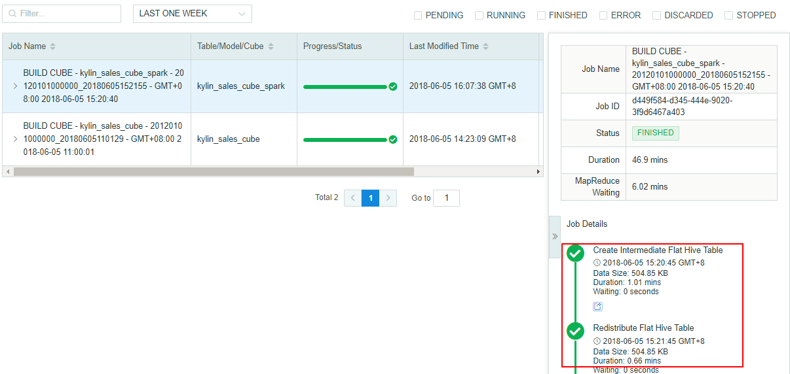

## Use SparkSQL during Cube Build

Kyligence Enterprise leverages Hive by default to do part of the pre-calculations during cube build process. Since SparkSQL has better performance over Hive in general, using SparkSQL instead of Hive during cube build may improve the build speed at certain steps.



### Configure SparkSQL

**HDP / CDH / FusionInsight Platform:**

Please follow the steps below to enable SparkSQL during cube build:

1. To run Spark on YARN, you need to specify environment variable `HADOOP_CONF_DIR`, which is the directory that contains the client side configuration files for Hadoop. In many Hadoop distributions, the directory normally is `/etc/hadoop/conf`. Therefore, it is recommended to create a directory to link those files. 

   ```shell
   mkdir $KYLIN_HOME/hadoop-conf
   ln -s $HADOOP_CONF_DIR/core-site.xml $KYLIN_HOME/hadoop-conf/core-site.xml
   ln -s $HADOOP_CONF_DIR/hdfs-site.xml $KYLIN_HOME/hadoop-conf/hdfs-site.xml
   ln -s $HADOOP_CONF_DIR/yarn-site.xml $KYLIN_HOME/hadoop-conf/yarn-site.xml
   ln -s $HBASE_HOME/hbase-site.xml $KYLIN_HOME/hadoop-conf/hbase-site.xml
   cp /$HIVE_HOME/conf/hive-site.xml $KYLIN_HOME/hadoop-conf/hive-site.xml
   ```

   > **Note**: In HDP 2.4, there is a conflict between hive-tez and Spark, so please change the default engine from “tez” to “mr” when copying.
   >
   > ```xml
   > <property>
   > 	<name>hive.execution.engine</name>
   > 	<value>mr</value>
   > </property>
   > ```

2. Set below configuration in `$KYLIN_HOME/conf/kylin.properties`.

   ```properties
   kylin.source.hive.enable-sparksql-for-table-ops=true
   kylin.env.hadoop-conf-dir=$KYLIN_HOME/hadoop-conf
   ```

**MapR Platform:**

Follow the steps below to enable SparkSQL during cube build:

> Note: If the Kyligence Enterprise has been started before configuring SparkSQL, please export the `$KYLIN_HOME/spark` as the `SPARK_HOME`.

1. To run Spark on YARN, you need to specify environment variable `HADOOP_CONF_DIR`, which is the directory that contains the client side configuration files for Hadoop. In many Hadoop distributions, the directory normally is `/etc/hadoop/conf`. Therefore, it is recommended to create a directory to link those files. 

   ```shell
   mkdir $KYLIN_HOME/hadoop-conf
   ln -s $HADOOP_CONF_DIR/core-site.xml $KYLIN_HOME/hadoop-conf/core-site.xml
   ln -s $HADOOP_CONF_DIR/hdfs-site.xml $KYLIN_HOME/hadoop-conf/hdfs-site.xml
   ln -s $HADOOP_CONF_DIR/yarn-site.xml $KYLIN_HOME/hadoop-conf/yarn-site.xml
   cp /$HIVE_HOME/conf/hive-site.xml $KYLIN_HOME/hadoop-conf/hive-site.xml
   ```

2. Copy the `hive-site.xml` file from `$HIVE_HOME/conf` to `$SPARK_HOME/conf` in your Hadoop environment and delete the default engine property.

   ```shell
   cp /$HIVE_HOME/conf/hive-site.xml $SPARK_HOME/conf/hive-site.xml
   vi $SPARK_HOME/conf/hive-site.xml
   # Delete "hive.execution.engine" property
   ```

3. Add `spark.yarn.dist.files` property in `$SPARK_HOME/conf/spark-default.conf`. 

   ```shell
   vi $SPARK_HOME/conf/spark-default.conf
   # spark.yarn.dist.files  $SPARK_HOME/conf/hive-site.xml
   ```

   > **Note**: Please using the absolute path to replace `$SPARK_HOME/conf/hive-site.xml`.

4. Set below configuration in `$KYLIN_HOME/conf/kylin.properties`.

   ```properties
   kylin.source.hive.enable-sparksql-for-table-ops=true
   kylin.env.hadoop-conf-dir=$KYLIN_HOME/hadoop-conf
   ```

   > **Note**: Please using the absolute path to replace `$KYLIN_HOME/hadoop-conf`.

5. Start Kyligence Enterprise

   ```sh
   $KYLIN_HOME/bin/kylin.sh start
   ```

### Verify SparkSQL

You can run the prepared check script to verify those properties.

```shell
$KYLIN_HOME/bin/spark-test.sh test
```

If you can see the following output, it means those properties have been configured successfully.

```shell
...
Starting test spark with conf
...
====================================
Testing spark-sql...
19/01/16 07:55:50 WARN ObjectStore: Version information not found in metastore. hive.metastore.schema.verification is not enabled so recording the schema version 1.2.0
19/01/16 07:55:51 WARN ObjectStore: Failed to get database default, returning NoSuchObjectException
19/01/16 07:56:02 WARN Utils: Your hostname, maprdemo resolves to a loopback address: 127.0.0.1; using 10.1.2.223 instead (on interface eth0)
19/01/16 07:56:02 WARN Utils: Set SPARK_LOCAL_IP if you need to bind to another address
Time taken: 1.597 seconds
...
```