## Integrate with Yonghong BI

Yonghong BI provides a one-stop large data analysis platform. This section will introduce how to connect Kyligence Enterprise with Yonghong BI.

### **Prerequisite**

* Install Yonghong BI Z-Suite. For the installation information, please read more about [Yonghong Help Center](https://www.yonghongtech.com/help/Z-Suite/8.5/en/).

* Install Kyligence JDBC Driver with the following steps:

  1. Download Kyligence JDBC Driver. For more details, please read more about [Kyligence JDBC Driver](../driver/jdbc.en.md).

  2. Add Kyligence JDBC Driver to Yonghong BI by copying the JDBC Driver to the installation path, such as `Yonghong/Yonghong/lib/jdbcDriver/`.

  > **Note**: Since Yonghong BI ships an Apache Kylin JDBC Driver, to prevent conflict, it is recommended to remove Apache Kylin JDBC Driver first and then install Kyligence Enterprise JDBC Driver.

### Create Kyligence Enterprise Datasource

Select **Add Data Source** on the home page, and click **Enter** - select **Kylin**:

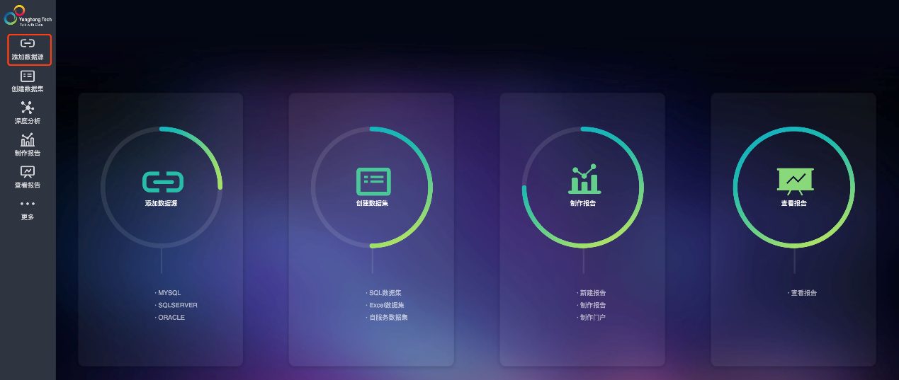

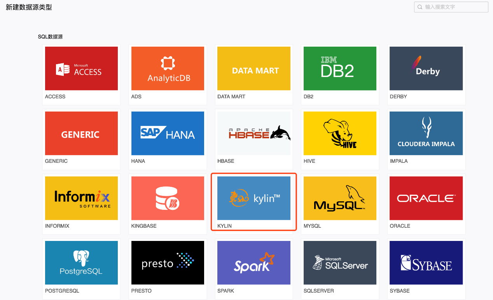

After filling the connection information, please click **Test Connection**. After the successful notice, please click save.

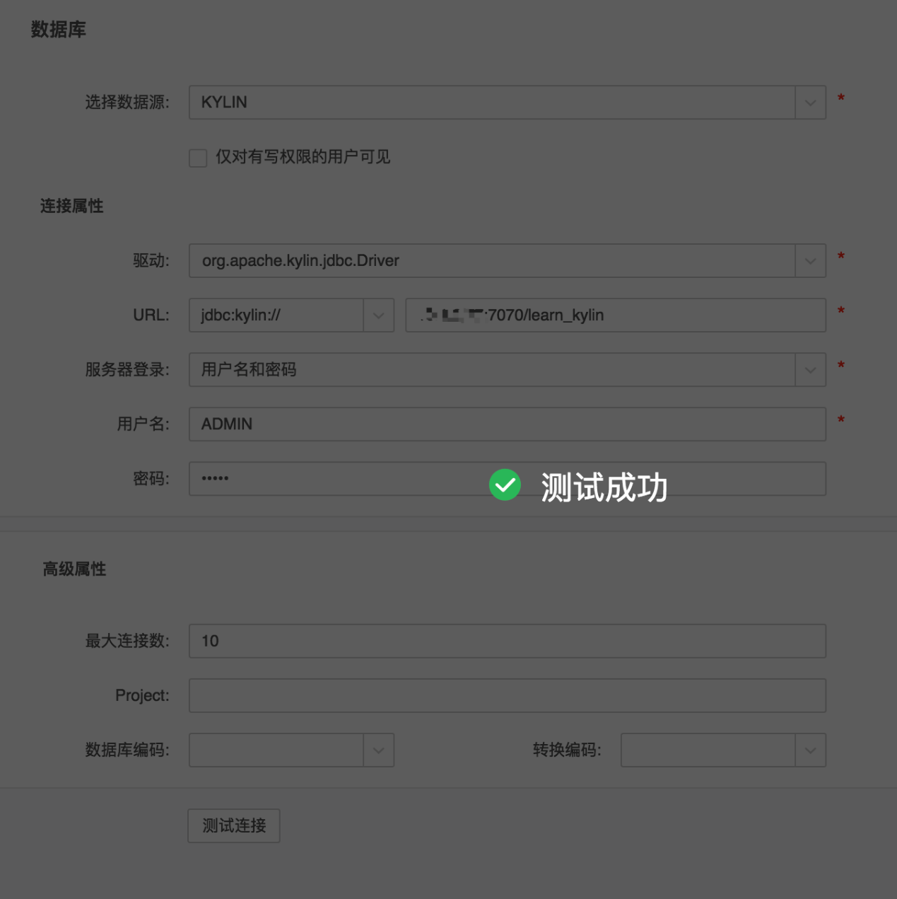

### Create Dataset

Select **Create Dataset** module on the home page, click **Enter** - select **SQL Dataset**:

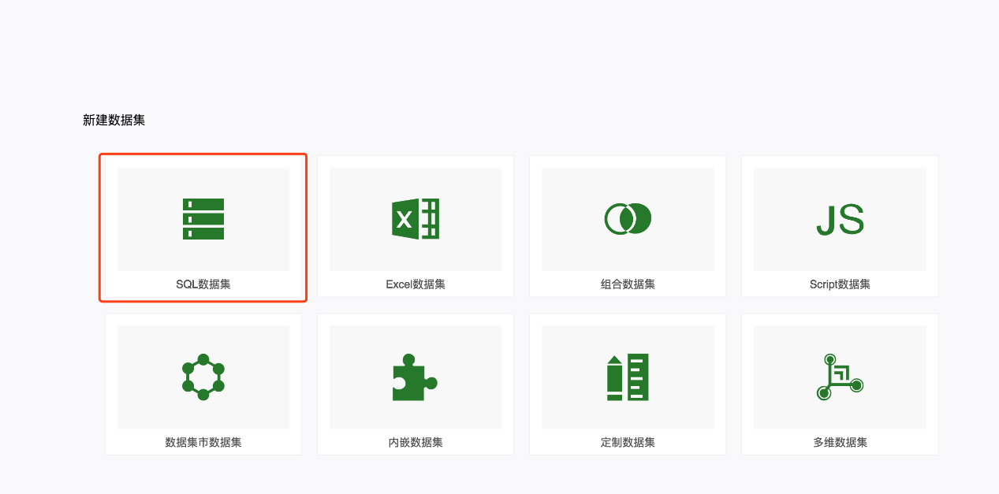

Select the Kyligence Enterprise data source that has been created and enter a customized SQL statement. Then please click **Refresh Metadata** and save:

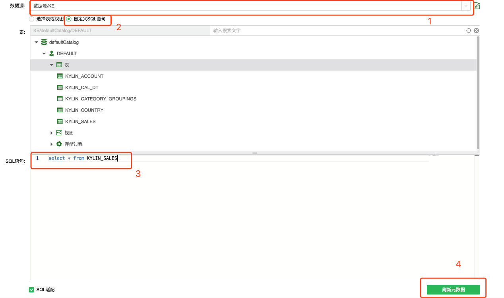

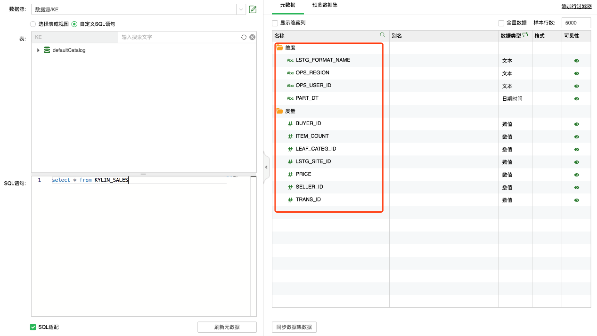

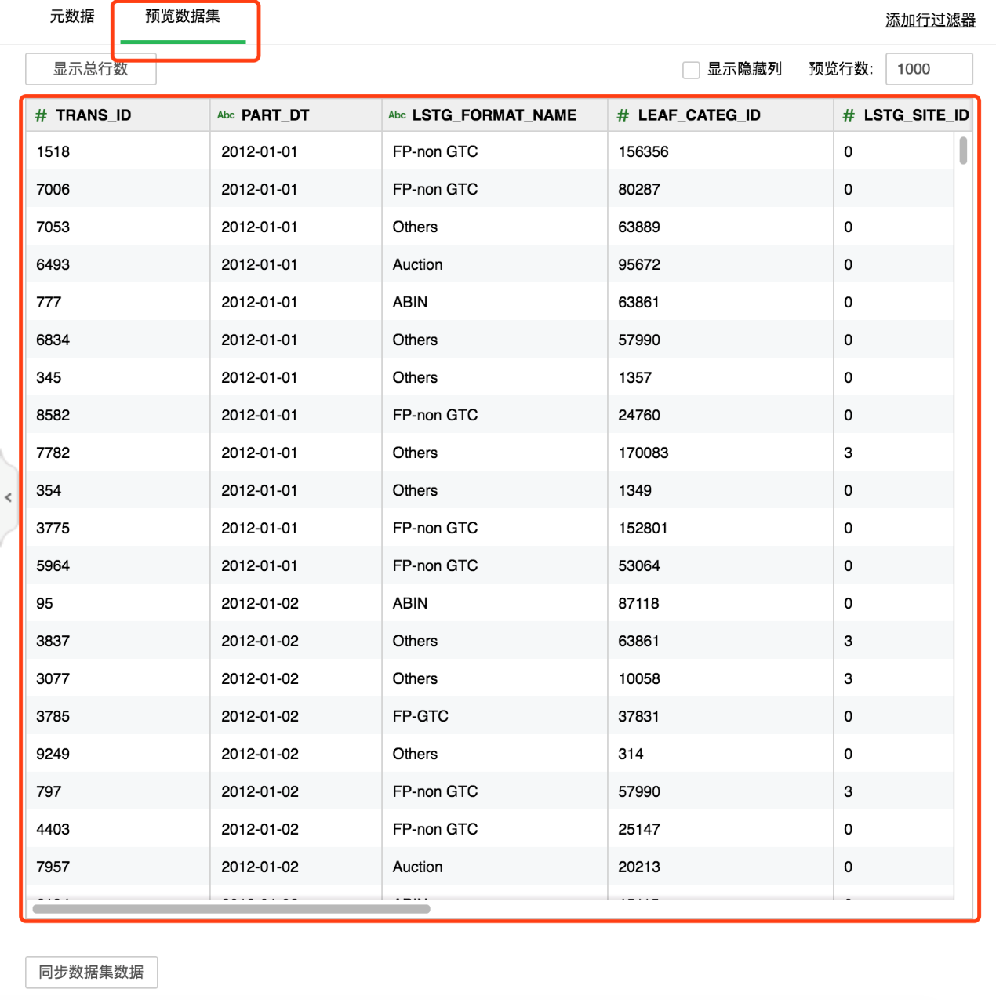

### Create Report

Please select **Create Report** on the home page. Then please select the theme and create a new report:

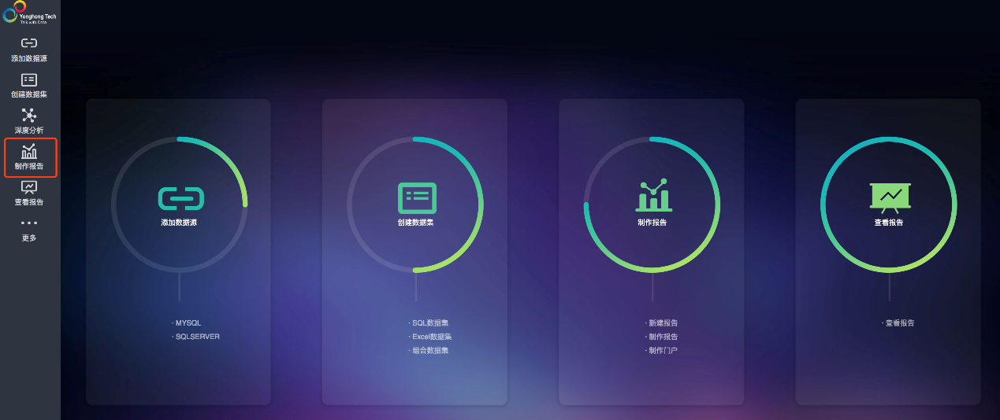

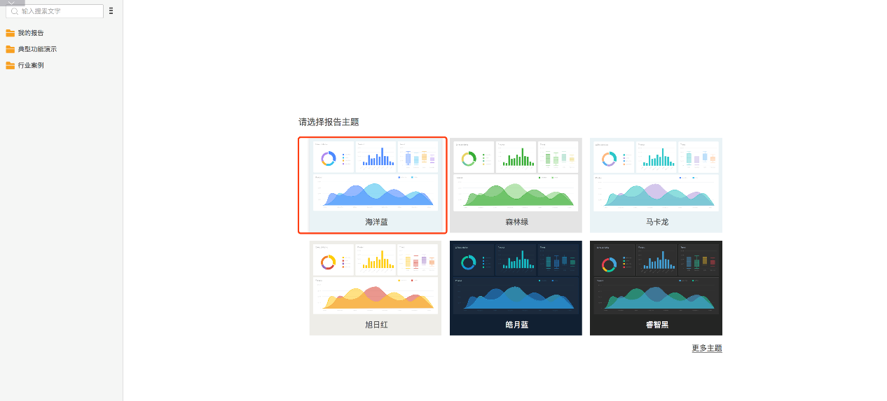

Select the saved query in the dataset, and drag fields to design the report.

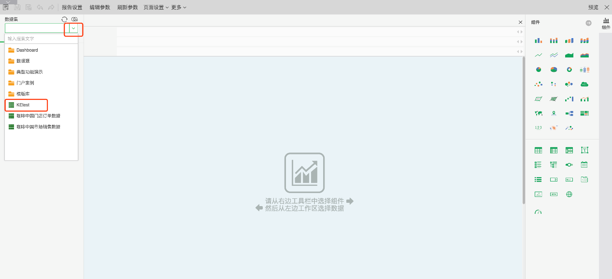

After the report is created, you can preview the report. Now you can view Kyligence Enterprise data in Yonghong BI.

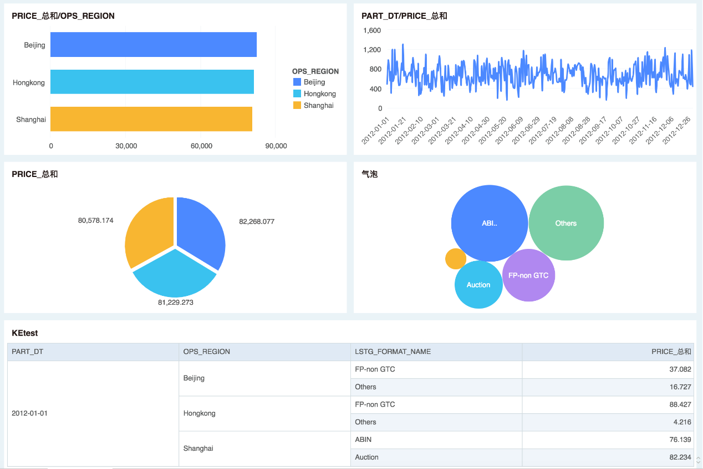

