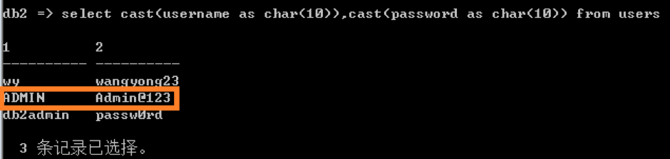

## Integrate with Cognos

### Install Kyligence ODBC Driver

Please refer to this guide [Kyligence ODBC Driver Tutorial](../driver/odbc/README.md) for installation.

The Kyligence ODBC driver needs to be installed in the machine or virtual environment where your Cognos Server is installed. We have verified integration with Cognos 10.x and 11.x for both Cognos Windows and Linux.

### Prerequisite

- The version of Cognos Framework manager needs to be consistent with Cognos server.

- **The version of 32-bit ODBC Driver needs to be consistent** in Framework manager and Cognos server.

- The name of DSN needs to be consistent in both Framework manager and Cognos server.

### Create a Data Source in Cognos

Depending on your business scenario, you may need to create a new project or simply use an existing project to create the data source for Kyligence Enterprise. In the example, we will start with a new project. 

1. Create a new project.

   Do not check `Use Dynamic Query Mode`.

2. Use `Metadata Wizard` create a new `Data Source`.

3. Choose `New` to create a new data source, you can select the existing data source from the list.

   

4. In the `New Data Source Wizard`, first fill in data source name, this could be any name you prefer.

5. Choose `ODBC` as the connection type. For `Isolation Level`, choose `Use the default object gateway`.

6. In ODBC data source, fill in the DSN name that you created in the previous step. Check `Unicode ODBC`. For Sign-on choose` no authorization` or `Signons` and login using Kyligence Enterprise account. Then Click `Test the connection`.

7. If everything is set up properly, test the connection will finish successfully.

   Now you have the data source created.

8. Click `Next`, you may test the connection in the`Metadata Wizard`.


###Test Connection

Next, you may test the connection with tables.

1. Click next to finish metadata wizard.
   

2. Keep default setting in Generate Relationships.
   

3. Now, this new data source has been imported into the project. You can right click on a table to test the connection.
   

4. On the pop-up window, click `test sample` to test connection against this table. If the connection is correct, test results may return as shown in the screen shot below.
   

5. Cognos cannot identify all columns from Kyligence Enterprise. Please modify the usage type for column. There are four usage types: Unknown, Identifier, Fact, Attribute. Date and ID columns can be defined as Identifier. Numbers can be defined as Fact and String can be defined as Attribute.
   

6. Right click table name, choose create -> relationship.
   

7. Set up the table relationship. Choose the cardinatlity and Operator.
   

8. Or you can double click on data source name, in the diagram page, hold ctrl and click the column to join, right click to choose Create -> Relationship to build the table join.
    

### Custom SQL

If you need to adjust table structure or convert column type, you may use custom SQL to define the model.

1. right click on the data source and choose Create -> Query Subject.

   

2. Choose type `Data Source`.

   

3. Select a data source, please do not check "Run databases query subject wizard".

   

4. Input the SQL query, click validate. If validation finish with no error, click OK.

   ```sql
   select
   	KYLIN_CAL_DT.CAL_DT, 
   	KYLIN_SALES.PART_DT, 
   	KYLIN_SALES.BUYER_ID, 
   	KYLIN_SALES.ITEM_COUNT
   From
   [sandbox-dong].KYLIN_SALES as KYLIN_SALES
   join
   [sandbox-dong].KYLIN_CAL_DT as KYLIN_CAL_DT
   on KYLIN_SALES.PART_DT = KYLIN_CAL_DT.CAL_DT
   ```

### Create Namespace

When you have the model ready, you can create a namespace to group the tables needed. 

1. Right click on namespace and choose Create -> Namespace.

   

2. Drag and drop the tables needed into the namespace in the project viewer.

### Publish Package

In the project viewer, right click on Packages->Create ->Package to publish data source as a package.


Name the package.


Choose the table and column that you want to publish.


Leave the functions lists as default.


Now you have successfully created a new package. Next, open the `publish package wizard`. 

You may leave the rest of the below settings as default, and finish the wizard.


Now you have published the package.

After publishing the package, you may go to IBM Cognos Connection on Web to check the package.


###Create a Simple Chart

Now you can create a simple chart with newly the published package.

Go to your IBM Cognos Web. Launch Report Studio.


Choose the package you just created in the previous step.


In Cognos Report Studio, click `Create New`.


Click `Chart` to create a new chart with the new package.


Choose a chart type.


Drag `PRICE` from `KYLIN_SALES` table to measure, and drag `LSTG_FORMAT_NAME` to series. 

Then click the `Play` button on the top menu to run this report. 


Now you have successfully created a new chart with Kyligence Enterprise as the data source.


### ACL Integration between Cognos & Kyligence Enterprise

In order to reflect Kyligence Enterprise Access Control in Cognos, it is necessary to allow Cognos users to query Kyligence Enterprise with their corresponding credentials. This following will introduce how to integrate the access permission of Cognos with Kyligence Enterprise by using a custom Java example, on the assumption that Cognos's authentication has been configured. For the details, please refer to the AuthenticationProvider document corresponding to Cognos SDK. The following diagram is a typical Cognos external authentication space using Java program:


In the database of Cognos authentication, add usename and password for Kyligence Enterprise:



Next, create a Cognos data source. You may refer to the 1st - 4th steps above. And select `An external namespace` in the 5th step as shown in below diagram:


### Known Limitation

1. Kyligence Enterprise does not support right join.

   Workaround: Create a view using SQL like

   ```sql
   create view vw_1 as 
   sleect * 
   from fact table 
   right join lookup table
   ```

   And use the view to model. 

2. Kyligence Enterprise does not support multiple fact table in the model.

   Workaround: In Framework Manager, write a query to join multiple fact tables in subquery, for example:

   ```sql
   select a.part_dt,sum_price,sum_item 
   from
   
   (select part_dt,sum(price) as sum_price 
    from KYLIN_SALES 
    group by PART_DT havingsum(price)>1000) a
   
   join (
     select part_dt,sum(ITEM_COUNT) as sum_item 
     from KYLIN_SALES 
     where LSTG_FORMAT_NAME='Others' 
     group by part_dt) b
   
   on a.part_dt=b.part_dt	
   ```

