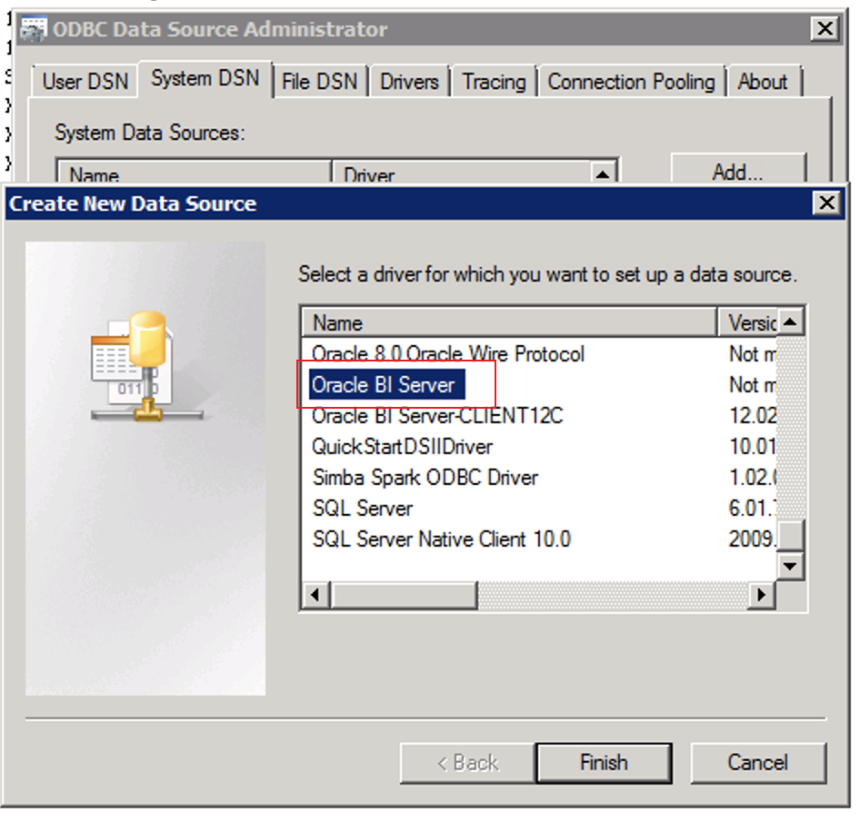
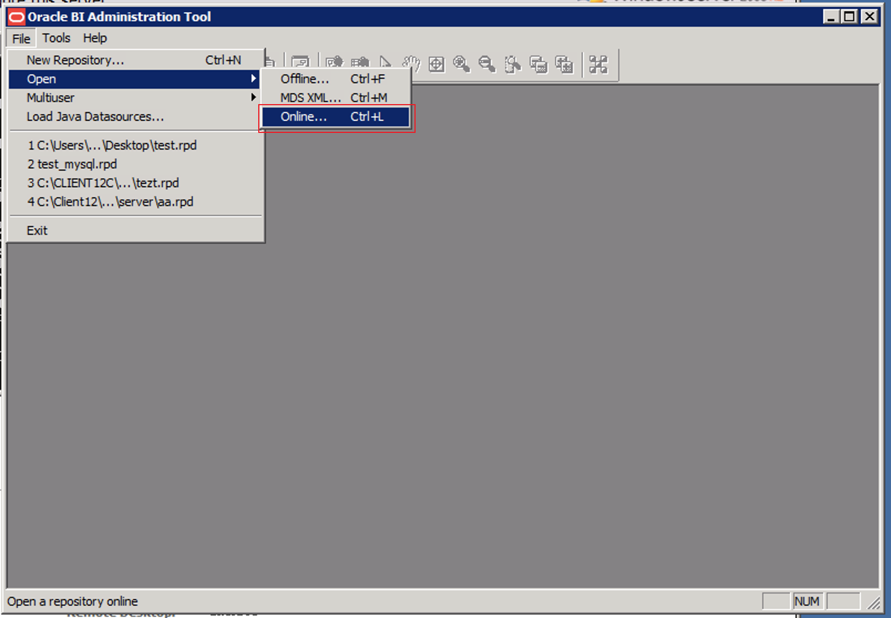
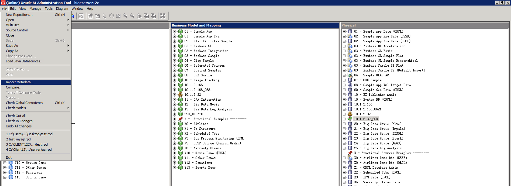
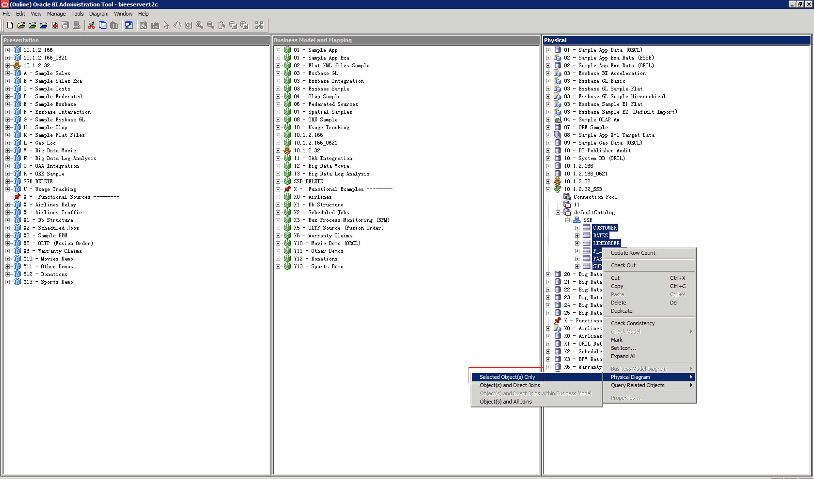
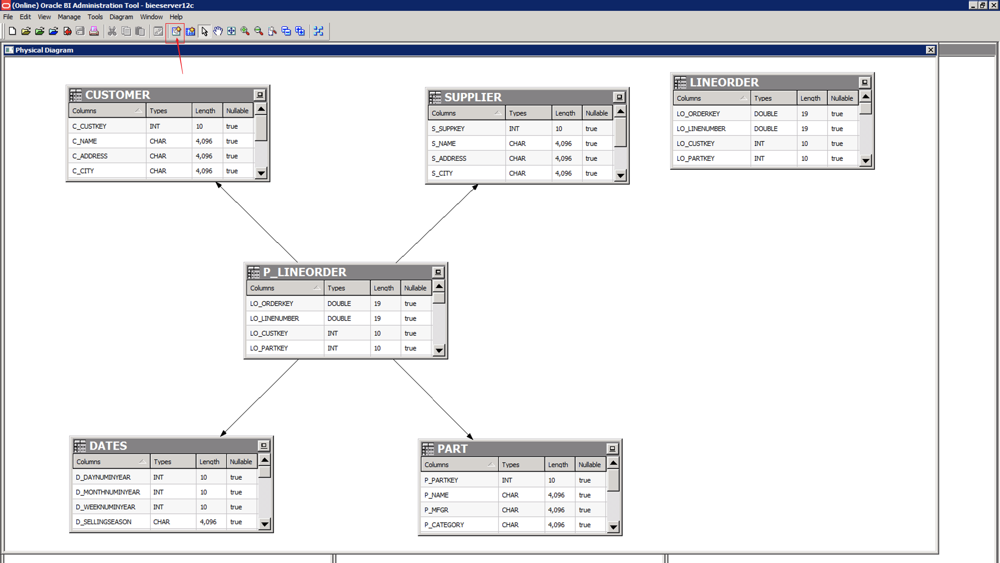
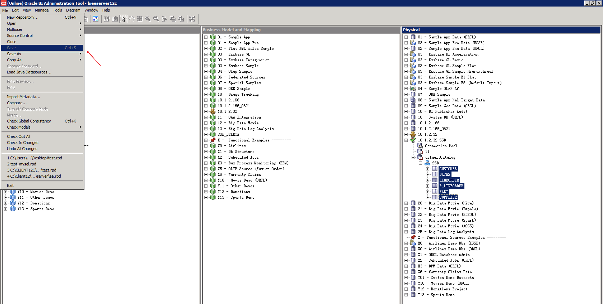
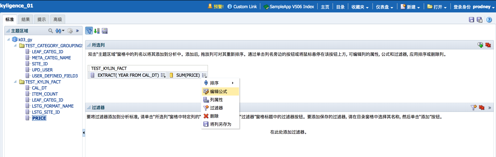
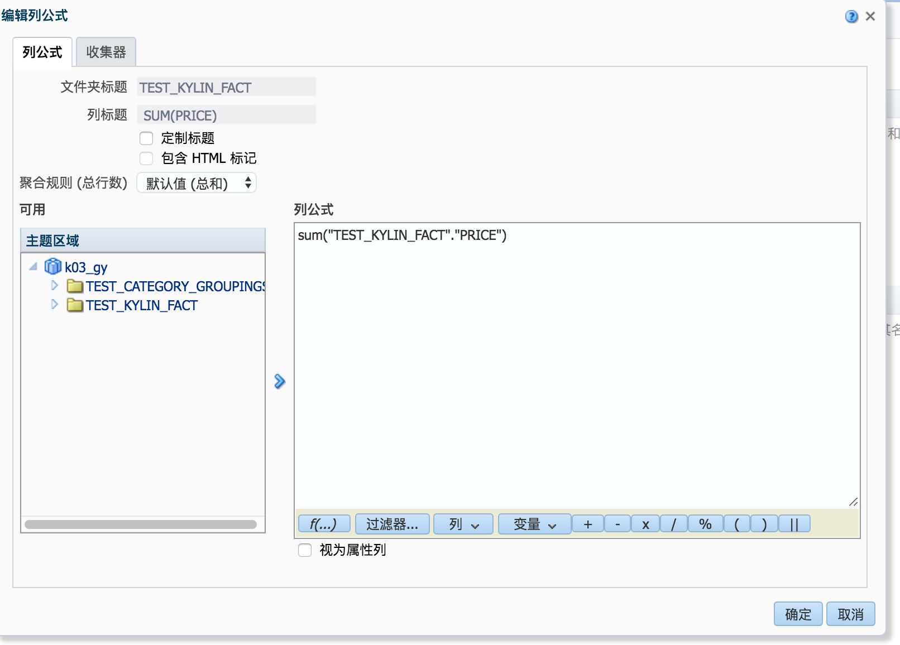
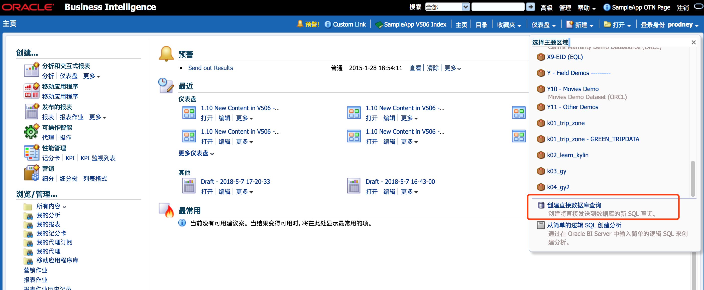
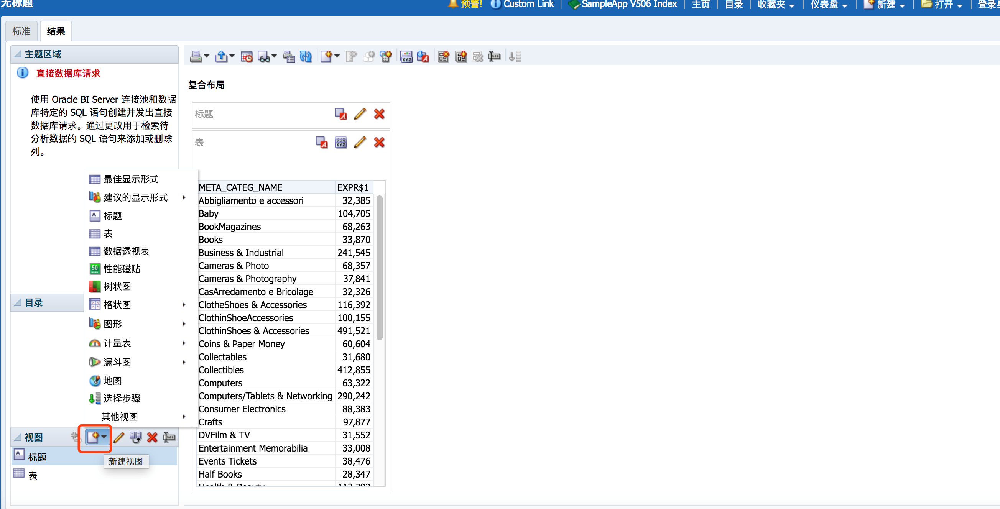

## Integrate with OBIEE 11g

Oracle Business Intelligence Enterprise Edition (OBIEE) is Oracle's BI product that provides complete BI capabilities, including interactive dashboards, full-featured proactive intelligence and alerts, enterprise and financial reporting, real-time predictive intelligence, and offline analysis. This article walks you through the steps to connect to Kyligence Enterprise using OBIEE.

### Prerequisite
- Kyligence Enterprise version is higher than 3.0
- Kyligence ODBC driver version is higher than 2.2

### Configuring ODBC and DSN

1. Configure OBIEE Client

    You need to install the BI Administrator tool first, and add a connection DSN to the BIEE server in the ODBC Administrator after installation.

    

    Once connected, you can manage the data model in the BIEE server by clicking Menu **Open** -> **Online** in the BI Administrator tool.

    


2. Set up DSN

   Kylignece ODBC and DSN need to be installed on both the client and server sides, and the DSN names on both ends should be **consistent**.

    For the configuration of Kyligence ODBC under Windows, please refer to [Installing and Configuring Kyligence ODBC Driver under Windows](../../driver/odbc/win_odbc.en.md).

    For the configuration of Kyligence ODBC under Linux, please refer to [Installing and Configuring Kyligence ODBC Driver under Linux](https://docs.oracle.com/middleware/12212/biee/BIEMG/GUID-CCDD9782-BC2A-497A-8ED0-AECA2ECFB3AE.htm#config_native_dbs).

    The Kyligence data source format added to the `odbc.ini` file is:

   ```
   [KyligenceDataSource]
   Driver = KyligenceODBC64
   PORT = 7070
   PROJECT = learn_kylin
   SERVER = http://kapdemo.chinaeast.cloudapp.chinacloudapi.cn   
   UID = KYLIN  
   PWD = ADMIN
   ```

### Creating a data model

1. Click **Import Metadata** in the BI Administrator tool to add a data source.
    

2. Select ODBC 3.5 to import the tables in Kyligence Enterprise.
    

3. After the import is successful, find the data source you just created in the physical model, right click on the data source, choose **Properties** -> **General** ->**Data source definition**, and change **database type** to **Apache Hadoop**.

4. Find the Kyligence Enterprise data source in the physical model and select the table you want to model, then right click and click **Physical Diagram** to create the model.
   

5. Click **New Join** to define the table association and save the physical model.

   

6. After saving the model, you need to manually retrieve and change the physical column whose data type is a string or varchar. If the length is displayed as 0, you need to change to the actual length of the field in Kyligence Enterprise.

    

7. After saving the physical model, create a new business model, and drag the newly added physical model to the business model. 
   If you need outer join, you can edit the business model, set it as external connection here, and save it to the business model. 
   Then drag the logical model you just added to the presentation layer and save it to the presentation layer.

   Click **File**->**Save** in the upper left corner of the BI Administrator tool to save the entire model.
   )

8. Restart BIEE server.


### Create An Analysis

There are two ways to analyze using the data from the model you just created.

- **Method One**

  1. Click **New-Analysis** on the BIEE home page to use Kyligence Enterprise for analysis using the subject area created on the client side. This way you use the drag and drop method.

     

  2. Drag the desired field to the selected column. The metric needs to click **Edit Formula ** to be edited aggregation method.

     

     Other fields that need to be reworked can be redefined in **Edit Formula**.

      

  3. Click **Results** to see the results of the query, then you can edit the desired chart type and related styles.

      


- **Method Two**

  1. Click **Create Direct Database Query** on the BIEE home page to query with Custom SQL.

     

  2. Select the connection pool name of the data source created on the client side to connect, and enter the query SQL for analysis.

     Connection pool name format：`"dsn_name"."connect_pool_name"`

     

  3. Click **Result** to get the query result. Click **New View** in the lower left corner of the result to change the chart type.

     

     

> **Notes**：
> 1. According to the BIEE development specification, the model created on the client side needs **at least two** tables, >otherwise the upload model will cause BIEE failed to start the service.
> 2. Since BIEE generates schema-less SQL statements, drag and drop queries require all tables belong to a database in the >project. Use **Create Direct Database Query** when connecting to a pool query to avoid this problem.
