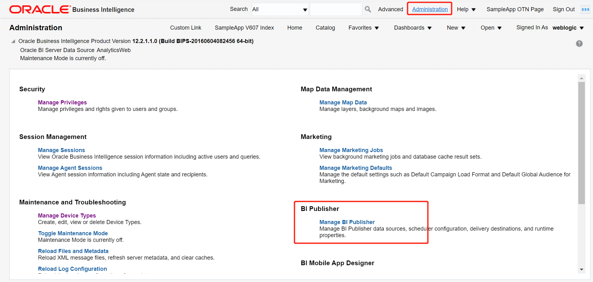
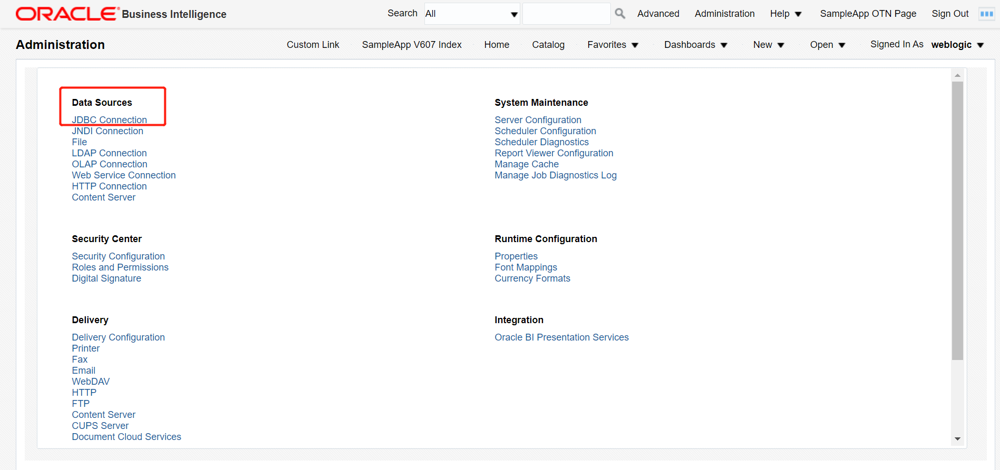
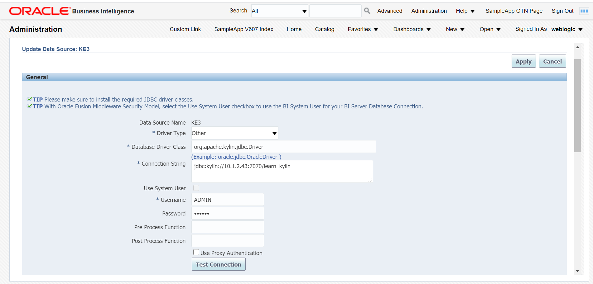
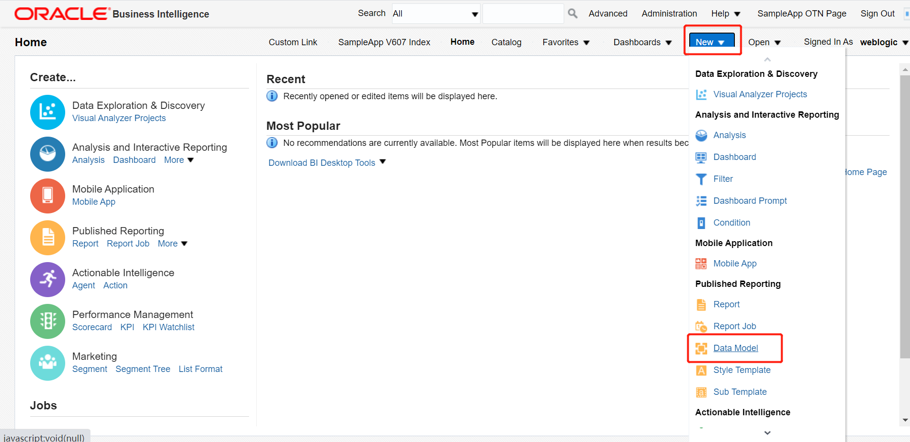
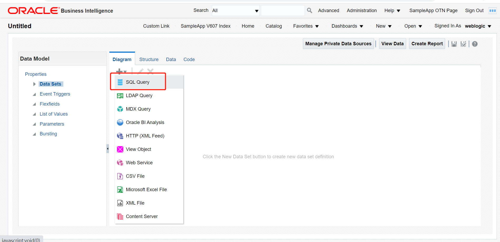
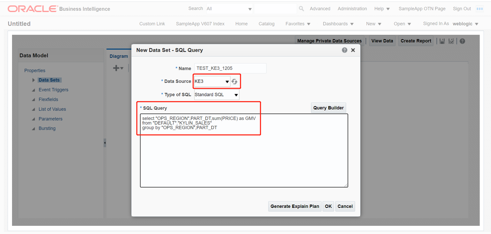
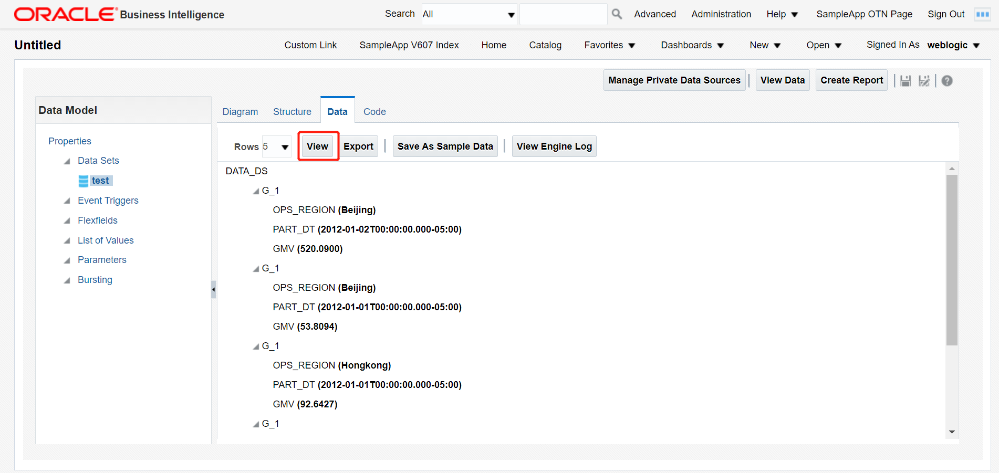

## Integrate with Oracle BI Publisher

**Oracle BI Publisher** is a reporting solution that can produce, manage and deliver all reports and documents easier and faster than traditional reporting tools. Use your web browser or familiar desktop tools to create the reports you need for almost any data source, from perfect customer-facing documents to interactive management reports.

This chapter will introduce how to integrate with Oracle BI Publisher by using OBIEE 12c as an example.

### Prerequisite
Install Kyligence JDBC driver on Oracle BI Server

1. Download Kyligence JDBC driver. For more information, please refer to [Kyligence JDBC Driver Tutorial](../../driver/jdbc.en.md).

2. Place the Kyligence JDBC driver in the Oracle BI Server installation directory, such as: 

   ```
   ${WL_HOME} /wlserver/server/lib
   ```

3. Modify the variable $WEBLOGIC_CLASSPATH in the configuration file ${WL_HOME} /oracle_common/common/bin/commExtEnv.sh, and add the driver package path information, such as:

   ```
   ${CLASSPATHSEP}${WL_HOME}/server/lib/kyligence-jdbc-{version}.jar
   ```

4. Restart Oracle BI Server

   


### Enter the Oracle BI Server, Select Administration -> Manage BI Publisher



### Create a new Kyligence JDBC data source

Select JDBC connection



Add a new Kyligence JDBC Data Source, enter:

- Driver type: Other
- Database driver class: org.apache.kylin.jdbc.driver
- Connection string: jdbc:kylin://<hostname>:<port>/<project_name>
- Username：
- Password:

After inputs, click **Test Connection**, apply and save.



### Create a new data model and use the created JDBC data source for report query

New -> **Data Model**



New **SQL query**



Select the created JDBC data source and enter the SQL query




Click **Data** -> **View** to view data.


