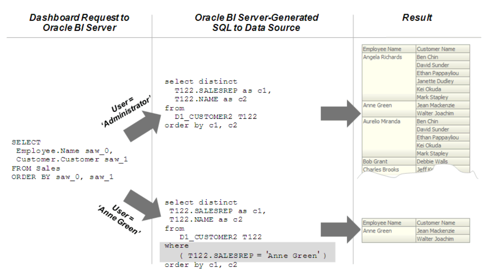
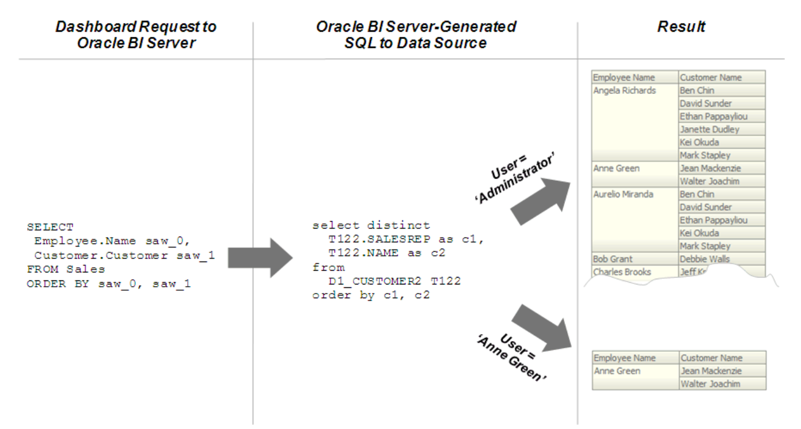

## OBIEE Setting Up Row-Level Security

This chapter will guide you to set up row-level security in OBIEE, integrate with Kyligence , and implement data access control.

You can choose to set up row-level security in the repository, or in the database ( Kyligence ).

Implementing row-level security in the repository provides many benefits, including the following:

- All users share the same database connection pool for better performance
- All users share cache for better performance
- You can define and maintain security rules that apply across many federated data sources

Implementing row-level security in the database, in contrast, is good for situations where multiple applications share the same database. Note that even when you design and implement row-level security in the database, you should still define and apply object permissions in the repository.

Although it is possible to set up row-level security in both the repository and in the database, you typically do not enforce row-level security in both places unless you have a particular need to do so.

This section contains the following topics:

- Setting Up Row-Level Security (Data Filters) in the Repository

- Setting Up Row-Level Security in the Database

## Setting Up Row-Level Security (Data Filters) in the Repository

Data filters are a security feature that provide a way to enforce row-level security rules in the repository.

Data filters are set up in the repository using the Administration Tool and are applied for a particular application role. You typically do not set up data filters if you have implemented row-level security in the database, because in this case, your row-level security policies are being enforced by the database rather than the Oracle BI Server.

Data filters can be set for objects in both the Business Model and Mapping layer and the Presentation layer. Applying a filter on a logical object impacts all Presentation layer objects that use the object. If you set a filter on a Presentation layer object, it is applied in addition to any filters that might be set on the underlying logical objects.

The image shows how data filter rules are enforced in the Oracle BI Server. The security rules are applied to all incoming clients and cannot be breached, even when the Logical SQL query is modified.

In this example, a filter has been applied to an application role. When Anne Green, who is a member of that role, sends a request, the return results are limited based on the filter. Because no filters have been applied to the application roles for the Administrator user, all results are returned. The Oracle BI Server-generated SQL takes into account any data filters that have been defined.

You should always set up data filters for particular application roles rather than for individual users.

To set up data filters to apply row-level authorization rules for queries:

1. Open your repository in the Administration Tool.

2. Select **Manage**, then select **Identity**.

3. In the Identity Manager dialog, in the tree pane, select **BI Repository**.

4. In the right pane, select the Application Roles tab, then double-click the application role for which you want to set data filters.

   Note that if you are in offline mode, no application roles appear in the list unless you have first modified them in online mode. See [About Applying Data Access Security in Offline Mode](https://docs.oracle.com/middleware/12211/biee/BIEMG/GUID-C63CD161-06A0-4757-BFE0-B06B1EFE5BAC.htm#GUID-C63CD161-06A0-4757-BFE0-B06B1EFE5BAC) for more information.

5. In the Application Role dialog, click **Permissions**.

6. In the User/Application Role Permissions dialog, click the Data Filters tab.

   To create filters, you first add objects on which you want to apply the filters. Then, you provide the filter expression information for the individual objects.

7. To add objects on which you want to apply filters, perform one of the following steps:

   - Click the **Add** button. Then, browse to locate the object you want, select it, and then click **Select**.
   - Click the **Name** field for an empty row. Then, browse to locate the object you want, select it, and then click **Select**.

8. To enter the filter expression for individual objects, perform one of the following steps:

   - Select the data filter, then click the **Expression Builder** button. Create the filter expression in Expression Builder, then click **OK**.
   - Click the **Data Filter** field for the appropriate filter, then type the filter expression.

   For example, you might want to define a filter like `"Sample Sales"."D2 Market"."M00 Mkt Key" > 5` to restrict results based on a range of values for another column in the table.

   You can also use repository and session variables in filter definitions. Use Expression Builder to include these variables to ensure the correct syntax.

9. Optionally, select a status for each filter from the Status list. You can choose one of the following options:

   - **Enabled:** The filter is applied to any query that accesses the object.
   - **Disabled:** The filter is not used and no other filters applied to the object at higher levels of precedence, for example, through an application role, are used.
   - **Ignored:** The filter is not in use, but any other filters applied to the object, for example, through a different application role, are used. If no other filters are enabled, no filtering occurs.

10. In addition to defining new filters, you can perform other operations in the Data Filters tab. See [OBIEE help](https://docs.oracle.com/middleware/12211/biee/BIEMG/GUID-1FDC0A15-9DE7-4838-9C0E-03290F5558B2.htm#dataaccess_db_level) for more information.

11. Click **OK**, then click **OK** again to return to the Identity Manager.

## Setting Up Row-Level Security in the Database

To achieve row-level security in the database, you first need to create the same user in Kyligence as in Oracle BI Server, and the password must also be consistent. Next, set different table, row, and column level permissions for different users in Kyligence. Finally, you need to configure the OBIEE connection pool so that Oracle BI Server will pass each user's credentials to Kyligence. Kyligence then applies its own ACL rules to user queries based on the credentials.

The image shows how row-level security is enforced in the database for Oracle Business Intelligence queries. The security rules are applied to all incoming clients and cannot be breached, even when the Logical SQL query is modified. In this example, the results returned are different depending on which user generated the query, even though the SQL query generated by the Oracle BI Server is the same. The returned results are based on ACL rules created and enforced in the Kyligence.

To set up Oracle Business Intelligence for row-level access security in the database:

1. Open your repository in the Administration Tool.
2. Double-click the connection pool associated with the database for which you want to set up database-level security.
3. In the General tab of the Connection Pool dialog, select **Shared logon**, and then enter **:USER** and **:PASSWORD** in the **User name** and **Password** fields. The :`USER` and :`PASSWORD` syntax automatically passes the value of user credentials upon login to the database. The `:USER` and `:PASSWORD` syntax does not refer to session variables.
4. Click **OK** in the Connection Pool dialog.
5. Double-click the database object for which you want to set up database-level security.
6. In the Database dialog, select **Virtual Private Database**. Selecting this option ensures that the Oracle BI Server protects cache entries for each user.
7. Click **OK** in the Database dialog.

After you have set up row-level security in the database, you must set up object permissions in the repository for Presentation layer or other objects. You can also set query limits (governors). See [Setting Up Object Permissions](https://docs.oracle.com/middleware/12211/biee/BIEMG/GUID-E4B828EE-B906-432A-834D-A045BB6A51BD.htm#GUID-E4B828EE-B906-432A-834D-A045BB6A51BD) and [Setting Query Limits](https://docs.oracle.com/middleware/12211/biee/BIEMG/GUID-3FD454F0-EBE3-4094-8ECB-F6F02F99267C.htm#GUID-3FD454F0-EBE3-4094-8ECB-F6F02F99267C) for more information.
