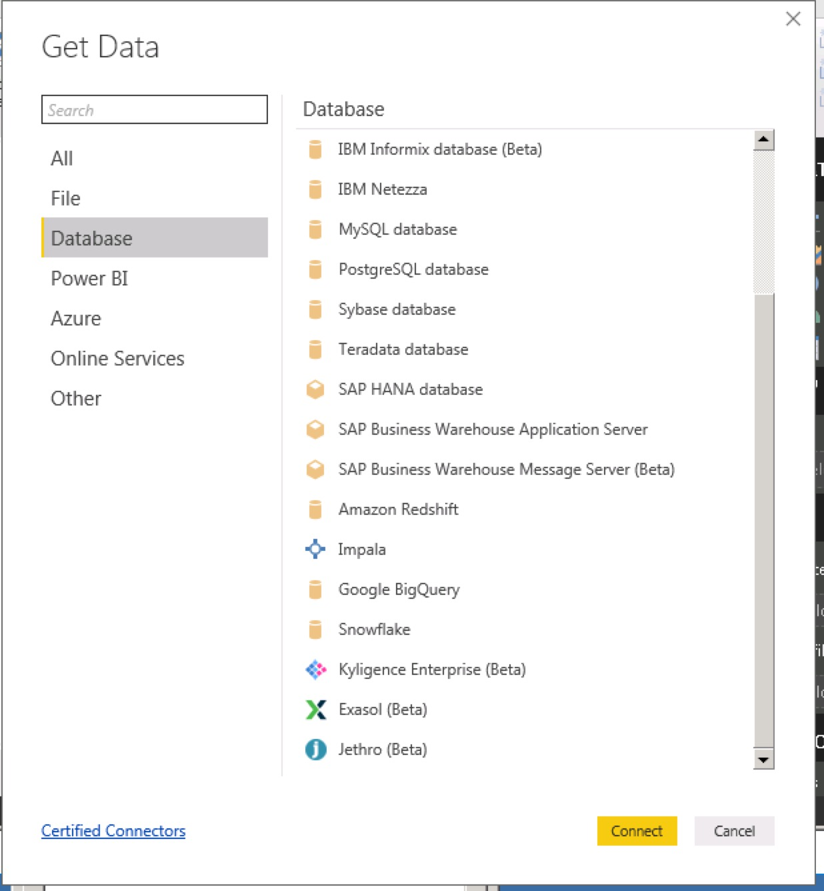

## Integrate with Power BI Desktop

Microsoft Power BI Desktop is a professional business intelligence analysis tool providing rich functionality and experience for data visualization and processing to user. This article will guide you to connect Kyligence Enterprise with Power BI Desktop. 

### Install Kyligence ODBC Driver

For the installation information, please refer to [Kyligence ODBC Driver tutorial](../../driver/odbc/README.md).

### Connect to Kyligence Enterprise in Power BI Desktop

Prerequisite:

- If your version of Power BI Desktop >= **October 2018 (v2.63)**, you don't need to install the plug-in, since Kyligence has become its built-in certified data source.

- If your version of Power BI Desktop is < **October 2018 (v2.63)**,  please first follow the guidance at the end of this article to [Install Kyligence Enterprise Data Connector for PowerBI](#Install Kyligence Enterprise Data Connector for PowerBI), and then continue.

Steps to connect Kyligence Enterprise:

1. Start the installed Power BI Desktop, click **Get data -> more**, and then click **Database -> Kyligence Enterprise**.

   > **Note**: To better integrate with Power BI, please turn on Kyligence Enterprises Query Pushdown. Please read more about [Query Pushdown](../../../installation/pushdown/pushdown_to_embedded_spark.en.md) for the how-to.
   
    

2. In the pop-up window, type the required database information, and select **DirectQuery** as Data Connectivity mode.

    > **Note**: If your Kyligence Enterprise is deployed on Azure, please add **https://** in server url and input 443 as PORT number

    

3. Enter **User name** and **Password** 

    

4. After connected, Power BI will list all the tables in the project. You may select the tables based on your requirements.
    

5. Model the tables which need to be connected.

   > **Note:** When editing relationship, please select  **Assume referential integrity**.

   

   

6. Return to the report page and start analysis.

### Install Kyligence Enterprise Data Connector for PowerBI

If your version of Power BI Desktop is < **October 2018 (v2.63)**, you can follow the steps to install the Kyligence Enterprise Data Connector for PowerBI plug-in:

1. Download Kyligence Enterprise Data Connector for Power BI plugin from [Kyligence Account Page](http://account.kyligence.io).

2. Copy the plug-in file (.mez)  to the installation folder `[Documents]\Microsoft Power BI Desktop\Custom Connectors`. If this folder does not exist, please create one.

3. In Power BI Desktop, open **Options** under **Options and settings**.

   Click **Preview features** and then check the box **Custom data connectors**.

   

   > **Tips：** Power BI version 2.61 can not display Kyligence data connector by default, you need to change data extension security settings to allow it.
   >
   > In Power BI Desktop, select **File > Options and Settings > Options > Security**. Under **Data Extensions**, select option **(Not Recommended) Allow any extension to load without warning**.

4. Restart Power BI Desktop.