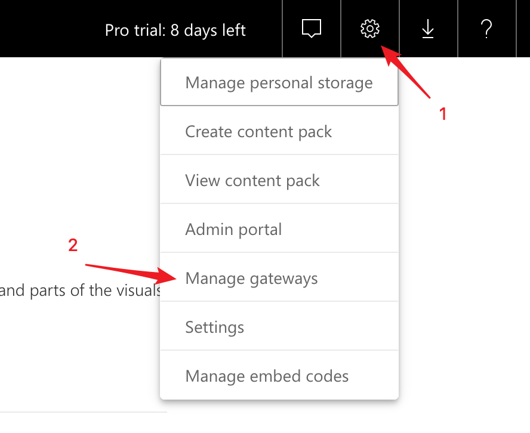
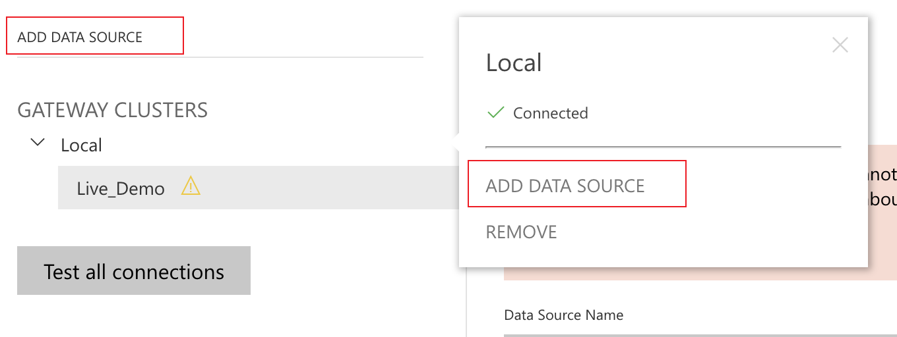

## Integrate with Power BI Service

Microsoft Power BI service is also named as Power BI online, which is an online SaaS service with strong analytical capabilities and collaborative management capabilities. It can easily collaborates with Power BI Desktop or Power BI Mobile to build an enterprise BI platform.


This article will guide you to connect Kyligence Enterprise with Power BI service.


### Integration With Power BI Desktop

To analyze and share the reports on Power BI service, which are published through Power BI Desktop, you need to integrate the Power BI Desktop with Kyligence at first. The relevant installation and configuration information, please refer to following link for details: [Power BI Desktop integration](powerbi_desktop.en.md). 

> Note: Power BI Desktop is linked to Power BI service through Power BI account, you need to guarantee that Power BI Desktop is at correct log-in status before deploying the reports on Power BI service platform. 

### Install Gateway

Power BI service communicates with local server by Gateway, you can refer this guide [Gateway installation](https://docs.microsoft.com/en-us/power-bi/service-gateway-install) for installation. 

> Note: 
>
> 1. Gateway does not need to be installed on the same machine as Power BI Desktop.
> 2. The machine network running the Gateway should be open and access to data source configured by Kyligence Enterprise Data Connector for Power BI. 
> 3. You should install 64 bit Kyligence ODBC Driver in the machine which has installed the Gateways,.
> 4. You can refer this guide [Kyligence ODBC Driver tutorial](../../driver/odbc/README.md) for Kyligence ODBC Driver installation.

### Configure Gateway

1. After completing the Gateway installation, you can open the administrator command prompt and run ```net start PBIEgwService``` to start the Gateway service. 
2. Then you can double-click the *On-premises data gateway* program icon to configure Gateway. For a detailed local data gateway configuration, please refer to Microsoft's tutorial [Local Data Gateway](https://docs.microsoft.com/en-us/power-bi/service-gateway-onprem).
3. You can also run ```net stop PBIEgwService``` command to stop the Gateway service.

### Add a data source to the Power BI Service

1. After logging into Power BI service, in the upper-right corner of the Power BI service, select the gear icon > **Manage gateways**.

   

2. Either select a gateway > **Add data source**, or go to Gateways > **Add data source**.

   

3. Select the **Data Source Type**, select Kyligence Enterprise here.

   

4. Fill out the Data Source Configuration using the same connection information between Power BI Desktop and Kyligence Enterprise Data Connector for Power BI. 

   

5. You can click the **Users** tab at right side of **Data Source Settings** to add users for data source. Then, the new-added users will have editor access, including report deployment. To learn more about the configuration features of Power BI Service, you can refer to Microsoft's official tutorial [Managing Power BI Local Gateway](https://docs.microsoft.com/en-us/power-bi/service-gateway-manage )

### Publish Reports on Power BI Service

After completing all configuration work of Gateway, you can edit your reports and publish them in assigned workspaces on Power BI Desktop. Then, you can make analysis or changes reports in Power BI Service workspaces.


