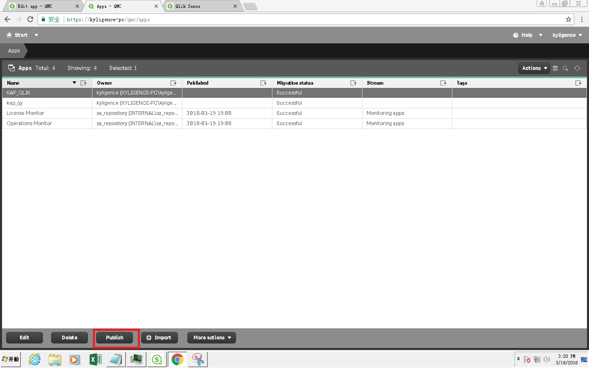

## Qlik Sense

Qlik Sense delivers intuitive platform solutions for self-service data visualization, guided analytics applications, embedded analytics and reporting. It is a new player in the Business Intelligence (BI) tools world, with a high growth since 2013. It has connectors with Hadoop Database (Hive and Impala). Now it can be integrated with Kyligence Enterprise. This article will guide you to connect Kyligence Enterprise with Qlik Sense.  

### Install Kyligence ODBC Driver

For the installation information, please refer to [Kyligence ODBC Driver tutorial](../../driver/odbc/README.md).

### Install Qlik Sense

For the installation of Qlik Sense, please visit [Qlik Sense Desktop download](https://www.qlik.com/us/try-or-buy/download-qlik-sense).

### Connection with Qlik Sense
After configuring your Local DSN and installing Qlik Sense successfully, you may go through the following steps to connect Kyligence Enterprise with Qlik Sense.

1. From Windows Desktop Shortcut or click **Start** -> **All Applications**-> **Qlik Sense** -> **Qlik Sense Desktop** to open the application **Qlik Sense Desktop**.

2. Input your Qlik account to login, then the following dialog will pop up. Click **Create A New App**.

   You may specify any name different from existing applications and then open this application. In this example, we name it as *Kylinfortesting*.

3. There are two choices in the Application View. Please select the bottom **Script Editor**.

   The Data Load Editor window shows. Click **Create New Connection** in the upper right of this page.

   Select **DSN** you have created, ignore the account information, and then click **Create**. 

4. Change the default scripts of "TimeFormat", "DateFormat" and "TimestampFormat" to:

   `SET TimeFormat='h:mm:ss';`

   `SET DateFormat='YYYY-MM-DD';`

   `SET TimestampFormat='YYYY-MM-DD h:mm:ss[.fff]';`

5. Configure Direct Query mode

   Given the Petabyte-Scale Cube size in a usual Kyligence Enterprise production environment, we recommend user to use Direct Query mode in Qlik Sense and avoid importing data into Qlik sense.

   You may be able to enable Direct Query mode by typing `Direct Query` in front of your query script in Script editor.

   > **Note**: When you connect Qlik to Kyligence Enterprise, it will send a query which triggers full table scan. This will take a relatively long time to process the query when the dataset is extremely large. You can adjust parameter `kylin.query.force-limit` in `kylin.properties` to 1000, which indicates that the total records queried by statement `select *` from the data source is limited to 1000.
   
   Below is the screenshot of such Direct Query script against *kylin_sales_cube* in *learn_kylin* project.

   Once you defined such script, Qlik Sense can generate SQL based on this script for your report.

   It is recommended that you define Dimension and Measure corresponding to the Dimension and Measure in the Kyligence Enterprise Cube.  

   The whole script has been posted for your reference. 

   You may also be able to utilize Kyligence Enterprise built-in functions by creating a Native expression, for example: `NATIVE('extract(month from PART_DT)') ` 

   Make sure to update `LIB CONNECT TO 'kylin';` to the DSN you created. 

   ```sql
   SET ThousandSep=',';
   SET DecimalSep='.';
   SET MoneyThousandSep=',';
   SET MoneyDecimalSep='.';
   SET MoneyFormat='$#,##0.00;-$#,##0.00';
   SET TimeFormat='h:mm:ss';
   SET DateFormat='YYYY/MM/DD';
   SET TimestampFormat='YYYY/MM/DD h:mm:ss[.fff]';
   SET FirstWeekDay=6;
   SET BrokenWeeks=1;
   SET ReferenceDay=0;
   SET FirstMonthOfYear=1;
   SET CollationLocale='en-US';
   SET CreateSearchIndexOnReload=1;
   SET MonthNames='Jan;Feb;Mar;Apr;May;Jun;Jul;Aug;Sep;Oct;Nov;Dec';
   SET LongMonthNames='January;February;March;April;May;June;July;August;September;October;November;December';
   SET DayNames='Mon;Tue;Wed;Thu;Fri;Sat;Sun';
   SET LongDayNames='Monday;Tuesday;Wednesday;Thursday;Friday;Saturday;Sunday';
   LIB CONNECT TO 'kylin';
   DIRECT QUERY
   DIMENSION 
     TRANS_ID,
     YEAR_BEG_DT,
     MONTH_BEG_DT,
     WEEK_BEG_DT,
     PART_DT,
     LSTG_FORMAT_NAME,
     OPS_USER_ID,
     OPS_REGION,
     NATIVE('extract(month from PART_DT)') AS PART_MONTH,
      NATIVE('extract(year from PART_DT)') AS PART_YEAR,
     META_CATEG_NAME,
     CATEG_LVL2_NAME,
     CATEG_LVL3_NAME,
     ACCOUNT_BUYER_LEVEL,
     NAME
   MEASURE
       ITEM_COUNT,
       PRICE,
       SELLER_ID
   FROM KYLIN_SALES 
   join KYLIN_CATEGORY_GROUPINGS  
   on( SITE_ID=LSTG_SITE_ID 
   and KYLIN_SALES.LEAF_CATEG_ID=KYLIN_CATEGORY_GROUPINGS.LEAF_CATEG_ID)
   join KYLIN_CAL_DT
   on (KYLIN_CAL_DT.CAL_DT=KYLIN_SALES.PART_DT)
   join KYLIN_ACCOUNT 
   on (KYLIN_ACCOUNT.ACCOUNT_ID=KYLIN_SALES.BUYER_ID)
   JOIN KYLIN_COUNTRY
   on (KYLIN_COUNTRY.COUNTRY=KYLIN_ACCOUNT.ACCOUNT_COUNTRY)
   ```

   Click **Load Data** on the upper right of the window, Qlik Sense will then send out inspection query to test the connection based on the script.

6. Create a new report.

   On the top left menu open **App Overview**.

   Click **Create new sheet** on the pop-up page.

   Select the charts you need, then add dimension and measure based on your requirements. 

   You will get your worksheet and the connection is complete. Your Kyligence Enterprise data shows in Qlik Sense now.

   Please note that if you want the report to hit on Cube, you need to create the measure exactly as those are defined in the Cube. For the case of *Kylin_sales_cube* in *learn_kylin* project, we use sum(price) as an example. 


### Connection with Qlik Sense Hub 


#### Upload apps from Qlik Sense Desktop to Qlik Sense Hub

1. From the browser, go to `Qlik Managerment Console (QMC)` and select the `License and tokens` module.


2. Select **QMC** -> **License and tokens** -> **User access allocations** -> **Allocate** to add the current user and enable the use of **Qlik Sense Hub**.


3. Select the **Apps** module in QMC


4. Select the Apps module in QMC and select **Import** to import the application created by **Qlik Sense Desktop** locally.


5. Select **Publish** to publish applications that have just been imported or previously existed.



6. Enter **Qlik Sense Hub**, you can find the application just released in the **Streams** module. If you just import it and not publish it, the application exists in the **Personal** module.


7. Go to the KAP_QLIK application just released to view the charts created in **Qlik Sense Desktop**.


#### Connect Kyligence Enterprise directly in Qlik Sense Hub

1. Create a new application in the **Qlik Sense Hub** through a browser and connect to a Kyligence Enterprise data source. The connection method is the same as connecting Kyligence Enterprise in **Qlik Sense Desktop**.


2. Edit the application you just created and use the data in Kyligence Enterprise.


3. Edit the chart and make it the same way as in **Qlik Sense Desktop**.


