## Qlik Sense Enterprise

Qlik Sense is a new generation of business intelligence software that provides comprehensive and easy-to-use data analysis and data visualization capabilities to quickly build and deploy powerful analytics applications. This article will guide you to connect Kyligence Enterprise with Qlik Sense Enterprise.

### Prerequisite
* Install Kyligence ODBC Driver. Please refer to [Kyligence ODBC Driver](../../driver/odbc/README.md).
* Install Qlik Sense Enterprise.
* Download **Kyligence Data Connector for Qlik** on the Kyligence download webpage, unzip and copy it into the Qlik installed directory(/QlikData/sense/client), keep the folder name as *KyligenceDataConnectorForQlik*.

### Modify The Config

You can find a file named `KE_METADATA_LOADER.qvf` in the unziped plugin folder. Upload it in **QMC-APP** and copy its app id.
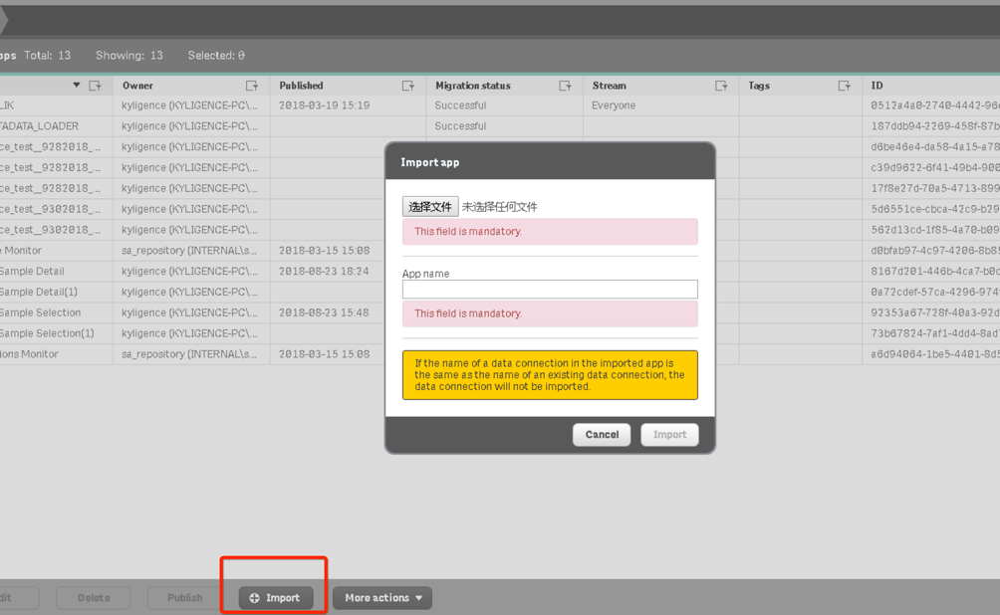
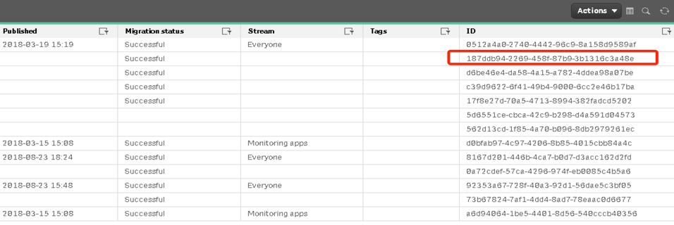

Open the JSON config file named `qdc_config.json`, replace the **appid** value with the one you copied in **QMC** just now. And also replace the *kyligence-pc* in the **connect** link with your actual Qlik server name.
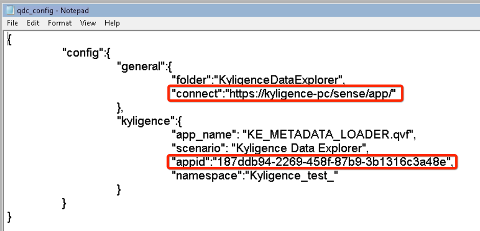

Now we can use this app to load our Kyligence cube metadata into Qlik.

1. Open this app which you can find in Qlik hub named **KE_METADATA_LOADER** and switch to its Data-load-editor page.
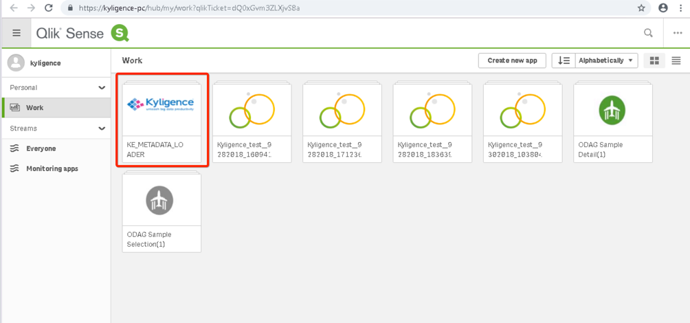

2. Create a valid **Qlik rest connector** to connect with Kyligence Enterprise. Hit the **Create new Connection** button, then choose **Rest** to start the creation. Fill the URL column with the API in the format below: "http://ip:port/kylin/api/cubes"Fill the Authentication column with **Basic**** type and your Kyligence Enterprise username and password. Click **Test Connection**. After its success, click Save button.
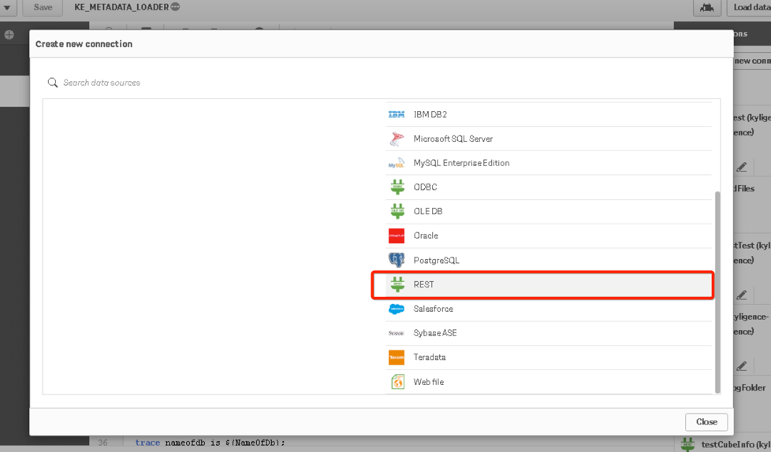
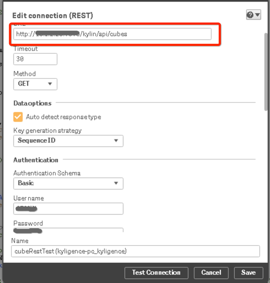

3. Click the button on the right panel to insert the connection string, and replace the origin string with it. Also, you need to change the **KE_HOST** and **KE_PORT** variable to your actual Kyligence Enterprise address.
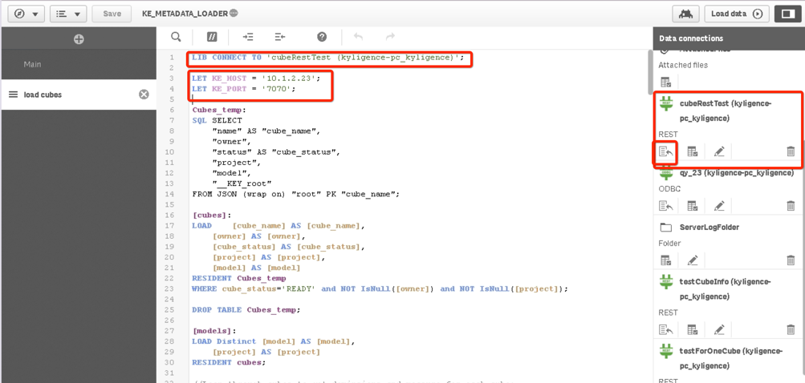

When this is done, click **Load data** button to load the cube metadata into Qlik.
>**Note**: If the cubes in Kyligence Enterprise are changed, you will need to reload this app.

### Create a Qlik APP with Kyligence Data Connector for Qlik

Open your internet browser, input the URL below:

https://[ your_qlik_server_name]/resources/KyligenceDataConnectorForQlik/index.html

Click the first entrance, start your trip to create an app based on the cube.
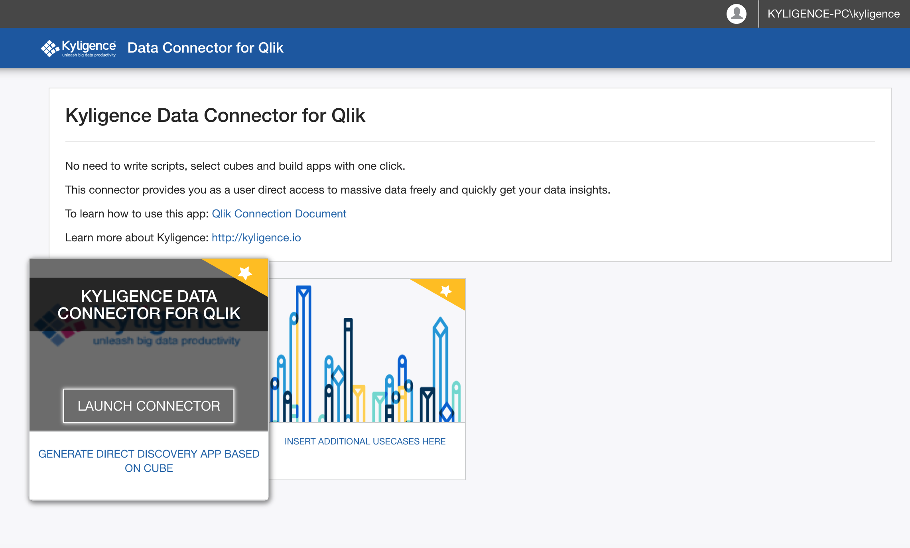

1. Input the information to connect Kyligence, then click **Apply Data Connection**.
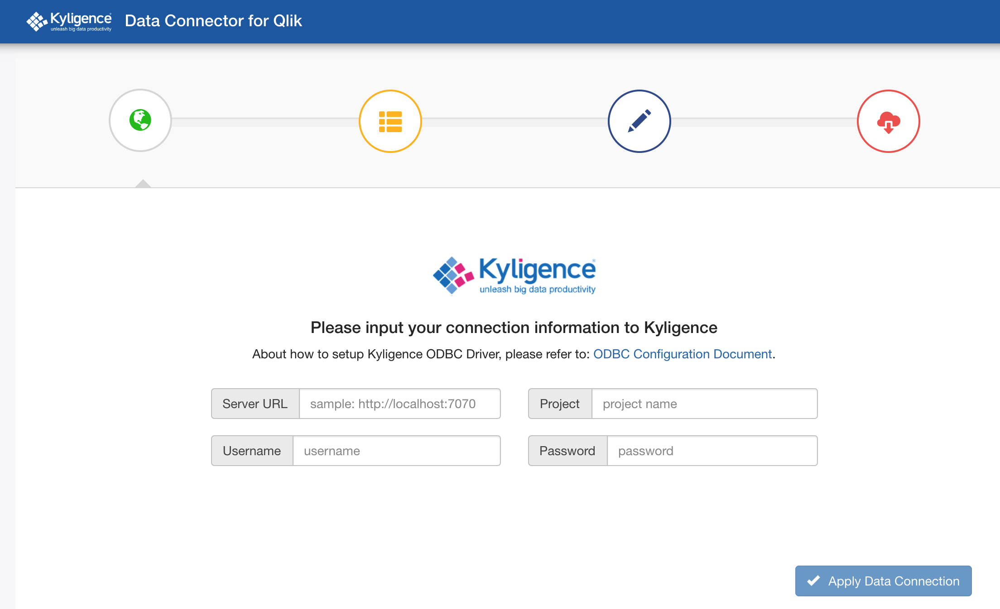

2. Choose **cube** in the rows you would like to use in this app. 
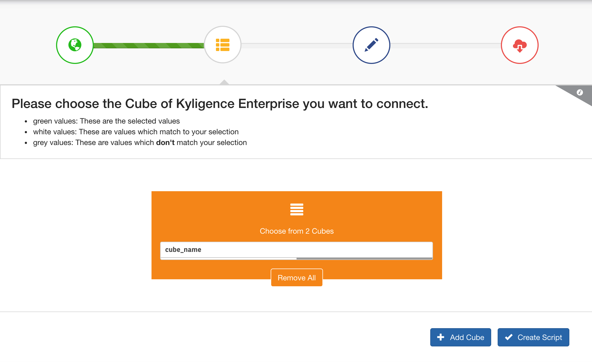

3. Click **Add Cube** and **Create Script** to generate **Qlik load script**. If the script is correct, click **Apply Selected Cube**.
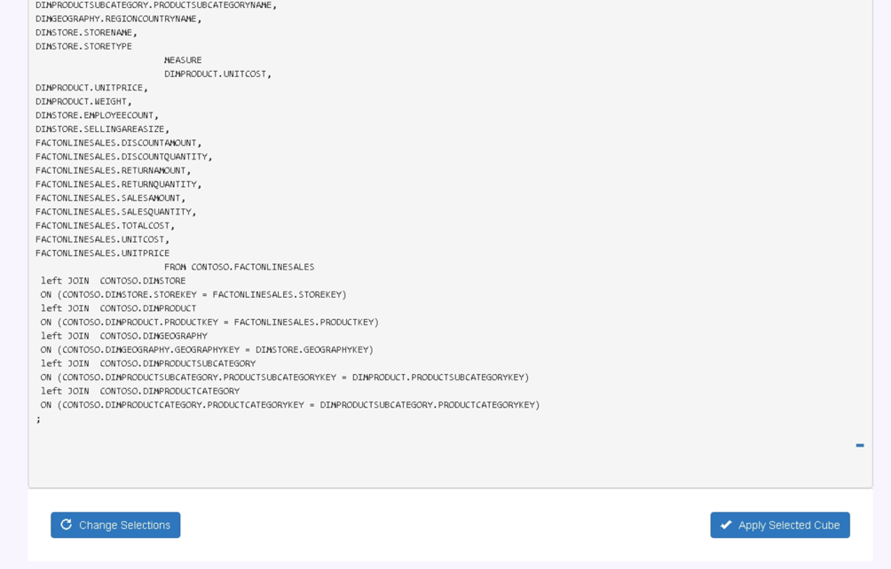

4. Finally, click **Create Application**. After the process finished, click to open the link **Click to Open APP**. Now you can see the Cube data has been loaded in the app.
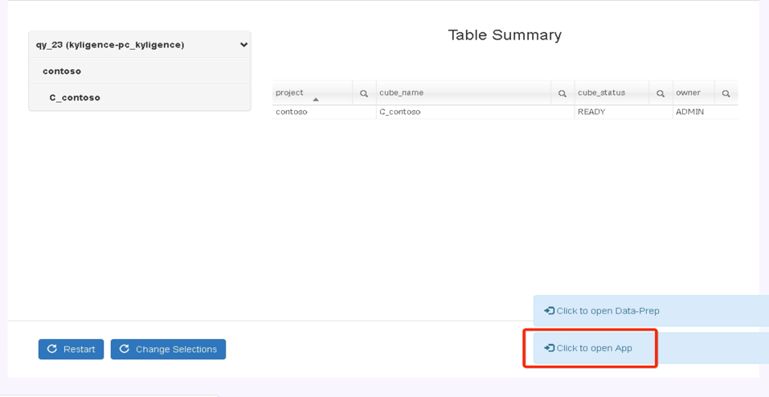

Now, you can analyze the data in Kyligence Enterprise in the generated app.
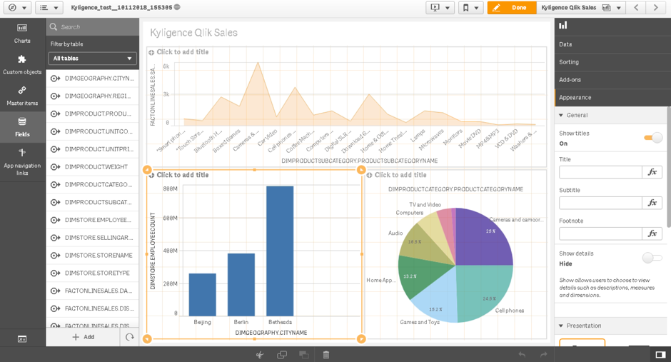

### Limitations

1. For **Qlik Direct Query Mode**, **Join As** is not supported, so cube based on that kind of model cannot be loaded into Qlik.
2. When making insights in QLik, if you drag dimension first, Qlik will send a detailed query to Kyligence and report an error. So it is recommended to drag a measure first.
3. You can sync measures defined in Kyligence using Kyligence Data Connector for Qlik, but only the basic measures will be sync to Qlik for now, like *Count*, *SUM*, *MAX*, *MIN*.
