## Integration with QlikView Desktop

QlikView is a business discovery platform that enables you to analyze business data and make data discoveries.

This article will guide you to connect Kyligence Enterprise with QlikView Desktop.

### **Prerequisite**

- Install Kyligence ODBC Driver. For the installation information, please refer to [Kyligence ODBC Driver](../../driver/odbc/README.md).
- Install QlikView Desktop. For the installation of QlikView Desktop, please visit [QlikView Desktop Download](https://www.qlik.com/us/try-or-buy/download-qlikview).

### Connection with QlikView Desktop

After configuring your Local DSN and installing QlikView successfully, you may go through the following steps to connect Kyligence Enterprise with QlikView Desktop.

1. From Windows Desktop Shortcut or click **Start** -> **All Applications**-> **QlikView** -> **QlikView Desktop** to open the application **QlikView Desktop**.

2. On the top left of the QlikView Desktop start page, please click "**Edit Script**".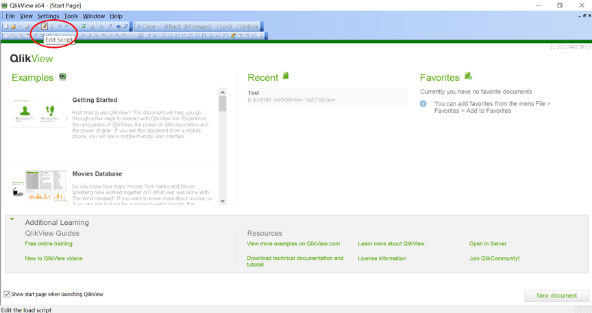

3. Change the default scripts of "TimeFormat", "DateFormat" and "TimestampFormat" to:

   `SET TimeFormat='h:mm:ss';`

   `SET DateFormat='YYYY-MM-DD';`

   `SET TimestampFormat='YYYY-MM-DD h:mm:ss[.fff]';`

4. Configure ODBC:

   Enter QlikView script editor, click on the **database** below the window to select **ODBC** and click **Select** button. Please select the local DSN and click **Test Connection**. After the test passed, the interface will pop up **Connection Test Succeed** and please click **OK** to confirm.

   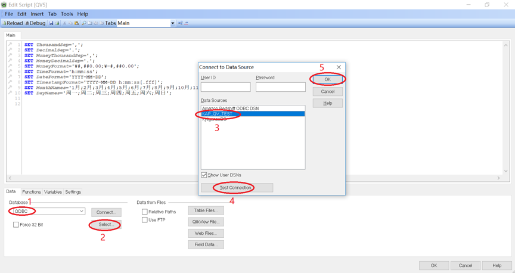

5. Select Cube:

   Please select the table which is involved with Cube or write the customized SQL.

   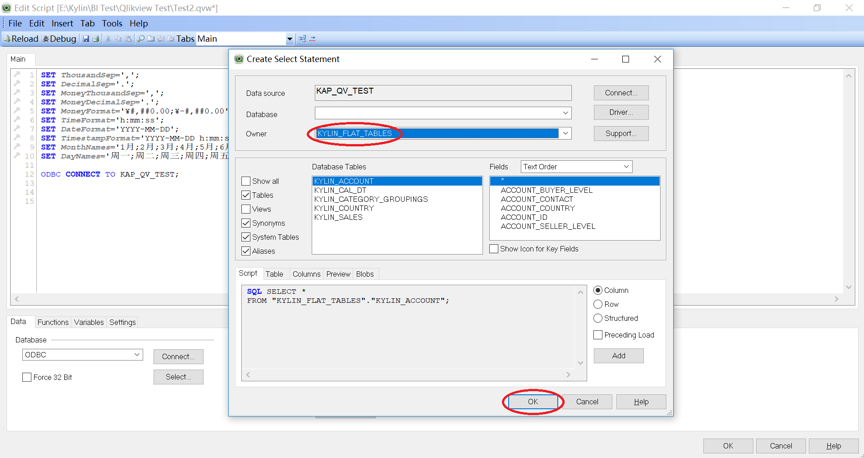

   On the top of the script editor, please click the **Save** and **Reload** buttons.

   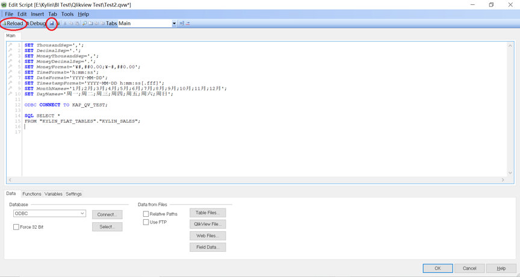

   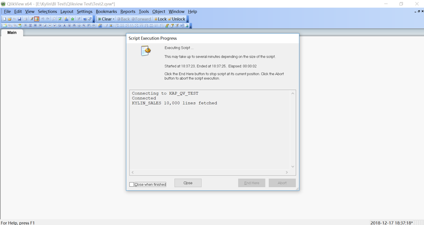

   After reloading successfully, click **Close** to close, and the cube data will be imported into QlikView. Then, you can create the report.

6. Configure Direct Query mode:

   Given the Petabyte-Scale Cube size in a usual Kyligence Enterprise production environment, we recommend user to use Direct Query mode in QlikView and avoid importing data into QlikView.

   You may be able to enable Direct Query mode by typing `Direct Query` in front of your query script in Script editor.

   > **Note**: When you connect Qlik to Kyligence Enterprise, it will send a query which triggers full table scan. This will take a relatively long time to process the query when the dataset is extremely large. You can adjust parameter `kylin.query.force-limit` in `kylin.properties` to 1000, which indicates that the total records queried by statement `select *` from the data source is limited to 1000.

   Below is the screenshot of such Direct Query script against `kylin_sales_cube` in `learn_kylin` project.

   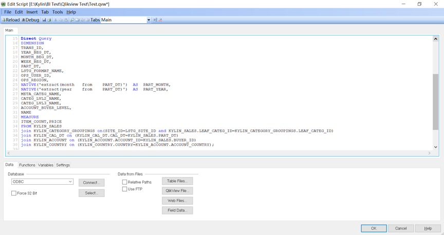

   Once you defined such script, QlikView can generate SQL based on this script for your report.

   It is recommended that you define Dimension and Measure corresponding to the Dimension and Measure in the Kyligence Enterprise Cube.  

   The whole script has been posted for your reference. 

   You may also be able to utilize Kyligence Enterprise built-in functions by creating a Native expression, for example: `NATIVE('extract(month from PART_DT)') ` 

   Make sure to update `LIB CONNECT TO 'kylin';` to the DSN you created. 

   ```shell
   SET ThousandSep=',';
   SET DecimalSep='.';
   SET MoneyThousandSep=',';
   SET MoneyDecimalSep='.';
   SET MoneyFormat='$#,##0.00;-$#,##0.00';
   SET TimeFormat='h:mm:ss';
   SET DateFormat='YYYY/MM/DD';
   SET TimestampFormat='YYYY/MM/DD h:mm:ss[.fff]';
   SET FirstWeekDay=6;
   SET BrokenWeeks=1;
   SET ReferenceDay=0;
   SET FirstMonthOfYear=1;
   SET CollationLocale='en-US';
   SET CreateSearchIndexOnReload=1;
   SET MonthNames='Jan;Feb;Mar;Apr;May;Jun;Jul;Aug;Sep;Oct;Nov;Dec';
   SET LongMonthNames='January;February;March;April;May;June;July;August;September;October;November;December';
   SET DayNames='Mon;Tue;Wed;Thu;Fri;Sat;Sun';
   SET LongDayNames='Monday;Tuesday;Wednesday;Thursday;Friday;Saturday;Sunday';
   LIB CONNECT TO 'kylin';
   DIRECT QUERY
   DIMENSION 
     TRANS_ID,
     YEAR_BEG_DT,
     MONTH_BEG_DT,
     WEEK_BEG_DT,
     PART_DT,
     LSTG_FORMAT_NAME,
     OPS_USER_ID,
     OPS_REGION,
     NATIVE('extract(month from PART_DT)') AS PART_MONTH,
      NATIVE('extract(year from PART_DT)') AS PART_YEAR,
     META_CATEG_NAME,
     CATEG_LVL2_NAME,
     CATEG_LVL3_NAME,
     ACCOUNT_BUYER_LEVEL,
     NAME
   MEASURE
       ITEM_COUNT,
       PRICE,
       SELLER_ID
   FROM KYLIN_SALES 
   join KYLIN_CATEGORY_GROUPINGS  
   on( SITE_ID=LSTG_SITE_ID 
   and KYLIN_SALES.LEAF_CATEG_ID=KYLIN_CATEGORY_GROUPINGS.LEAF_CATEG_ID)
   join KYLIN_CAL_DT
   on (KYLIN_CAL_DT.CAL_DT=KYLIN_SALES.PART_DT)
   join KYLIN_ACCOUNT 
   on (KYLIN_ACCOUNT.ACCOUNT_ID=KYLIN_SALES.BUYER_ID)
   JOIN KYLIN_COUNTRY
   on (KYLIN_COUNTRY.COUNTRY=KYLIN_ACCOUNT.ACCOUNT_COUNTRY)
   ```

   Click **Save** and **Load Data** button on the upper right of the window, QlikView will then send out inspection query to test the connection based on the script.

   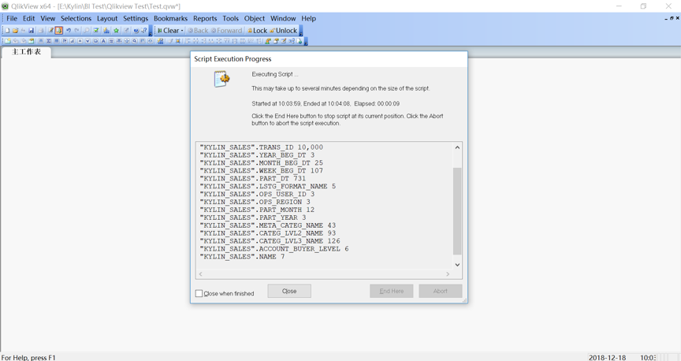

7. Create a new report:

   Click **Create Chart** on the top of the window.

   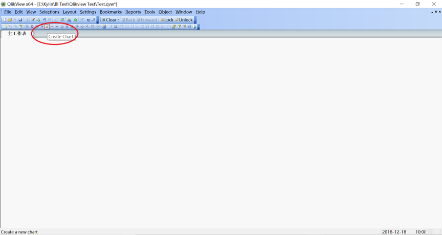

   Select the charts you need, then add dimension and measure based on your requirements.

   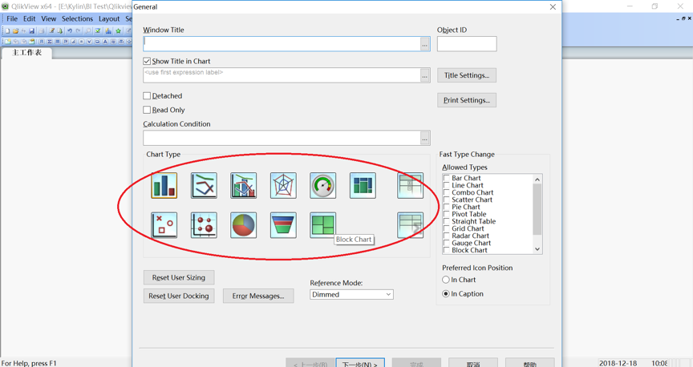

   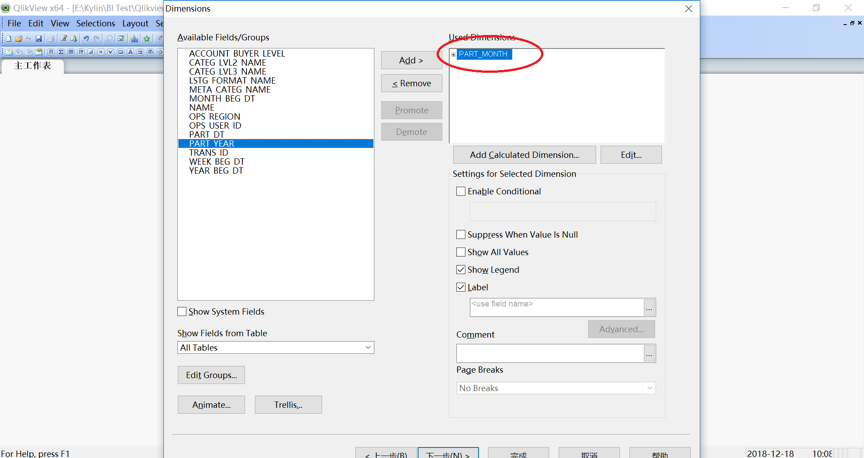

   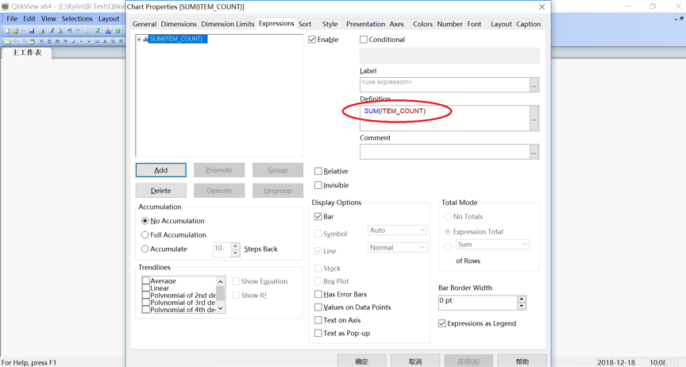

   After that, the worksheet and connection are completed. You can now view the Kyligence Enterprise data in QlikView.

   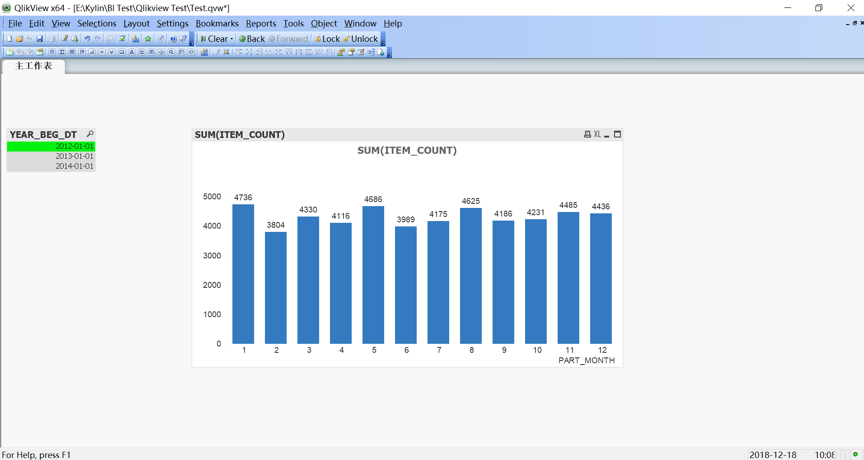

8. Known Limitations:

   - For QlikView **Direct Query** Mode, **Join As** is not supported, so cube based on that kind of model cannot be loaded into QlikView.
   - For QlikView **Direct Query** Mode, Advanced calculations (Set Analysis, complex expressions) is not supported, but only the basic measures, like Sum,Avg,Count,Max,Min
