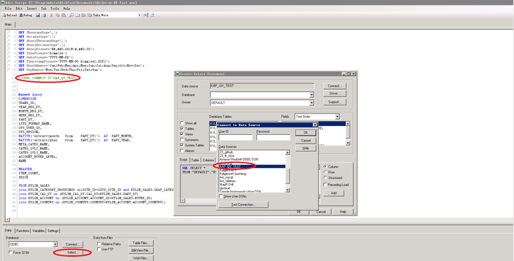
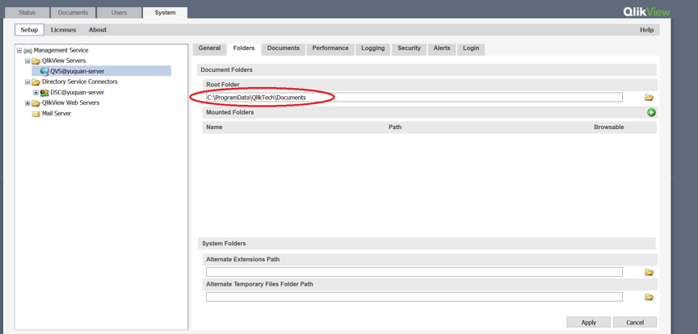
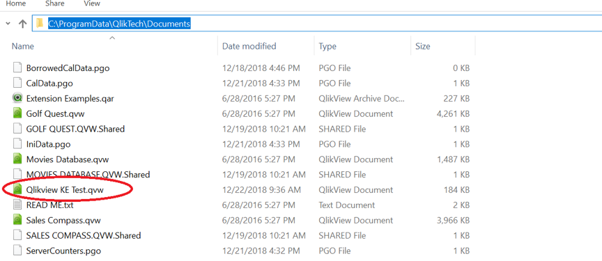
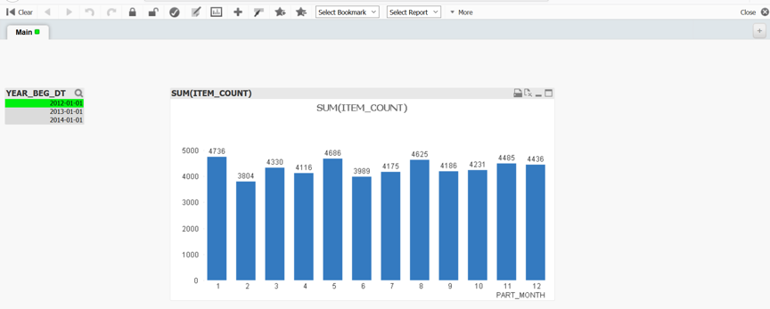

## Integration with QlikView Server{#server}

QlikView Server provides a business intelligence information platform for publishing and sharing Qlikview through LAN or WAN. QlikView Server provides a data analysis technology for multi-terminal users through close integration with QlikView.

### **Prerequisite**

- Install Kyligence ODBC Driver. For the installation information, please refer to [Kyligence ODBC Driver](../../driver/odbc/README.md).
- Install QlikView Server. For the installation of QlikView Server, please visit [QlikView Website](https://www.qlik.com/us).

### Connection with QlikView Server

After configuring QlikView Server DSN and installing QlikView Server successfully, you may go through the following steps to connect Kyligence Enterprise with QlikView Server.

1. Change DSN:

   Firstly, please create a QlikView report integrated with Kyligence Enterprise by using desktop,the operation steps can refer to [Integration With QlikView Desktop](#desktop). Then, on the QlikView server, open the Qlikview report that has been created, edit the script, and replace the local DSN with the server DSN.

   

2. Publish Report

   在 **QlikView Management Console** 查看发布根目录,将切换DSN后的QlikView报表拷贝至该目录后进行发布.

   Find the publishing root folders in **QlikView Management Console**. Then copy the QlikView report to this directory and publish.

   

   

3. View Report:

   View the report integrated with Kyligence Enterprise in **QlikView AccessPoint**.

   