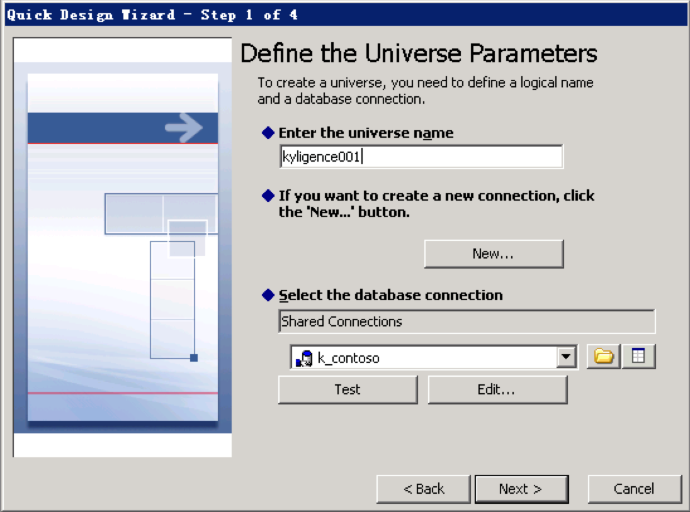

## SAP Business Objects

SAP BusinessObjects (SAP BO) is a SAP business intelligence product. This article walks you through the steps to connect SAP BO Web Intelligence 4.1 to Kyligence Enterprise.

### Prerequisite
- Kyligence Enterprise version is higher than 3.0
- Kyligence ODBC Driver version is higher than 2.2

- Kyligence ODBC Driver 64 bit is installed on your SAP BO machine and DSN is configured. For the configuration of Kyligence ODBC Driver and DSN, please refer to [Installing and Configuring Kyligence ODBC Driver under Windows](../driver/odbc/win_odbc.en.md).

### Modeling with the universe design tool

1. **Manage data connections**

   Open Universe Design Tool on your windows.

   - Click **Connections** to manage the data connection

   

   Click **New Connection** to add a connection.

   

   For **Connection Type**, choose **Shared** and input a connection name.

   

   Select the **Generic ODBC datasource**

   

   Enter your Kyligence username and password, choose DSN name, then click Next.

   

   Select the Connection Pool Mode to **Keep the connection active during the whole session**, then click next and save the connection

   

2. **Create a data model**

   In **Universe design tool**, open Quick Design Wizard, create a model using the newly created connection. In the Step 1 of the wizard, enter a universe name and choose the shared connections created in the previous step.

   

   Add the table you want to use to the right side panel

   

   Add the measure to the right side panel as an aggregated form.

   Click next and save to finish the Quick Design Wizard.

   > Note： In order to leverage the pre-calculation in Kyligence Enterprise Cube, the measure defined in Quick Design Wizard need to consistent with measures in the Cube.

   

   After importing the table, it will enter the modeling process. Firstly, the connection relationship will be automatically matched according to the column name. If you have a table that is not connected, you can click **add connection** to create one.

   

   Define all the joins between tables.

   If you want to edit all the relationships, click the join line to modify the connection.

   

### Create a report

Open Web Intelligence Rich client, under Universe choose the data source you created in previous step to create a query.

   

Click **Run Query** on the top right of the panel, and you can get a report

   

### Method of replacing a data source

- **Method 1: Modify in the report**

   First you need to create a universe of kyligence, then click **Data Access** - **Tools** - **Change Source** in the report design page. And select other universe, click **Run Query** in the query interface to restore the report.

   

- **Method 2: Modify on Universe design tool**

   Edit Connection in Universe

   

   Modify the DSN to the DSN that map to Kyligence Enterprise and save it

### FAQ

**Q:Queries generated by BO will be accompanied by database name, including default database How "default" is a key word in the Kyligence Enterprise that need to be escaped with double quote.**

Please set `kylin.query.escape-default-keyword` to true in **kylin.properties**, and Kyligence Enterprise will automatically escape default to "DEFAULT".
