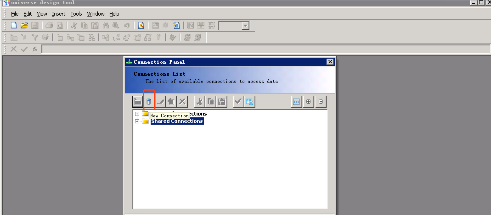
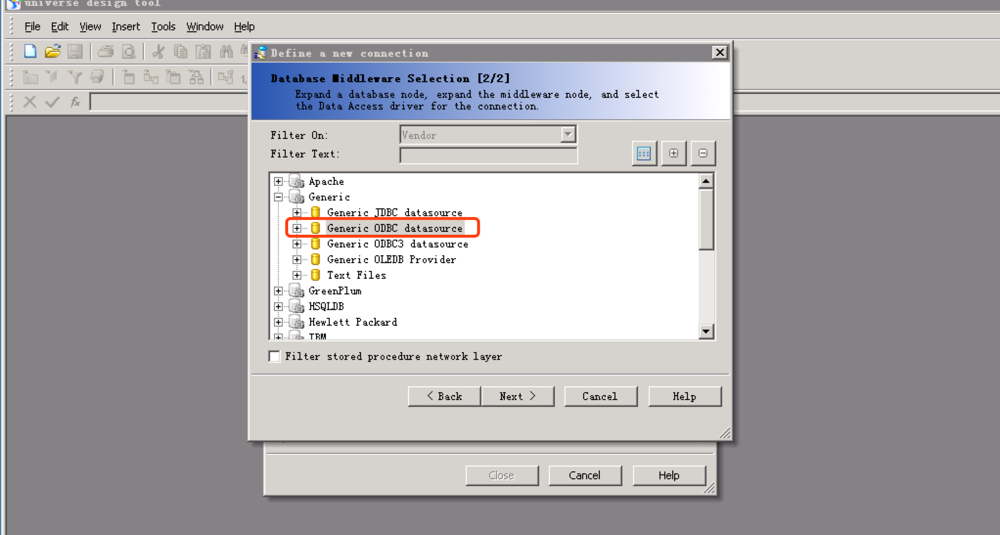

## Integrate with SAP Business Objects Client

SAP BusinessObjects (SAP BO) is a SAP business intelligence product. This article walks you through the steps to connect SAP BO Web Intelligence 4.1 to Kyligence Enterprise.

### Prerequisite
- Kyligence Enterprise version 3.0 or higher 
- Kyligence ODBC driver version 2.2 or higher 

### Configuring ODBC and DSN

For Kyligence ODBC configuration, please refer to [Installing and Configuring Kyligence ODBC Driver under Windows](../../driver/odbc/win_odbc.en.md).

### Modeling with the universe design tool

#### **Manage data connections**

- Click **Connections** to manage the data connection

- Click **New Connection** to add a connection.

- Select the **Generic ODBC datasource**

- Enter your Kyligence username and password, choose DSN name, then click Next

- Select the Connection Pool Mode to **Keep the connection active during the whole session** then save the connection

#### **Create a data model**

- Open the **Universe** design tool and create a model using the newly created connection

- Add the table you want to use to the right side panel

- Add the metric to the right side panel as an aggregated form

- After importing the table, it will enter the modeling process. The connection relationship will be automatically matched according to the column name. If you have a table that is not connected, you can click add connection to create one.

- Click the link line to modify the connection, edit all the relationships and save

#### Publish to server

Save as and publish to CMC Server model path.

### Create a report in the Rich Client

   Select the universe as the data source and use the newly created universe. Drag the field you want to analyze to the right side and click **Run Query**

   

   And you can get a report

   

Save, publish to BO Server.

### Method of replacing a data source

- **Method 1: Modify in the report**

   First you need to create a Kyligence universe, then click **Data Access** - **Tools** - **Change Source** in the report design page. And select other universe, click **Run Query** in the query interface to restore the report.

   

- **Method 2: Modify on Universe design tool**

   Edit Connection in Universe

   

   Modify the DSN to the required DSN and save it

### FAQ

**Q:Queries generated by BO will be accompanied by database name, including the default database, and the default is a key word in  Kyligence Enterprise that cannot use the form of "default.table".**

Please set `kylin.query.escape-default-keyword` to true in **kylin.properties**, and Kyligence Enterprise will automatically convert default to "DEFAULT".
