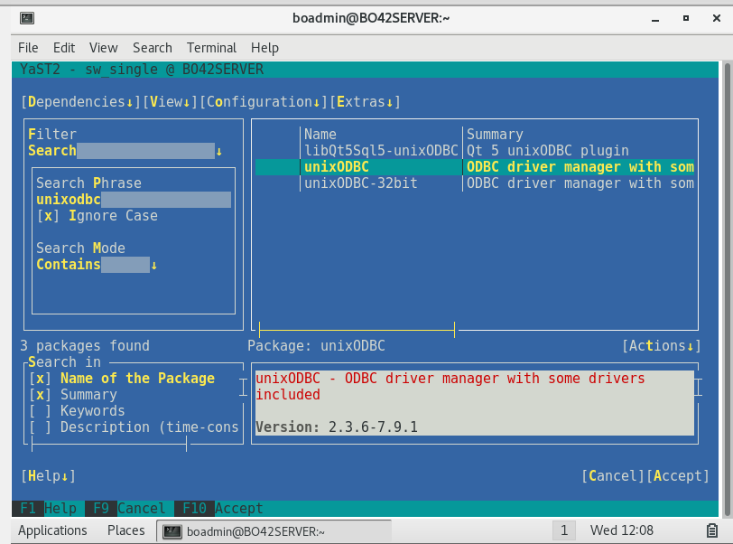
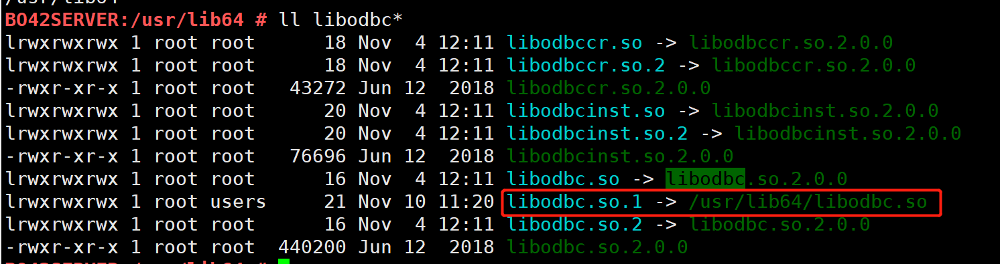
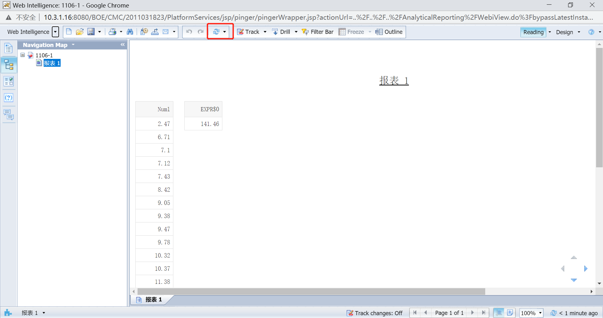

## Integrate with SAP Business Objects Server

This chapter takes Suse 12 SAP BO Server 4.2 as an example to introduce how to integrate with SAP BO Server.

### Server configuration operation

#### Install Unix ODBC Manager 

```
sudo -i yast
```

Go to Software Management. In the search box, type unixodbc and Enter to confirm.



Select the 64-bit installation package, press Tab+Enter to open the operation menu, select Install *+*, and Enter to confirm.

After the installation is complete, press F10 to exit to finish, and then press F9 to exit to exit YaST.

Use the command `odbcinst` to verify that the Unix ODBC Manager installation is successful. If the following message appears, the installation is successful.


Use the command `odbcinst -j` to confirm the Unix ODBC Manager version.


> **Note**：Different versions of unix odbc manager, BO Server odbc.sbo configuration is different

#### Install Kyligence ODBC Driver

 Download the installation package from the [Download](http://download.kyligence.io/#/download)，copy it to the custom path of BO Server, and unzip

```
tar -zxvf Kyligence.ODBC.{version}.tar.gz
```

such as，copy it to {BO install path}/sap_bobj/enterprise_xi40/linux_x64/odbc/KyligenceODBC

#### Confirm libodbc path, set libodbc.so.1 symbolic link

libodbc is a pre-condition for BO Server installation in Suse environment, no need to install again

```
cd /usr/lib64
ll libodbc*
```

Confirm that libodbc.so exists, and set up the libodbc.so.1 symbolic link

```
ln -s /usr/lib64/libodbc.so libodbc.so.1
```

Use the command `ll libodbc*` to confirm whether the symbolic link is correct.



#### Configure Environment Variables

1）Modify /etc/profile 

```
vi /etc/profile 
```

Add a new variable ODBCINI points to DSN path, LD_LIBRARY_PATH points to libodbc and Kyligence ODBC lib

```
export ODBCINI=/home/boadmin/BOServer/install_dir/sap_bobj/enterprise_xi40/odbc.ini
export LD_LIBRARY_PATH=/usr/lib64:/home/boadmin/BOServer/install_dir/sap_bobj/enterprise_xi40/linux_x64/odbc/KyligenceODBC
source /etc/profile 
```

2）Modify env.sh

```
vi {BO install path}/sap_bobj/setup/env.sh
```

Find LIBRARYPATH，add libodbc and Kyligence ODBC lib path

```
:/usr/lib64:${BOBJEDIR}enterprise_xi40/linux_x64/odbc/KyligenceODBC
```

#### Create DSN 

Edit the odbc.ini file of the ODBCINI path, add Kyligence Enterprise DSN

```
cd {BO install path}/sap_bobj/enterprise_xi40
vi odbc.ini
```

Add DSN **KyligenceDataSource** 

> **Note** ：The DSN name must be consistent with the DSN built by the client.

```
[KyligenceDataSource]
SERVER=10.1.2.43
PORT = 7070
PROJECT = learn_kylin
Driver=/home/boadmin/BOServer/install_dir/sap_bobj/enterprise_xi40/linux_x64/odbc/KyligenceODBC/libKyligenceODBC64.so
```

#### Test DSN by ISQL

```
isql KyligenceDataSource ADMIN 'KYLIN'
select * from KYLIN_SALES limit 1;
```

The SQL result is returned normally, which means that the DSN is valid.

#### Configure BO Server odbc.sbo

Enter the path where odbc.sbo is located. For related introduction of odbc.sbo, please refer to [SAP Manual](https://help.sap.com/viewer/aa4cb9ab429349e49678e146f05d7341/4.2.6/en-US/4594fbce6e041014910aba7db0e91070.html).

```
cd {BO install path}/sap_bobj/enterprise_xi40/dataAccess/connectionServer/odbc
vi odbc.sbo
```

Refer to the remarks of odbc.sbo, based on the installed ODBC Manager version, modify the odbc.sbo file and save it.

For example, when the Unix ODBC Manager version is 2.3.6, you need to modify the <Library Platform="Unix"> parameter value in odbc.sbo and comment out the Table parameter.

#### Restart BO Server

```
cd {BO install path}/sap_bobj
./stopservers
./startservers
```


## Create and publish reports

Use Universe + Web Intelligence rich client to create and publish reports, refer to the manual [Integrate with SAP Business Objects web intelligence](sap_bo_client.en.md).


## View report in server

In the browser, enter CMC Server http://ip:port/BOE/CMC, enter the report publishing directory, select the report, and right click **View**.




